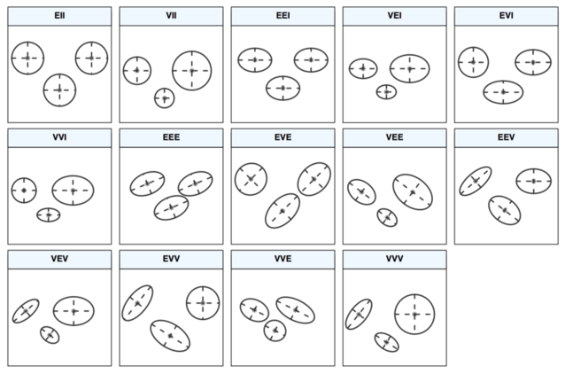

```{r options_communes, include=FALSE}
source("options_communes.R")
```

La classification automatique constitue, avec les méthodes de réduction de dimension (ACP, SVD, échelonnement multidimensionnel, etc.), l'une des pierres angulaires des techniques dites d'_analyse de données_. Les méthodes de classification automatique visent à former des groupes homogènes d'individus, ou de n'importe quel objet statistique puisqu'il est possible de travailler sur les variables plutôt que sur les individus. Pour ce faire, il est nécessaire de définir une mesure de distance ou de similarité entre deux individus, et comment les individus qui se ressemblent le plus sont regroupés ensemble dans la même classe. Un exemple d'une telle approche est la [classification hiérarchique ascendante](classification-ascendante-hierarchique.html) (CAH). Dans ce chapitre, on va s'intéresser à d'autres méthodes de classification automatique, en particulier les nuées dynamiques et les modèles de mélange, ainsi qu'aux outils qui nous permettent d'évaluer quelle solution de partitionnement est la meilleure.

## Nuées dynamiques et modèles de mélange

### Algorithme des k-means

L'approche par « k-means » repose sur un regroupement itératif des observations par minimisation de la variance intra-cluster (comme dans le cas du critère de Ward dans la CAH), après initialisation aléatoire des centres de classe. On parle également d'_agrégation en centres mobiles_. À retenir : contrairement à la CAH, il s'agit ici d'un algorithme non déterministe, ce qui signifie que d'un essai à l'autre on ne retombera pas nécessairement sur le même partitionnement, à moins de toujours définir les mêmes centres de classes initiaux. Plusieurs choix de distance sont possibles, mais en général on retrouve la distance euclidienne et la distance de Manhanttan (_k-medians_), ainsi que d'autres variations (_k-medoids_). En pratique, il est nécessaire de spécifier à l'avance le nombre de classes que l'on souhaite constituer.

On peut schématiser l'algorithme de la manière suivante (data figure ici un data frmae contenant les données numériques d'intérêt) :

```{r, eval = FALSE}
s <- 1234
k <- 10
wss <- numeric(k)
wss[1] <- (nrow(data) - 1) * sum(sapply(data, var))
for (i in 2:k) {
    set.seed(s)
    wss[i] = sum(kmeans(data, centers = i)$withinss)
}
```

### Modèles de mélange

Les modèles de mélange permettent de spécifier la forme de la matrice de variance-covariance des classes (ou clusters dans la littérature anglo-saxonne). Les k-means constituent en réalité un cas particulier de ces modèles probabilistes où cette matrice de variance-covariance (VC) est supposée constante. Dans un modèle de mélange, la distribution (non conditionnelle) des observations s'écrit :

$$
\begin{array}{l}
p(x_i) = \sum_{c=1}^k\pi_cp(x_i\mid c) \\
x_i\mid c \sim \text{N}(\mu_c,\Sigma_x)
\end{array}
$$

Dans le cas où $\Sigma_x = \sigma^2I$, on retrouve les k-means.

En pratique, on construit plusieurs partitionnement en considérant différentes matrices VC, qui varient tant du point de vue de leur forme que de leur direction (figure ci-après, tiré de [Scrucca et al., 2016](https://journal.r-project.org/archive/2016/RJ-2016-021/)). La sélection du « meilleur » modèle repose sur le critère BIC (Bayesian Information Criteria).



## Méthodes de validation

About k-means specifically, you can use the Gap statistics. Basically, the idea is to compute a goodness of clustering measure based on average dispersion compared to a reference distribution for an increasing number of clusters.

One generally consider that a "good partitioning" must satisfy one or more of the following criteria: (a) compactness (small within-cluster variation), connectedness (neighbouring data belong to the same cluster), and spatial separation (must be combined with other criteria like compactness or balance of cluster sizes). As part of a large battery of internal measures of cluster validity (where we do not use additional knowledge about the data, like some a priori on class labeling), they can be complemented with so-called combination measures (for example, assessing intra-cluster homogeneity and inter-cluster separation), like Dunn or Davies–Bouldin index, silhouette width, SD-validity index, etc., but also estimates of predictive power (self-consistency and stability of a partitioning), how well distance information are reproduced in the resulting partitions (e.g., cophenetic correlation and Hubert's Gamma statistic).

I guess you could rely on some of them for comparing your different cluster solutions and choose the features set that yields the better indices. You can even use bootstrap to get an estimate of the variability of those indices (e.g., cophenetic correlation, Dunn's index, silhouette width), as was done by Tom Nichols and coll. in a neuroimaging study, Finding Distinct Genetic Factors that Influence Cortical Thickness.

If you are using R, I warmly recommend taking a look at the fpc package, by Christian Hennig, which provides almost all statistical indices described above (cluster.stats()) as well as a bootstrap procedure (clusterboot()).

When you don't have any idea of what you would expect to find if there was noise only, a good approach is to use resampling and study clusters stability. In other words, resample your data (via bootstrap or by adding small noise to it) and compute the "closeness" of the resulting partitions, as measured by Jaccard similarities. In short, it allows to estimate the frequency with which similar clusters were recovered in the data. This method is readily available in the fpc R package as clusterboot(). It takes as input either raw data or a distance matrix, and allows to apply a wide range of clustering methods (hierarchical, k-means, fuzzy methods).

You can extend this idea to any validity index, of course: choose a new series of observations by bootstrap (with replacement), compute your statistic (e.g., silhouette width, cophenetic correlation, Hubert's gamma, within sum of squares) for a range of cluster numbers (e.g., 2 to 10), repeat 100 or 500 times, and look at the boxplot of your statistic as a function of the number of cluster.
