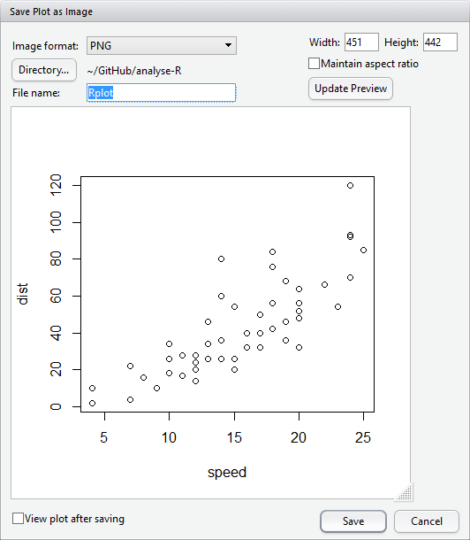
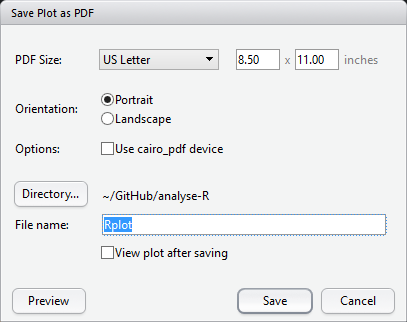
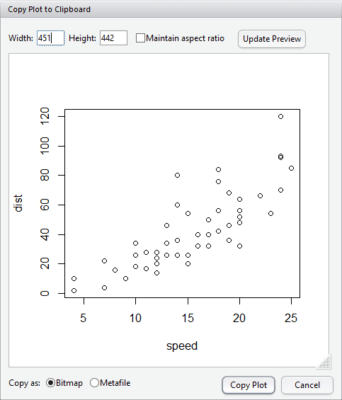

```{r options_communes, include=FALSE}
source("options_communes.R")
```

## Via l'interface de RStudio

L'<dfn>export de graphiques</dfn><dfn data-index="graphique, export"></dfn> est 
très facile avec **RStudio**. Lorsque l'on
créé un graphique, ce dernier est affiché sous l'onglet *Plots* dans
le quadrant inférieur droit. Il suffit de cliquer sur *Export* pour 
avoir accès à trois options différentes :

* *Save as image* pour sauvegarder le graphique en tant que fichier image ;
* *Save as PDF* pour sauvegarder le graphique dans un fichier **PDF** ;
* *Copy to Clipboard* pour copier le graphique dans le presse-papier (et pouvoir
  ainsi le coller ensuite dans un document **Word** par exemple).
  
### Sauvegarder le fichier en tant qu'image

<figure>

<figcaption>Sauvegarder un graphique en tant qu'image avec RStudio</figcaption>
</figure>

La boîte de dialogue qui s'ouvre propose différentes options d'export :

* le type de fichier désiré ;
* le nom du fichier ;
* le répertoire où le fichier doit être créé (par défaut, il s'agit du répertoire de travail) ;
* la taille de l'image.

**R** peut exporter un graphique dans une grande variété de formats. Nous n'aborderons ici que 
les principaux. Les formats **PNG**, **JPEG** et **TIFF** sont des formats de type 
<dfn langue="en">bitmap</dfn><dfn data-index="image bitmap"></dfn> (on parle aussi 
d'<dfn data-index="image matricielle">images matricielles</dfn>^[Voir
<http://fr.wikipedia.org/wiki/Image_matricielle>.]). 
L'image est stockée sous forme de points, sa qualité dépendant de sa <dfn>résolution</dfn>, c'est-à-dire du 
nombre total de points qui la composent. L'intérêt des images matricielles est d'être toujours
interprétées de manière identique quelque soit l'outil utilisé. Par contre, elles ne sont pas
adaptées lorsque l'on souhaite effectuer des retouches avec un logiciel de dessin.

Pour une utilisation sur un site web, on privilégiera une résolution d'image modérée (entre 400
et 800 pixels de largeur) et les formats **PNG** ou **JPEG**. Pour un document destiné à être
imprimé, on priviligiera une résolution plus élevée, pour éviter un phénomène dit de pixellisation.

Les <dfn data-index="image vectorielle">images vectorielles</dfn>^[Voir
<http://fr.wikipedia.org/wiki/Image_vectorielle>.] ont l'avantage 
de pouvoir être redimensionnées à volonté sans perte de qualité et produisent des fichiers en général 
de plus petite taille^[Sauf dans le cas des graphiques complexes reposant sur des dégradés de couleurs,
comme les cartes produites à partir de rasters. Auquel cas, il sera parfois préférable de privilégier
un export dans un format *bitmap*.]. Elles sont donc tout à fait adaptées pour l'impression.
Si l'on souhaite importer l'image dans **Word**, on choisira le format **Metafile** (le seul
compris par ce logiciel). Pour **Libre Office** ou **Open Office**, on choisira le format **SVG**.

**SVG** (*scalable vector graphic*^[Voir <https://www.wikiwand.com/fr/Scalable_Vector_Graphics>.]) 
est un format libre permettant de décrire une image vectorielle. Les fichiers **SVG** peuvent 
être directement lus par la majorité des navigateurs récents (**Firefox**, **Chrome**, ...).
De plus, le logiciel libre de dessins **Inkscape**^[téléchargeable gratuitement sur <https://inkscape.org/fr/>.]
permet d'éditer et de modifier des fichiers **SVG**. Ce format est donc tout à fait adapté pour les
graphiques que l'on souhaite retoucher avant publication. Depuis **Inkscape**, il sera possible
de faire un export **PNG** en haute résolution pour intégration dans un fichier **Word**.

On pourra modifier la taille de l'image avec les paramètres *Height* (hauteur) et *Width* (largeur).
En cliquant sur *Update Preview* la prévisulation du rendu final sera mise à jour.

### Sauvegarder le graphique en PDF

<figure>

<figcaption>Sauvegarder un graphique en PDF avec RStudio</figcaption>
</figure>

Les options de la boîte de dialogue permettent de modifier la taille du fichier **PDF** et,
bien entendu, d'indiquer le nom et le répertoire du fichier à créer.

En cliquant sur *Preview*, **RStudio** générera un fichier temporaire afin de visualiser le
rendu final.

### Copier le graphique dans le presse-papier

<figure>

<figcaption>Copier un graphique dans le presse-papier avec RStudio</figcaption>
</figure>

Il est possible de redimensionner le graphique. De plus, on précisera si l'on souhaite copier une version
matricielle (*bitmap*) ou vectorielle (*metafile*) du graphique.

## Export avec les commandes de R

On peut également exporter les graphiques dans des fichiers de différents formats directement avec
des commandes **R**. Ceci a l'avantage de fonctionner sur toutes les plateformes et de faciliter la mise à
jour du graphique exporté (on n'a qu'à relancer les commandes concernées pour que le fichier externe soit
mis à jour).

La première possibilité est d'exporter le contenu d'une fenêtre déjà existante à l'aide de la fonction
`dev.print`{data-pkg="grDevices" data-rdoc="dev2"}. On doit fournir à celle-ci le format de 
l'export (option `device`) et le nom du fichier (option `file`).

Par exemple :

```{r, eval=FALSE}
boxplot(rnorm(100))
dev.print(device = png, file = "export.png", width = 600)
```

Les formats de sortie possibles varient selon les plateformes, mais on retrouve partout les formats
*bitmap* `png`, `jpeg`, `tiff` et les formats vectoriels `svg`, `postscript` ou `pdf`. 

L'autre possibilité est de rediriger directement la sortie graphique dans un fichier, avant d'exécuter
la commande générant la figure. On doit pour cela faire appel à l'une des commandes permettant cette
redirection. Les plus courantes sont `png`{data-pkg="grDevices"}, 
`jpeg`{data-pkg="grDevices" data-rdoc="png"} et
`tiff`{data-pkg="grDevices" data-rdoc="png"} pour les formats *bitmap*, 
`svg`{data-pkg="grDevices" data-rdoc="cairo"},
`pdf`{data-pkg="grDevices"}, `postscript`{data-pkg="grDevices"} et
`win.metafile`{data-pkg="grDevices" data-rdoc="windows"} pour les formats vectoriels.

Ces fonctions prennent différentes options permettant de personnaliser la sortie graphique. Les plus
courantes sont `width` et `height` qui donnent la largeur et la hauteur de l'image générée (en pixels pour
les images bitmap, en pouces pour les images vectorielles) et `pointsize` qui donne la taille de base des
polices de caractère utilisées.


```{r, eval=FALSE}
png(file = "out.png", width = 800, height = 700)
plot(rnorm(100))
dev.off()
pdf(file = "out.pdf", width = 9, height = 9, pointsize = 10)
plot(rnorm(150))
dev.off()
```

Il est nécessaire de faire un appel à la fonction `dev.off`{data-pkg="grDevices" data-rdoc="dev"} 
après génération du graphique pour que le résultat soit bien écrit dans le fichier de sortie 
(dans le cas contraire on se retrouve avec un fichier vide).

## Export avec ggplot2

Les graphiques produits par `ggplot2`{.pkg} peuvent être sauvegardés manuellement, comme vu précédemment, ou programmatiquement. Pour sauvegarder le dernier graphique affiché par `ggplot2`{.pkg} au format PNG, il suffit d'utiliser la fonction `ggsave`{data-pkg="ggplot2" data-rdoc="ggsave"}, qui permet d'en régler la taille (en pouces) et la résolution (en pixels par pouce ; 72 par défaut) :

```{r, eval = FALSE}
ggsave("mon_graphique.png", width = 11, height = 8)
```

De la même manière, pour sauvegarder n'importe quel graphique construit avec `ggplot2`{.pkg} et stocké dans un objet, il suffit de préciser le nom de cet objet, comme ci-dessous, où l'on sauvegarde le graphique contenu dans l'objet `p` au format vectoriel PDF, qui préserve la netteté du texte et des autres éléments du graphique à n'importe quelle résolution d'affichage :

```{r, eval = FALSE}
ggsave("mon_graphique.pdf", plot = p,
       width = 11, height = 8)
```
