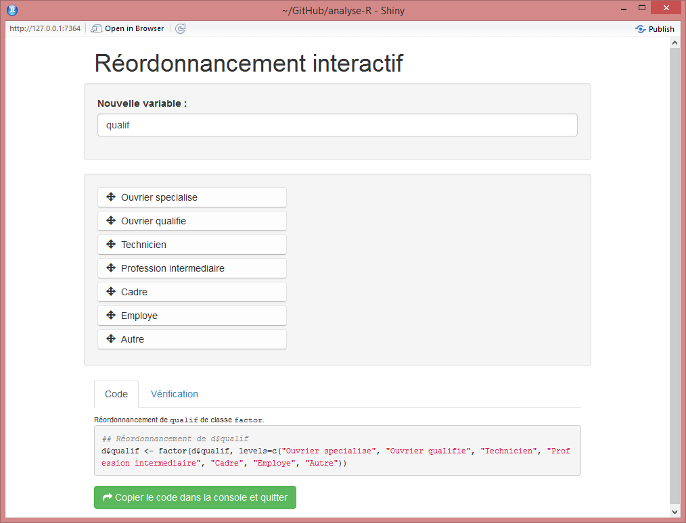

```{r options_communes, include=FALSE}
source("options_communes.R")
```


Dans le chapire sur les [vecteurs](vecteurs-indexation-et-assignation.html), nous avons abordé les types fondementaux de vecteurs (numériques, textuels, logiques). Mais il existe de nombreux autres classes de vecteurs afin de représenter des données diverses (comme les dates). Dans ce chapitre, nous nous intéressons plus particulièrement aux <dfn data-index="variable catégorielle">variables catégorielles</dfn><dfn data-index="catégorielle, variable"></dfn>.

Les <dfn data-index="facteur">facteurs</dfn> (ou <dfn data-index="factor" lang="en">factors</dfn> an anglais) sont un type de vecteur géré nativement par **R** et utilisés dans de nombreux domaines (modèles statistiques, représentations graphiques, ...).

Les facteurs sont souvent mis en regard des <dfn data-index="donnée labelissée">données labellisées</dfn><dfn data-index="labellisée, donnée"></dfn><dfn data-index="labelled data"></dfn> telles qu'elles sont utilisées dans d'autres logiciels comme **SPSS** ou **Stata**. Or, les limites propres aux facteurs font qu'ils ne sont pas adpatés pour rendre compte des différents usages qui sont fait des données labellisées. Plusieurs extensions (telles que `memisc`{.pkg} ou `Hmisc`{.pkg}) ont proposé leur propre solution qui, bien qu'elles apportaient un plus pour la gestion des données labellisées, ne permettaient pas que celles-ci soient utilisées en dehors de ces extensions ou des extensions compatibles. Nous aborderons ici une nouvelle classe de vecteurs, la classe `labelled`{data-pkg="labelled"}, introduite par l'extension `haven`{.pkg} (que nous aborderons dans le cadre de l'[import de données](import-de-donnees.html)) et qui peut être manipulée avec l'extension homonyme `labelled`{.pkg}.

## Facteurs

Dans ce qui suit on travaillera sur le jeu de données tiré de l'enquête *Histoire de vie*, fourni avec
l'extension `questionr`{.pkg}.

```{r, warning=FALSE}
library(questionr)
data(hdv2003)
d <- hdv2003
```

Jetons un œil à la liste des variables de `d` :

```{r}
str(d)
```

Nous voyons que de nombreuses variables de ce tableau de données, telles que <var>sexe</var> ou <var>nivetud</var>, sont du type facteur.

Les facteurs prennent leurs valeurs dans un ensemble de modalités prédéfinies et ne peuvent en prendre d'autres. La liste des valeurs possibles est donnée par la fonction `levels`{data-pkg="base"} :

```{r}
levels(d$sexe)
```

Si on veut modifier la valeur du sexe du premier individu de notre tableau de données avec une valeur non autorisée, on obient un message d'erreur et une valeur manquante est utilisée à la place :

```{r}
d$sexe[1] <- "Chihuahua"
d$sexe[1]
d$sexe[1] <- "Homme"
d$sexe[1]
```

On peut très facilement créer un facteur à partir d'une variable textuelle avec la fonction `factor`{data-pkg="base"} :

```{r}
v <- factor(c("H", "H", "F", "H"))
v
```

Par défaut, les niveaux d'un facteur nouvellement créés sont l'ensemble des valeurs de la variable textuelle, ordonnées par ordre alphabétique. Cette ordre des niveaux est utilisé à chaque fois qu'on utilise des fonctions comme `table`{data-pkg="base"}, par exemple :

```{r}
table(v)
```

On peut modifier cet ordre au moment de la création du facteur en utilisant l'option `levels` :

```{r}
v <- factor(c("H", "H", "F", "H"), levels = c("H", "F"))
table(v)
```

On peut aussi modifier l'ordre des niveaux d'une variable déjà existante :

```{r}
d$qualif <- factor(d$qualif, levels = c("Ouvrier specialise", "Ouvrier qualifie",
  "Employe", "Technicien", "Profession intermediaire", "Cadre", "Autre"))
table(d$qualif)
```

<div class="note">
L'extension `questionr`{.pkg} propose une *interface interactive* pour le réordonnancement des niveaux d'un facteur. Cette fonction, nommée `iorder`{data-pkg="questionr"}, vous permet de réordonner les modalités de manière graphique et de générer le code **R** correspondant.

Dans l'exemple précédant, si vous exécutez :

```{r, eval=FALSE}
iorder(d, "qualif")
```

**RStudio** devrait ouvrir une fenêtre semblable à celle de la figure ci-dessous.



Vous pouvez alors déplacer les modalités par glisser-déposer, vérifier le résultat dans l'onglet *Vérification* et, une fois le résultat satisfaisant, récupérer le code généré pour l'inclure dans votre script.
</div>

On peut également modifier les niveaux eux-mêmes. Imaginons que l'on souhaite créer une nouvelle variable *qualif.abr* contenant les noms abrégés des catégories socioprofessionnelles de *qualif*. On peut alors procéder comme suit :

```{r}
d$qualif.abr <- factor(d$qualif, levels = c("Ouvrier specialise", "Ouvrier qualifie",
  "Employe", "Technicien", "Profession intermediaire", "Cadre", "Autre"),
 labels = c("OS", "OQ", "Empl", "Tech", "Interm", "Cadre", "Autre"))
table(d$qualif.abr)
```

Dans ce qui précède, le paramètre `levels` de `factor`{data-pkg="base"} permet de spécifier quels sont les niveaux retenus dans le facteur résultat, ainsi que leur ordre. Le paramètre `labels`, lui, permet de modifier les noms de ces niveaux dans le facteur résultat. Il est donc capital d'indiquer les noms de `labels` exactement dans le même ordre que les niveaux de `levels`. Pour s'assurer de ne pas avoir commis d'erreur, il est recommandé d'effectuer un tableau croisé entre l'ancien et le nouveau facteur :

```{r}
table(d$qualif, d$qualif.abr)
```

On a donc ici un premier moyen d'effectuer un recodage des modalités d'une variable de type facteur. D'autres méthodes existent, que nous aborderons dans le chapitre [Recodage](recodage.html).

À noter que par défaut, les valeurs manquantes ne sont pas considérées comme un niveau de facteur. On peut cependant les transformer en niveau en utilisant la fonction `addNA`{data-pkg="base" data-rdoc="factor"}. Ceci signifie cependant qu'elle ne seront plus considérées comme manquantes par **R** mais comme une modalité à part entière :

```{r}
summary(d$trav.satisf)
summary(addNA(d$trav.satisf))
```

La fonction `addNAstr`{data-pkg="questionr"} de l'extension `questionr`{.pkg} fait la même chose mais permet de spécifier l'étiquette de la modalité des valeurs manquantes.

```{r}
library(questionr)
summary(addNAstr(d$trav.satisf, "Manquant"))
```

## Vecteurs labellisés {#labelled}

<dfn data-index="vecteur labellisé"></dfn><dfn data-index="labellisé, vecteur"></dfn>Nous abordons ici une nouvelle classe de vecteurs, la classe `haven_labelled`{data-pkg="labelled" data-rdoc="labelled"}, 
introduite récemment par l'extension `haven`{.pkg} (que nous aborderons dans le cadre de 
l'[import de données](import-de-donnees.html)) et qui peut être manipulée avec l'extension 
homonyme `labelled`{.pkg}.

Pour cette section, nous allons utiliser d'autres données d'exemple, également disponibles dans l'extension `questionr`{.pkg}. Il s'agit d'un ensemble de trois tableaux de données (`menages`, `femmes` et `enfants`) contenant les données d'une enquête de fécondité. Commençons par les charger en mémoire :

```{r}
library(questionr)
data(fecondite)
```

Pour ailleurs, nous allons avoir besoin de l'extension `labelled`{.pkg} qui permet de manipuler ces données labellisées.

```{r}
library(labelled)
```

### Les étiquettes de variable

Les <dfn data-index="étiquette de variable">étiquettes de variable</dfn><dfn data-index="variable, étiquette"></dfn> permettent de donner un nom long, plus explicite, aux différentes colonnes d'un tableau de données (ou encore directement à un vecteur autonome).

La visonneuse de données de **RStudio** sait reconnaître et afficher ces étiquettes de variable lorsqu'elles existent. Essayez par exemple la commande suivante :

```{r, eval=FALSE}
View(femmes)
```

Les fonctions `lookfor`{data-pkg="questionr"} et `describe`{data-pkg="questionr"} de l'extension `questionr`{.pkg} affichent également les étiquettes de variables lorsqu'elles existent.

```{r}
lookfor(femmes, "rés")
describe(femmes$id_femme)
```

Pour manipuler les étiquettes de variable, il suffit d'utiliser la fonction `var_label`{data-pkg="labelled"} de l'extension `labelled`{.pkg}.

```{r}
var_label(femmes$id_menage)
var_label(femmes$id_menage) <- "ID du ménage auquel elle appartient"
var_label(femmes$id_menage)
```

On utilisera la valeur `NULL` pour supprimer une étiquette :

```{r}
v <- c(1, 5, 2, 4, 1)
var_label(v)
var_label(v) <- "Ma variable"
var_label(v)
var_label(v) <- NULL
var_label(v)
var_label(v) <- "Une autre étiquette"
var_label(v)
```

Le fait d'ajouter une étiquette à un vecteur ne modifie en rien son type. Regardons la structure de notre objet `v` :

```{r}
str(v)
```

Que voit-on ? Notre vecteur possède maintenant ce qu'on appelle un <dfn>attribut</dfn>, c'est-à-dire une information supplémentaire qui lui est attachée. Un objet peut avoir plusieurs attributs. Ici, notre étiquette de variable est strocké dans un attribut nommé `"label"`. Cela ne modifie en rien sa nature. Il ne s'agit que d'information en plus. Toutes les fonctions ne tiennent pas compte des étiquettes de variable. Peu importe ! La présence d'un attribut ne les empêchera de fonctionner. De même, même si l'extension `labelled`{.pkg} n'est pas installée sur votre machine, vous pourrez toujours manipuler vos données comme si de rien n'était.

On peut associer une étiquette de variable à n'importe quel type de variable, qu'elle soit numérique, textuelle, un facteur ou encore des dates.

### Les étiquettes de valeur

Les <dfn data-index="étiquette de valeur">étiquettes de valeur</dfn><dfn data-index="valeur, étiquette"></dfn> consistent à attribuer une étiquette textuelle à certaines valeurs d'un vecteur. Elles ne peuvent s'appliquer qu'aux vecteurs numériques ou textuels. 

Lorsqu'un vecteur possède des étiquettes de valeur, sa classe change et devient `labelled`{data-pkg="labelled"}. Regardons déjà quelques exemples. Tout d'abord, jetons un apercu au contenu de l'objet `femmes` grace à la fonction `glimpse`{data-pkg="dplyr"} de l'extension `dplyr`{.pkg}.

```{r, message=FALSE}
library(dplyr)
glimpse(femmes)
```

Il apparaît que la variable <var>region</region> est de type `haven_labelled`{data-pkg="labelled" data-rdoc="labelled"}. On peut le confirmer avec `class`{data-pkg="base"}.

```{r}
class(femmes$region)
```

Regardons les premières valeurs prises par cette variable.

```{r}
head(femmes$region)
```

Nous voyons que quatre étiquettes de valeurs ont été associées à notre variable. Le code 1 correspond ainsi à la région <q>Nord</q>, le code 2 à la région <q>Est</q>, etc. Laissons de côté pour le moment la colonne `is_na` que nous aborderons dans une prochaine section.

La liste des étiquettes est également renvoyée par la fonction `describe`{data-pkg="questionr"} de `questionr`{.pkg}.

```{r}
describe(femmes$region)
```

L'extension `labelled`{.pkg} fournit la fonction `val_labels`{data-pkg="labelled"} qui renvoie la liste des étiquettes de valeurs d'une variable sous la forme d'un vecteur nommé et la fonction `val_label`{data-pkg="labelled" data-rdoc="val_labels"} (notez l'absence de 's') qui renvoie l'étiquette associée à une valeur particulière. S'il n'y a pas d'étiquette de valeur, ces fonctions renvoient `NULL`.

```{r}
val_labels(femmes$region)
val_label(femmes$region, 2)
val_label(femmes$region, 6)
val_labels(femmes$age)
```

Re-regardons d'un peu plus près les premières valeurs de notre variable <var>region</var>.

```{r}
head(femmes$region)
```

On s'aperçoit qu'il s'agit de valeurs numériques. Et l'affichage indique que notre variable est plus précisément du type `labelled double`. Pour rappel, `double` est synonyme de `numeric`. Autrement dit, la classe `haven_labelled`{data-pkg="labelled" data-rdoc="labelled"} ne modifie pas le type sous-jacent d'un vecteur, que l'on peut toujours obtenir avec la fonction `typeof`{data-pkg="base"}. Nous pouvons également tester si notre variable est numérique avec la fonction `is.numeric`{data-pkg="base" data-rdoc="numeric"}.

```{r}
typeof(femmes$region)
is.numeric(femmes$region)
```

À la différence des facteurs, le type original d'une variable labellisée n'est pas modifié par la présence d'étiquettes de valeur. Ainsi, il reste possible de calculer une moyenne à partir de notre variable <var>region</var> (même si cela n'est pas pertinent ici d'un point de vue sémantique).

```{r}
mean(femmes$region)
```

Avec un facteur, nous aurions eu un bon message d'erreur.

```{r}
mean(d$nivetud)
```

Nous allons voir qu'il est aussi possible d'associer des étiquettes de valeurs à des vecteurs textuels. Créons tout d'abord un vecteur textuel qui nous servira d'exemple.

```{r}
v <- c("f", "f", "h", "f", "h")
v
```

Le plus facile pour lui associer des étiquettes de valeur est d'utiliser `val_label`{data-pkg="labelled" data-rdoc="val_labels"}.

```{r}
val_label(v, "f") <- "femmes"
val_label(v, "h") <- "hommes"
v
typeof(v)
```

Notre vecteur `v` a automatiquement été transformé en un vecteur de la classe `labelled`. Mais son type sous-jacent est resté `"character"`. Par ailleurs, les données elle-même n'ont pas été modifiées et ont conservé leurs valeurs originales.

Il est également possible de définir/modifier/supprimer l'ensemble des étiquettes de valeur d'une variable avec `val_labels`{data-pkg="labelled"} en lui assignant un vecteur nommé.

```{r}
val_labels(v) <- c(Homme = "h", Femme = "f", "Valeur indéterminée" = "i")
v
```

Comme précédemment, on utilisera `NULL` pour supprimer une ou toutes les étiquettes.

```{r}
val_label(v, "i") <- NULL
v
val_labels(v) <- NULL
v
class(v)
```

Si l'on supprime toutes les étiquettes de valeur, alors notre vecteur retrouve sa classe initiale.

### Assignation et condition

Les étiquettes de valeur sont plus souples que les facteurs, en ce sens qu'il n'est pas obligatoire d'indiquer une étiquette pour chaque valeur prise par une variable. Alors qu'il n'est pas possible avec un facteur d'assigner une valeur qui n'a pas été préalablement définie comme une des modalités possibles du facteur, nous n'avons pas cette limite avec les vecteurs labellisés.

```{r}
femmes$region[3] <- 5
```

Important : quand on assigne une valeur à un facteur, on doit transmettre le texte correspondant à la modalité, alors que pour un vecteur labellisé on transmettra le code sous-jacent (pour rappel, les étiquettes de valeur ne sont qu'une information additionnelle).

De plus, nous avons vu que les données initiales n'étaient pas modifiées par l'ajout ou la suppression d'étiquettes de valeur, alors que pour les facteurs ce n'est pas vrai. Pour mieux comprendre, essayons la commande suivante :

```{r}
unclass(factor(v))
```

Un facteur stocke de manière interne les valeurs sous la forme d'une suite d'entiers, démarrant toujours par 1, forcément consécutifs, et dont les valeurs dépendent de l'ordre des facteurs. Pour s'en rendre compte :

```{r}
unclass(factor(v, levels = c("h", "f")))
unclass(factor(v, levels = c("f", "h")))
```

Ce qui importe pour un facteur ce sont les modalités de ce dernier tandis que pour un vecteur labellisé ce sont les valeurs du vecteur elles-mêmes. Cela reste vrai pour l'écriture de conditions.

Prenons un premier exemple avec un facteur :

```{r}
describe(d$sexe)
table(d$sexe == "Homme")
table(d$sexe == 1)
```

La condition valide est celle utilisant `"Homme"` qui est la valeur de la modalité du facteur.

Et avec un vecteur labellisé ?

```{r}
describe(femmes$milieu)
table(femmes$milieu == "urbain")
table(femmes$milieu == 1)
```

Ici, pour être valide, la condition doit porter sur les valeurs de la variable elle-même et non sur les étiquette.

### Quelques fonctions supplémentaires

L'extension `labelled`{.pkg} fournit quelques fonctions supplémentaires qui peuvent s'avérer utiles :

- `labelled`{data-pkg="labelled"} pour créer directement des vecteurs labellisés ;
- `nolabel_to_na`{data-pkg="labelled"} pour convertir les valeurs n'ayant pas d'étiquette en `NA` ;
- `val_labels_to_na`{data-pkg="labelled"} qui, à l'inverse, converti les valeurs avec étiquette en `NA` ;
- `sort_val_labels`{data-pkg="labelled"} pour trier l'ordre des étiquettes de valeurs.

On pourra se réferrer à l'aide de chacune de ces fonctions.

L'[import de données labellisées](import-de-donnees.html) et le [recodage de variables](recodage.html) (dont la conversion d'un vecteur labellisé en facteur) seront quant à eux abordés dans les prochains chapitres.
