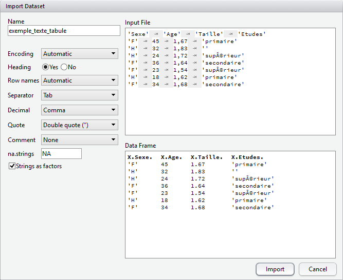

```{r options_communes, include=FALSE}
source("options_communes.R")
```

<dfn data-index="données, exporter"></dfn><dfn data-index="exporter des données"></dfn>

<div class="important">
Importer des données est souvent l'une des première opérations que l'on effectue lorsque l'on débute sous
**R**, et ce n'est pas la moins compliquée. En cas de problème il ne faut donc pas hésiter à demander de l'aide
par les différents moyens disponibles (voir le chapitre [Où trouver de l'aide ?](ou-trouver-de-l-aide.html))
avant de se décourager.

N'hésitez donc pas à relire régulièrement ce chapitre en fonction de vos besoins.

Avant toute chose, il est impératif de bien organiser ses différents fichiers
(voir le [chapitre dédié](organiser-ses-fichiers.html)). Concernant les données
sources que l'on utilisera pour ses analyses, je vous recommande de les placer
dans un sous-répertoire dédié de votre projet.

Lorsque l'on importe des données, il est également impératif de vérifier que l'import s'est correctement
déroulé (voir la section [Inspecter les données](premier-travail-avec-les-donnees.html#inspecter) du chapitre
*Premier travail avec les données*).
</div>

## Importer des fichiers texte

Les <dfn data-index="fichier texte">fichiers texte</dfn><dfn data-index="texte, fichier"></dfn>
constituent un des formats les plus largement supportés par la majorité
des logiciels statistiques. Presque tous permettent d'exporter des données dans un format
texte, y compris les tableurs comme **Libre Office**, **Open Office** ou **Excel**.

Cependant, il existe une grande variétés de format texte, qui peuvent prendre différents
noms selon les outils, tels que <dfn data-index="texte tabulé, fichier">texte tabulé</dfn>
ou *texte (séparateur : tabulation)*, **<dfn data-index="CSV, fichier">CSV</dfn>** <dfn data-index="fichier CSV"></dfn> (pour *comma-separated value*, sachant que suivant les logiciels le séparateur peut être une virgule ou un point-virgule).

### Structure d'un fichier texte

Dès lors, avant d'importer un fichier texte dans **R**, il est indispensable de regarder
comment ce dernier est structuré. Il importe de prendre note des éléments suivants :

* La première ligne contient-elle le nom des variables ? Ici c'est le cas.
* Quel est le caractère séparateur entre les différentes variables (encore appelé 
  <dfn>séparateur de champs</dfn>) ? Dans le cadre d'un fichier **CSV**, il aurait 
  pu s'agir d'une virgule ou d'un point-virgule.
* Quel est le caractère utilisé pour indiquer les décimales (le <dfn>séparateur décimal</dfn>) ? Il 
  s'agit en général d'un point (à l'anglo-saxonne) ou d'une virgule (à la française). 
* Les valeurs textuelles sont-elles encadrées par des guillemets et, si oui, s'agit-il de guillements
  simple (`'`) ou de guillemets doubles (`"`) ?
* Pour les variables textuelles, y a-t-il des <dfn data-index="valeur manquante">valeurs manquantes</dfn>
  <dfn data-index="manquante, valeur"></dfn> et si oui comment sont-elles
  indiquées ? Par exemple, le texte `NA` est parfois utilisé.

Il ne faut pas hésitez à ouvrir le fichier avec un éditeur de texte pour le regarder de plus près.

### Interface graphique avec RStudio

**RStudio** fournit une interface graphique pour faciliter l'import d'un fichier texte.
Pour cela, il suffit d'aller dans le menu *File > Import Dataset* et de choisir l'option
*From CSV*^[L'option CSV fonctionne pour tous les fichiers de type texte, même si votre fichier 
a une autre extension, `.txt` par exemple]. Cette option est également disponible via l'onglet *Environment* dans le quadrant haut-droite.

Pour la suite de la démonstration, nous allons utiliser le fichier exemple
<http://larmarange.github.io/analyse-R/data/exemple_texte_tabule.txt>.

<figure>

<figcaption>Importer un fichier texte avec RStudio</figcaption>
</figure>

L'interface de **RStudio** vous présente sous *Import Options* les différentes options d'import disponible. La section *Data Preview* vous permet de voir en temps réel comment les données sont importées. La section *Code Preview* vous indique le code **R** correspondant à vos choix. Il n'y a plus qu'à le copier/coller dans un de vos scripts ou à cliquer sur **Import** pour l'exécuter.

Vous pourrez remarquer que **RStudio** fait appel à l'extension `readr`{.pkg} du <dfn>tidyverse</dfn> pour l'import des données via la fonction `read_csv`{data-pkg="readr" data-rdoc="read_delim"}. 

`readr`{.pkg} essaie de deviner le type de chacune des colonnes, en se basant sur les premières observations. En cliquant sur le nom d'une colonne, il est possible de modifier le type de la variable importée. Il est également possible d'exclure une colonne de l'import (*skip*).

### Dans un script

L'interface graphique de **RStudio** fournit le code d'import. On peut également l'adapter à ces besoins en consultant la page d'aide de `read_csv`{data-pkg="readr" data-rdoc="read_delim"} pour plus de détails. Par exemple :

```{r}
library(readr)
d <- read_delim("http://larmarange.github.io/analyse-R/data/exemple_texte_tabule.txt", 
    delim = "\t", quote = "'")
```

Le premier élément peut être un lien internet ou bien le chemin local vers un fichier. Afin d'organiser au mieux vos fichiers, voir le chapitre [Organiser ses fichiers](organiser-ses-fichiers.html).

<div class="note">
Certains caractères sont parfois précédés d'une barre oblique inversée ou *antislash* (`\`).
Cela correspond à des caractères spéciaux. En effet, `"` est utilisé pour délimiter dans le
code le début et la fin d'une chaîne de caractères. Comment indiquer à **R** le caractère
`"` proprement dit. Et bien avec `\"`.  De même, `\t` sera interprété comme une tabulation et
non comme la lettre `t`.

Pour une liste complète des caractères spéciaux, voir `?Quotes`.
</div>


```{r}
class(d)
d
```

L'objet renvoyé est un tableau de données ou <dfn lang="en">data.frame</dfn>. Plus précisément, il s'agit d'un <dfn lang="en">tibble</dfn>, c'est-à-dire un tableau de données légèrement amélioré facilement utilisable avec les différentes extensions du <dfn>tidyverse</dfn>. Pas de panique, c'est un tableau de données comme les autres. Disons qu'il est possible de faire un peu plus de choses avec. Pour cela, voir le [chapitre dédié à dplyr](manipuler-les-donnees-avec-dplyr.html).

`readr`{.pkg} propose plusieurs fonctions proches : `read_delim`{data-pkg="readr" data-rdoc="read_delim"}, `read_csv`{data-pkg="readr" data-rdoc="read_delim"}, `read_csv2`{data-pkg="readr" data-rdoc="read_delim"} et `read_tsv`{data-pkg="readr" data-rdoc="read_delim"}. Elles fonctionnent toutes de manière identique et ont les mêmes arguments. Seule différence, les valeurs par défaut de certainsparamètres.


<div class="note">
Dans des manuels ou des exemples en ligne, vous trouverez parfois mention des fonctions `read.table`{data-pkg="utils" data-rdoc="read.table"}, `read.csv`{data-pkg="utils" data-rdoc="read.table"}, `read.csv2`{data-pkg="utils" data-rdoc="read.table"}, `read.delim`{data-pkg="utils" data-rdoc="read.table"} ou encore `read.delim2`{data-pkg="utils" data-rdoc="read.table"}. Il s'agit des fonctions natives et historiques de **R** (extension `utils`{.pkg}) dédiées à l'import de fichiers textes. Elles sont similaires à celles de `readr`{.pkg} dans l'idée générale mais diffèrent dans leurs détails et les traitements effectués sur les données (pas de détection des dates par exemple). Pour plus d'information, vous pouvez vous référer à la page d'aide de ces fonctions.
</div>

## Importer depuis des logiciels de statistique

Plusieurs extensions existent pour importer des fichiers de données issus d'autres logiciels de statistiques. En premier lieu, il y a `foreign`{.pkg}, installée par défaut avec **R** et décrite en détails dans le manuel <cite>R Data Import/Export</cite> disponible sur <http://cran.r-project.org/manuals.html>.
Un des soucis majeurs de cette extension réside dans la manière dont elle traite les  <dfn data-index="métadonnée">métadonnées</dfn> utilisées en particulier dans les fichiers **SAS**, **SPSS** et **Stata**, à savoir les <dfn data-index="étiquette de variable">étiquettes de variable</dfn><dfn data-index="variable, étiquette"></dfn>, les <dfn data-index="étiquette de valeur">étiquettes de valeur</dfn><dfn data-index="valeur, étiquette"></dfn> et les <dfn data-index="valeur manquante déclarée">valeurs manquantes déclarées</dfn><dfn data-index="manquante, valeur"></dfn>.
En effet, chaque fonction va importer ces métadonnées sous la forme d'<dfn data-index="attribut">attributs</dfn> dont le nom diffère d'une fonction à l'autre. Par ailleurs, selon les options retenues, les <dfn data-index="variable labellisée">variables labellisées</dfn><dfn data-index="labellisée, variable"></dfn> seront parfois transformées ou non en <dfn data-index="facteur">facteurs</dfn>. Enfin, `foreign`{.pkg} ne sait pas toujours importer les différents types de variables représentant des dates et des heures.

L'extension `haven`{.pkg} (qui fait partie du <q lang="en">tidyverse</q>) tente de remédier à plusieurs des limitations rencontrées avec `foreign`{.pkg} :

* le format des métadonnées importé est uniforme, quel que soit le type de fichier source 
  (**SAS**, **SPSS** ou **Stata**) ;
* les variables labellisées ne sont pas transformées en facteurs, mais héritent d'une nouvelle
  classe `haven_labelled`{data-pkg="haven" data-rdoc="labelled"}, la valeur initiale restant inchangée ;
* les différents formats de date sont convertis dans des classes **R** appropriées, utilisables
  en particulier avec `lubridate`{.pkg} ;
* `haven`{.pkg} peut lire les fichiers **SAS natifs** (extension `.sas7bdat`) ce que ne peut pas faire
  `foreign`{.pkg} ;
* `haven`{.pkg} peut lire les fichiers **Stata** 13 et 14, alors que `foreign`{.pkg} ne sait lire
  ces fichiers que jusqu'à la version 12 ;
* les tableaux de données produits ont directement la classe `tbl_df`{data-pkg="dplyr"} ce qui 
  permets d'utiliser directement les fonctionnalités de l'extension `dplyr`{.pkg}.

À noter, il est également possible d'utiliser l'interface graphique de **RStudio** pour l'import des fichiers **SPSS**, **Stata**, **SAS** et **Excel**.

<div class="important">
**Données labellisées**

À la différence de `foreign`{.pkg}, `haven`{.pkg} ne convertit pas les variables avec des étiquettes de valeurs en <dfn data-index="facteur">facteurs</dfn> mais en <dfn data-index="vecteur labellisé">vecteurs labellisés</dfn><dfn data-index="labellisé, vecteur"></dfn> du type `haven_labelled`{data-pkg="haven" data-rdoc="labelled"} qui sont présentés en détail dans le chapitre [Facteurs et vecteurs labellisés](facteurs-et-vecteurs-labellises.html#labelled).
</div>

### SPSS

Les fichiers générés par **SPSS**<dfn data-index="SPSS, fichier"></dfn> sont de deux types :
les fichiers **SPSS natifs** natifs (extension `.sav`) et les fichiers au format
**SPSS export** (extension `.por`). 

Dans les deux cas, on aura recours à la fonction `read_spss`{data-pkg="haven"} :

```{r, eval=FALSE}
library(haven)
donnees <- read_spss("data/fichier.sav", user_na = TRUE)
```

<div class="important">
**Gestion des valeurs manquantes**

Dans **SPSS**, il est possible de définir des valeurs à considérées comme manquantes. Plus précisément jusqu'à 3 valeurs spécfiques et/ou les valeurs comprises entre un minimum et un maximum. Par défaut, `read_spss`{data-pkg="haven"} convertir toutes ces valeurs en `NA` lors de l'import.

Or, il est parfois important de garder les différentes valeurs originelles, notamment dans le cadre de l'analyse de données d'enquête, un manquant du type <q>ne sait pas</q> n'étant pas équivalent à un manquant du type <q>refus</q> ou du type <q>variable non collectée</q>.

Dès lors, nous vous recommandons d'appeler `read_spss`{data-pkg="haven"} avec l'option `user_na = TRUE`. Dans ce cas-là, les valeurs manquantes définies dans **SPSS** ne seront pas converties en `NA`, tout en conservant la définition des valeurs définies comme manquantes. Il sera alors toujours possible de convertir, dans un second temps et en fonction des besoins, ces valeurs à considérer comme manquantes en `NA` grace aux fonctions de l'extension `labelled`, en particulier `user_na_to_na`{data-pkg="labelled" data-rdoc="remove_labels"}, `na_values`{data-pkg="labelled"} et `na_range`{data-pkg="labelled" data-rdoc="na_values"}.

À noter que les fonctions `describe`{data-pkg="questionr"} et `freq`{data-pkg="questionr"} de l'extension `questionr`{.pkg} que nous arboderons dans d'autres chapitres savent exploiter ces valeurs à considérer comme manquantes.
</div>

<div class="note">
Si vous préférez utiliser l'extension `foreign`{.pkg}, la fonction correspondante est
`read.spss`{data-kg="foreign"}. On indiquera à la fonction de renvoyer un tableau de
données avec l'argument `to.data.frame = TRUE`.

Par défaut, les variables numériques pour lesquelles des 
<dfn data-inndex="étiquette de valeur">étiquettes de valeurs</dfn><dfn data-index="valeur, étiquette"></dfn>
ont été définies sont transformées en variables de type <dfn>facteur</dfn>, 
les étiquettes définies dans **SPSS** étant utilisées comme _labels_ du facteur. 
De même, si des <dfn data-index="valeur manquante">valeurs manquantes</dfn> ont été définies dans **SPSS**,
ces dernières seront toutes transformées en `NA` (**R** ne permettant pas de gérer plusieurs
types de valeurs manquantes). Ce comportement peut être modifié avec `use.value.labels` et
`use.missings`.

```{r, eval=FALSE}
library(foreign)
donnees <- read.spss("data/fichier.sav", to.data.frame = TRUE, use.value.labels = FALSE, use.missings = FALSE)
```

Il est important de noter que `read.spss`{data-pkg="foreign"} de l'extension 
`foreign`{.pkg} ne sait pas importer les dates. Ces dernières
sont donc automatiquement transformées en valeurs numériques.

**SPSS** stocke les dates sous la forme du nombre de secondes depuis le début du calendrier
grégorien, à savoir le 14 octobre 1582. Dès lors, si l'on des dates dans un fichier **SPSS**
et que ces dernières ont été converties en valeurs numériques, on pourra essayer la commande
suivante :

```{r, eval=FALSE}
donnees$date <- as.POSIXlt(donnees$date, origin="1582-10-14")
```
</div>

### SAS

Les <dfn data-index="SAS, fichier">fichiers **SAS**</dfn> se présentent en général sous deux format : 
format **SAS export** (extension `.xport` ou `.xpt`) ou format **SAS natif** (extension `.sas7bdat`).

Les fichiers **SAS natifs** peuvent être importées directement avec `read_sas`{data-pkg="haven"}
de l'extension `haven`{.pkg} :

```{r, eval=FALSE}
library(haven)
donnees <- read_sas("data/fichier.sas7bdat")
```

Au besoin, on pourra préciser en deuxième argument le nom d'un fichier **SAS catalogue** 
(extension `.sas7bcat`) contenant les métadonnées du fichier de données.

```{r, eval=FALSE}
library(haven)
donnees <- read_sas("data/fichier.sas7bdat", "data/fichier.sas7bcat")
```

Les fichiers au format **SAS export** peuvent être importés via la fonction 
`read.xport`{data-pkg="foreign"} de l'extension `foreign`{.pkg}.
Celle-ci s'utilise très simplement, en lui passant le nom du fichier en argument :

```{r, eval=FALSE}
library(foreign)
donnees <- read.xport("data/fichier.xpt")
```

### Stata

Pour les <dfn data-index="Stata, fichier">fichiers **Stata**</dfn> (extension `.dta`), 
on aura recours aux fonctions `read_dta`{data-pkg="haven"} et 
`read_stata`{data-pkg="haven" data-rdoc="read_dta"} de l'extension `haven`{.pkg}.
Ces deux fonctions sont identiques.

```{r, eval=FALSE}
library(haven)
donnees <- read_dta("data/fichier.dta")
```

<div class="important">
**Gestion des valeurs manquantes**

Dans **Stata**, il est possible de définir plusieurs types de valeurs manquantes, qui sont notées sous la forme `.a` à `.z`. Pour conserver cette information lors de l'import, `haven`{.pkg} a introduit dans **R** le concept de <dfn lang="en">tagged NA</dfn> ou <dfn lang="en">tagged missing value</dfn>. Plus de détails sur ces données manquantes <q>étiquettées</q>, on se référera à la page d'aide de la fonction `tagged_na`{data-pkg="haven"}.
</div>

<div class="note">
Si l'on préfère utiliser l'extension `foreign`{.pkg}, on aura recours à la fonction
`read.dta`{data-pkg="foreign"}. 

L'option `convert.factors` indique si les variables labellisées doit être converties
automatiquement en facteurs. Pour un résultat similaire à celui de `haven`{.pkg}, on
choisira donc :

```{r, eval=FALSE}
library(foreign)
donnees <- read.dta("data/fichier.dta", convert.factors = FALSE)
```

L'option `convert.dates` permet de convertir les dates du format **Stata** dans un
format de dates géré par **R**. Cependant, cela ne marche pas toujours. Dans ces cas là, 
l'opération suivante peut fonctionner. Sans garantie néanmoins, il est toujours vivement 
conseillé de vérifier le résultat obtenu !

```{r, eval=FALSE}
donnees$date <- as.Date(donnees$Date, origin = "1960-01-01")
```
</div>

### Excel

Une première approche pour importer des données **Excel** dans **R** consiste à les exporter
depuis **Excel** dans un fichier texte (texte tabulé ou **CSV**) puis de suivre la procédure
d'importation d'un fichier texte.

Une feuille **Excel** peut également être importée directement avec l'extension `readxl`{.pkg}
qui appartient à la même famille que `haven`{.pkg} et `readr`{.pkg}.

La fonction `read_excel`{data-pkg="readxl"} permet d'importer à la fois des fichiers
`.xls` (**Excel** 2003 et précédents) et `.xlsx` (**Excel** 2007 et suivants).

```{r, eval=FALSE}
library(readxl)
donnees <- read_excel("data/fichier.xlsx")
```

Une seule feuille de calculs peut être importée à la fois. On pourra préciser
la feuille désirée avec `sheet` en indiquant soit le nom de la feuille, soit sa
position (première, seconde, ...).

```{r, eval=FALSE}
donnees <- read_excel("data/fichier.xlsx", sheet = 3)
donnees <- read_excel("data/fichier.xlsx", sheet = "mes_donnees")
```

On pourra préciser avec `col_names` si la première ligne contient le nom
des variables. 

Par défaut, `read_excel`{data-pkg="readxl"} va essayer
de deviner le type (numérique, textuelle, date) de chaque colonne. Au besoin,
on pourra indiquer le type souhaité de chaque colonne avec `col_types`.

**RStudio** propose également pour les fichiers **Excel** un assitant d'importation, similaire à celui pour les fichiers texte, permettant de faciliter l'import.

<div class="note">
Une alternative est l'extension `xlsx`{.pkg} qui propose deux fonctions
différentes pour importer des fichiers **Excel** : `read.xlsx`{data-pkg="xlsx"}
et `read.xlsx2`{data-pkg="xlsx" data-rdoc="read.xlsx"}. La finalité
est la même mais leur fonctionnement interne est différent. En cas de difficultés
d'import, on pourra tester l'autre. Il est
impératif de spécifier la position de la feuille de calculs que l'on souhaite
importer.

```{r, eval=FALSE}
library(xlsx)
donnees <- read.xlsx("data/fichier.xlsx", 1)
```
</div>

### dBase

L'Insee et d'autres producteur de données diffusent leurs fichiers au format **dBase** (extension `.dbf`). 
Ceux-ci sont directement lisibles dans **R** avec la fonction `read.dbf`{data-pkg="foreign"} 
de l'extension `foreign`{.pkg}.

```{r, eval=FALSE}
library(foreign)
donnees <- read.dbf("data/fichier.dbf")
```

La principale limitation des <dfn data-index="dBase, fichier">fichiers **dBase**</dfn>
est de ne pas gérer plus de 256 colonnes. Les tables des
enquêtes de l'Insee sont donc parfois découpées en plusieurs fichiers `.dbf` qu'il convient de fusionner avec
la fonction `merge`{data-pkg="base"}. L'utilisation de cette fonction est détaillée dans 
le chapitre sur la [fusion de tables](fusion-de-tables.html).

### Feuille de calcul Google Sheets

Pour importer des données stockées sous formes de feuilles de calcul **Google**, on pourra se référer à l'extension `googlesheets`{.pkg}.

## Données spatiales

### Shapefile

Les <dfn date-index="shapefile, fichier">fichiers **Shapefile**</dfn> sont couramment utilisés pour 
échanger des données géoréférencées.
La majorité des logiciels de **SIG** (systèmes d'informations géographiques) sont en capacité
d'importer et d'exporter des données dans ce format.

Un **shapefile** contient toute l'information liée à la géométrie des objets décrits, qui peuvent être :

* des points
* des lignes
* des polygones

Son extension est classiquement `.shp` et il est toujours accompagné de deux autres fichiers de même nom et d'extensions :

* un fichier `.dbf`, qui contient les données attributaires relatives aux objets contenus dans le 
  **shapefile**
* un fichier `.shx`, qui stocke l'index de la géométrie

D'autres fichiers peuvent être également fournis :

* `.sbn` et `.sbx` - index spatial des formes.
* `.fbn` et `.fbx` - index spatial des formes pour les shapefile en lecture seule
* `.ain` et `.aih` - index des attributs des champs actifs dans une table ou dans une table d'attributs du thème
* `.prj` - information sur le système de coordonnées
* `.shp.xml` - métadonnées du shapefile.
* `.atx` - fichier d'index des attributs pour le fichier `.dbf`
* `.qix`

En premier lieu, il importe que tous les fichiers qui compose un même **shapefile** soit situés dans le
même répertoire et aient le même nom (seule l'extension étant différente).

L'extension `maptools`{.pkg} fournit les fonctions permettant d'importer
un **shapefile** dans **R**. Le résultat obtenu utilisera l'une des différentes classes spatiales
fournies par l'extension `sp`{.pkg}.

La fonction générique d'import est `readShapeSpatial`{data-pkg="maptools"} :

```{r, eval=FALSE}
library(maptools)
donnees_spatiales <- readShapeSpatial("data/fichier.shp")
```

Si l'on connait déjà le type de données du **shapefile** (points, lignes ou polygones), on pourra
utiliser directement `readShapePoints`{data-pkg="maptools"}, `readShapeLines`{data-pkg="maptools"}
ou `readShapePoly`{data-pkg="maptools"}.

### Rasters

Il existe de multiples formats pour stocker des données matricielles spatiales. L'un des plus
communs est le format **ASCII grid** aussi connu sous le nom de **Arc/Info ASCII grid** ou
**ESRI grid**. L'extension de ce format n'est pas toujours uniforme. On trouve parfois `.asc`
ou encore `.ag` voir même `.txt`.

Pour importer ce type de fichier, on pourra avoir recours à la fonction 
`readAsciiGrid`{data-pkg="maptools"} de l'extension `maptools`{.pkg}.
Le résultat sera, par défaut, au format 
`SpatialGridDataFrame`{data-pkg="sp" data-rdoc="SpatialGridDataFrame-class"} de
l'extension `sp`{.pkg}.

```{r, eval=FALSE}
library(maptools)
donnees_spatiales <- readAsciiGrid("data/fichier.asc")
```

L'extension `raster`{.pkg} permet d'effectuer
de multiples manipulations sur les données du type <dfn data-index="raster, fichier">raster</dfn>.
Elle est en capacité d'importer des données depuis différents formats
(plus précisément les formats pris en charge par la librairie **GDAL**, <http://www.gdal.org/>).

De plus, les fichiers raster pouvant être particulièrement volumineux (jusqu'à
plusieurs Go de données), l'extension `raster`{.pkg}
est capable de travailler sur un fichier raster sans avoir à le charger intégralement
en mémoire.

Pour plus d'informations, voir les fonctions `raster`{data-pkg="raster"} et
`getValues`{data-pkg="raster"}.


## Connexion à des bases de données


### Interfaçage via l'extension DBI

**R** est capable de s'interfacer avec différents systèmes de bases de données relationnelles, dont **SQLite**, **MS SQL Server**, **PostgreSQL**, **MariaDB**, etc.

Pour illustrer rapidement l'utilisation de bases de données, on va créer une base SQLite d'exemple à l'aide du code R suivant, qui copie la table du jeu de données `mtcars` dans une base de données `bdd.sqlite` :

```{r, echo=FALSE, warning=FALSE}
if (file.exists("bdd.sqlite")) file.remove("bdd.sqlite")
```


```{r}
library(DBI)
library(RSQLite)
con <- DBI::dbConnect(RSQLite::SQLite(), dbname = "bdd.sqlite")
data(mtcars)
mtcars$name <- rownames(mtcars)
dbWriteTable(con, "mtcars", mtcars)
dbDisconnect(con)
```

Si on souhaite se connecter à cette base de données par la suite, on peut utiliser l'extension `DBI`{.pkg}, qui propose une interface générique entre **R// et différents systèmes de bases de données. On doit aussi avoir installé et chargé l'extension spécifique à notre base, ici `RSQLite`{.pkg}. On commence par ouvrir une connexion à l'aide de la fonction `dbConnect`{data-pkg="DBI"} de `DBI`{.pkg} :

```{r}
library(DBI)
library(RSQLite)
con <- DBI::dbConnect(RSQLite::SQLite(), dbname = "bdd.sqlite")
```

La connexion est stockée dans un objet `con`, qu'on va utiliser à chaque fois qu'on voudra interroger la base.

On peut vérifier la liste des tables présentes et les champs de ces tables avec `dbListTables`{data-pkg="DBI"} et `dbListFields`{data-pkg="DBI"} :

```{r}
dbListTables(con)
```
```{r}
dbListFields(con, "mtcars")
```

On peut également lire le contenu d'une table dans un objet de notre environnement avec `dbReadTable`{data-pkg="DBI"} :

```{r}
cars <- dbReadTable(con, "mtcars")
```

On peut également envoyer une requête SQL directement à la base et récupérer le résultat avec `dbGetQuery`{data-pkg="DBI"} :

```{r}
dbGetQuery(con, "SELECT * FROM mtcars WHERE cyl = 4")
```

Enfin, quand on a terminé, on peut se déconnecter à l'aide de `dbDisconnect`{data-pkg="DBI"} :

```{r, eval = FALSE}
dbDisconnect(con)
```

Ceci n'est évidemment qu'un tout petit aperçu des fonctionnalités de `DBI`{.pkg}.

### Utilisation de dplyr et dbplyr

L'extension `dplyr`{.pkg} est dédiée à la manipulation de données, elle est présentée dans un [chapitre dédié](manipuler-les-donnees-avec-dplyr.html). En installant l'extension complémentaire `dbplyr`{.pkg}, on peut utiliser `dplyr`{.pkg} directement sur une connection à une base de données générée par `DBI`{.pkg} :

```{r}
library(DBI)
library(RSQLite)
library(dplyr)
con <- DBI::dbConnect(RSQLite::SQLite(), dbname = "bdd.sqlite")
```

La fonction `tbl`{data-pkg="dplyr"} notamment permet de créer un nouvel objet qui représente une table de la base de données :

```{r}
cars_tbl <- tbl(con, "mtcars")
```

<div class="important">
Ici l'objet `cars_tbl` n'est *pas* un tableau de données, c'est juste un objet permettant d'interroger la table de notre base de données.
</div>

On peut utiliser cet objet avec les [verbes](manipuler-les-donnees-avec-dplyr.html) de `dplyr`{.pkg} :

```{r}
cars_tbl %>% 
  filter(cyl == 4) %>% 
  select(name, mpg, cyl)
```

`dbplyr`{.pkg} s'occupe, de manière transparente, de transformer les instructions `dplyr`{.pkg} en requête SQL, d'interroger la base de données et de renvoyer le résultat. De plus, tout est fait pour qu'un minimum d'opérations sur la base, parfois coûteuses en temps de calcul, ne soient effectuées.


<div class="important">
Il est possible de modifier des objets de type `tbl`, par exemple avec `mutate`{data-pkg="dplyr"} :

`cars_tbl <- cars_tbl %>% mutate(type = "voiture")`

Dans ce cas la nouvelle colonne `type` est bien créée et on peut y accéder par la suite. Mais **cette création se fait dans une table temporaire** : elle n'existe que le temps de la connexion à la base de données. À la prochaine connexion, cette nouvelle colonne n'apparaîtra pas dans la table.
</div>

Bien souvent on utilisera une base de données quand les données sont trop volumineuses pour être gérées par un ordinateur de bureau. Mais si les données ne sont pas trop importantes, il sera toujours plus rapide de récupérer l'intégralité de la table dans notre session R pour pouvoir la manipuler comme les tableaux de données habituels. Ceci se fait grâce à la fonction `collect`{data-pkg="dplyr" data-rdoc="compute"} de `dplyr`{.pkg} :

```{r}
cars <- cars_tbl %>% collect
```

Ici, `cars` est bien un tableau de données classique, copie de la table de la base au moment du `collect`{data-pkg="dplyr" data-rdoc="compute"}.

Et dans tous les cas, on n'oubliera pas de se déconnecter avec :

```{r, eval = FALSE}
dbDisconnect(con)
```


### Ressources

Pour plus d'informations, voir la [documentation très complète](https://db.rstudio.com/) (en anglais) proposée par RStudio.

Par ailleurs, depuis la version 1.1, RStudio facilite la connexion à certaines bases de données grâce à l'onglet *Connections*. Pour plus d'informations on pourra se référer à l'article (en anglais) [Using RStudio Connections](https://support.rstudio.com/hc/en-us/articles/115010915687-Using-RStudio-Connections).


## Autres sources

**R** offre de très nombreuses autres possibilités pour accéder aux données. Il est ainsi possible d'importer
des données depuis d'autres applications qui n'ont pas été évoquées (**Epi Info**, **S-Plus**, etc.), de lire des données 
via **ODBC** ou des connexions réseau, etc.

Pour plus d'informations on consultera le manuel *R Data Import/Export* :<br />
<http://cran.r-project.org/manuals.html>.

La section [Database Management](https://awesome-r.com/#awesome-r-database-management) du site *Awesome R* fournit également une liste d'extensions permettant de s'interfacer avec différents gestionnaires de bases de données.


## Sauver ses données

**R** dispose également de son propre format pour sauvegarder et échanger des données. On peut sauver
n'importe quel objet créé avec **R** et il est possible de sauver plusieurs objets dans un même fichier.
L'usage est d'utiliser l'extension `.RData` pour les fichiers de données **R**. 
La fonction à utiliser s'appelle tout simplement `save`{data-pkg="base"}.

Par exemple, si l'on souhaite sauvegarder son tableau de données `d` ainsi que les objets `tailles` et
`poids` dans un fichier `export.RData` :

```{r, eval=FALSE}
save(d, tailles, poids, file = "export.RData")
```

À tout moment, il sera toujours possible de recharger ces données en mémoire à l'aide de la fonction
`load`{data-pkg="base"} :

```{r, eval=FALSE}
load("export.RData")
```

<div class="important">
Si entre temps vous aviez modifié votre tableau `d`, vos modifications seront perdues. En effet, si lors du
chargement de données, un objet du même nom existe en mémoire, ce dernier sera remplacé par l'objet
importé.
</div>

La fonction `save.image`{data-pkg="base" data-rdoc="save"} est un raccourci pour sauvergarder 
tous les objets de la session de travail dans le fichier `.RData` (un fichier un peu étrange car il n'a pas 
de nom mais juste une extension). Lors de la fermeture de **RStudio**, il vous sera demandé si vous 
souhaitez enregistrer votre session. Si vous répondez *Oui*, c'est cette fonction 
`save.image`{data-pkg="base" data-rdoc="save"} qui sera appliquée.

```{r, eval=FALSE}
save.image()
```

```{r, echo=FALSE, warning=FALSE}
if (file.exists("bdd.sqlite")) file.remove("bdd.sqlite")
```
