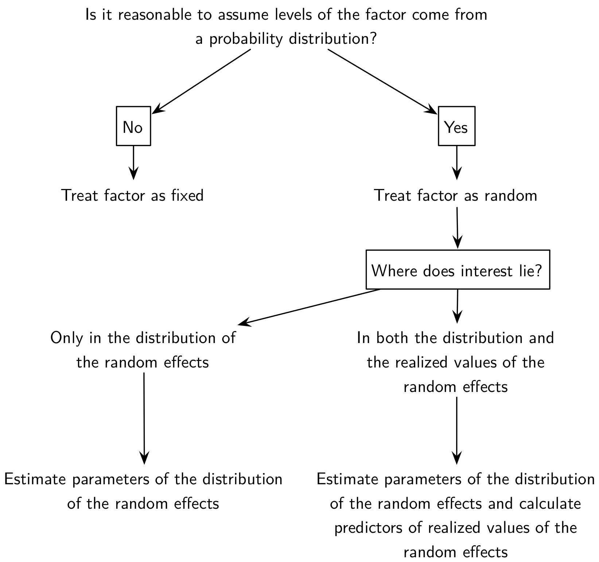
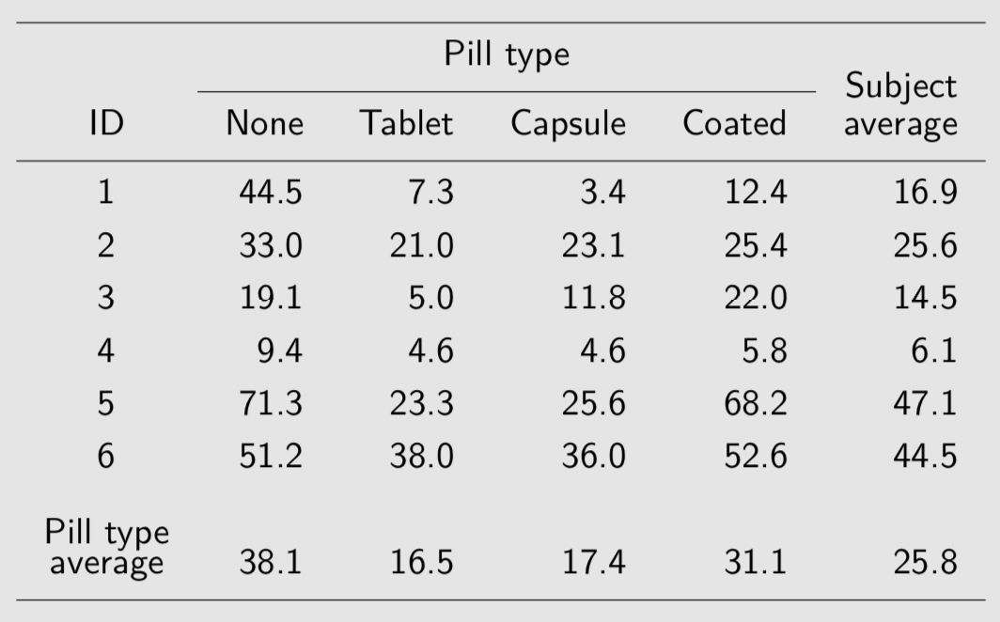
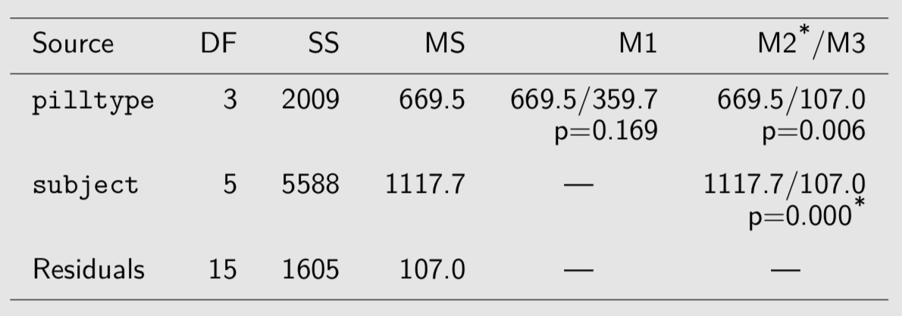
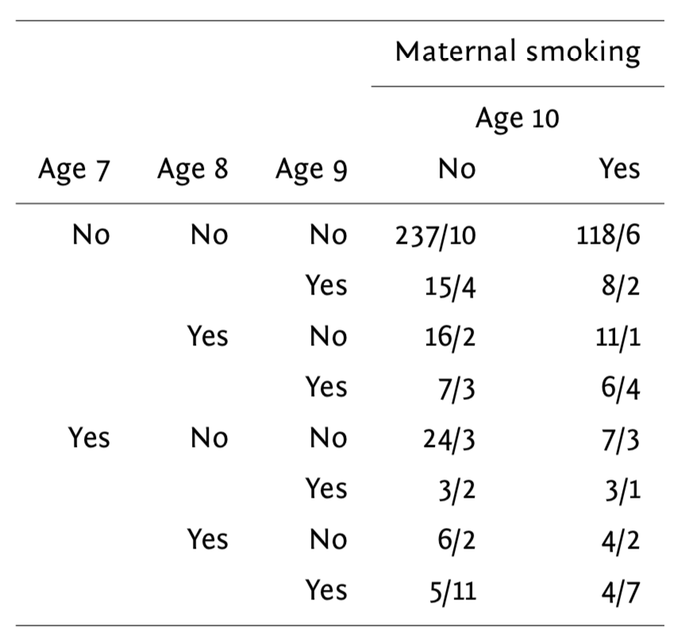

```{r options_communes, include=FALSE}
source("options_communes.R")
```

## De la régression linéaire aux modèles mixtes

### Généralités

Dans un modèle de régression classique, il s'agit d'étudier la liaison statistique entre une variable à expliquer <var>Y</var> et des variables explicatives <var>X</var> non aléatoire. Soit <var>y~i~</var> la réponse de l'individu <var>i</var> et <var>x~i~</var> les valeurs prises par les variables explicatives pour cet individu. La relation entre <var>X</var> et <var>Y</var> peut s'écrire sous la forme :

$$y_{i}=\alpha +\beta x_{i}+\varepsilon_{i}$$

où $\varepsilon_{i}$ est une variable aléatoire distribuée selon une loi normale d'espérance nulle et représentant les <dfn>résidus du modèle</dfn><dfn data-index="modèle, résidus"></dfn> ou <dfn>erreurs</dfn>, $\alpha$ correspond à ce qu'on appelle l'<dfn>intercept</dfn> et $\beta$ représente les <dfn>coefficients du modèle</dfn><dfn data-index="modèle, coefficients"></dfn>.

Dans un modèle classique, les erreurs sont supposées être indépendantes et identiquement distribuées selon une loi normale. Or, ce n'est pas le cas dans un certain nombres de cas : lorsque plusieurs réponses sont disponibles pour le même individu pour un même <var>x~i~</var> (cas des mesures répétées), lorsque plusieurs observations sont naturellement groupées (par exemple, les membres d'une famille, des jumeaux homozygotes, des patients dans une même unité de soins, etc.), ou lorsque l'on collecte des données au cours du temps chez un même individu. Les <dfn data-index="modèle mixte">modèles mixtes<dfn><dfn data-index="mixte, modèle"></dfn> ou <dfn data-index="modèle à effets aléatoires">modèles à effets aléatoires</dfn> permettent de prendre en considération ce type d'information et de généraliser l'approche déjà connue pour l'estimation des paramètres d'un modèle de régression linéaire classique (pour observations indépendantes).

<figure>

<figcaption>Typologie des modèles de régression</figcaption>
</figure>

### Modèles mixtes (GLMM)

Par rapport au modèle linéaire (généralisé) classique, les modèles mixtes (GLMM dans la littérature anglo-saxonne) considèrent, en plus des effets fixes, des effets aléatoires qui permettent de refléter la corrélation entre les unités statistiques. Ce type de données en cluster s'observe lorsque des unités statistiques sont groupées ensemble (étudiants dans des écoles), en raison d'une corrélation intra-unité (données longitudinales) ou un mélange des deux (performance mesurée au cours du temps pour différents groupes de sujets).

On rattache ce type de modèle aux approches conditionnelles, par opposition aux approches marginales telles que les GLS ou les GEE, décrites dans la deuxième partie de ce chapitre. Les modèles mixtes ne se limitent pas à un seul niveau de cluster, et il peut exister une hiérarchie de clusters imbriqués les uns dans les autres, d'où l'appelation de modèles hiérarchiques dans certains cas de figure.

En ce qui concerne les effets fixes _versus_ aléatoires, il existe peu de définition consensuelle, mais on peut considérer le schéma suivant pour décider si un effet doit être considéré comme fixe ou aléatoire :

<figure>

<figcaption>Schéma décisionnel pour définir un effet</figcaption>
</figure>

L'analyse des données corrélées ou appariées permet de mettre en lumière l'importance de tenir compte de la structure de corrélation intra-unité. Voici l'exemple célèbre des données sur le sommeil utilisé par W. Gosset pour présenter son test de Student :

```{r}
t.test(extra ~ group, data=sleep)
t.test(extra ~ group, data=sleep, paired = TRUE)
```

Le résultat du test dans le premier cas de figure, qui ignore complètement l'appariement, se révèle non significatif alors que la prise en compte de l'appariement indique qu'il existe bien une différence significative dans le gain de sommeil selon le type d'hypnotique administré.

Ignorer la corrélation intra-unité résulte en test généralement moins puissant sur le plan statistique. On sait que dans le cas où deux variables aléatoires, $X_1$ et $X_2$, ne sont pas indépendantes, la variance de leur différence vaut :

$$ \text{Var}(X_1-X_2)=\text{Var}(X_1)+\text{Var}(X_2)-2\text{Cov}(X_1,X_2). $$

Considérer que $\text{Cov}(X_1,X_2)=0$ revient à sur-estimer la variance de la différence, dans la mesure où $\text{Cov}(X_1,X_2)$ est généralement positive, soulignant le fait que les individus ayant un niveau plus élevé sur le premier niveau de la variable explicative ont généralement un niveau plus élevé que les autres sur le second niveau. On peut visualiser cette tendance très clairement avec les données "sleep" :

<figure>

```{r}
library(lattice)
library(gridExtra)
#lattice.options(default.theme=brewer.theme)
trellis.par.set(strip.background = list(col = 'transparent'))
data(sleep)
xyplot(extra ~ group, data=sleep, groups=ID, type="l")
```

<figcaption>Les données "sleep" de Student</figcaption>
</figure>

### Cas de l'ANOVA à mesures répétées

Voici des données concernant l'excès de graisse dans les scelles suite à une défaillance des enzymes de digestion dans l'intestin. Des suppléments en enzyme pancréatique permettent de corriger ce problème, la question étant de déterminer quel est le meilleur mode d'administration (tablette, capsule, enrobé) :

<figure>

</figure>

Il n'y a qu'un seul prédicteur, le type de comprimé, qui est attaché au sujet et à la période d'administration dans le temps (répétition sur un même sujet). On dispose de plusieurs manières de décomposer la variance totale :

```{r}
fat <- data.frame(fecfat = c(44.5,33.0,19.1,9.4,71.3,51.2,
                             7.3,21.0,5.0,4.6,23.3,38.0,
                             3.4,23.1,11.8,4.6,25.6,36.0,
                             12.4,25.4,22.0,5.8,68.2,52.6),
                  pilltype = gl(4, 6, labels = c("None", "Tablet", "Capsule", "Coated")),
                  subject = gl(6, 1))
summary(aov1 <- aov(fecfat ~ pilltype, data = fat))                    # (M1) one-way ANOVA
summary(aov2 <- aov(fecfat ~ pilltype + subject, data = fat))          # (M2) two-way ANOVA
summary(aov3 <- aov(fecfat ~ pilltype + Error(subject), data = fat))   # (M3) RM ANOVA
```

Voici les résultats que l'on obtient avec ces trois modèles résumés dans un tableau de synthèse :

<figure>

</figure>

Le premier modèle, qui suppose les observations indépendantes, ne supprime pas la variance entre sujets (presque 78~\% de la variance résiduelle). Les deux modèles suivants, `M2` et `M3`, incorpore chacun des effets spécifiques aux sujets :

$$
y_{ij} = \mu + \text{subject}_i + \text{pilltype}_j + \varepsilon_{ij},\quad \varepsilon_{ij}\sim{\cal N}(0,\sigma_{\varepsilon}^2). 
$$

Dans le troisième modèle (`M3`), on suppose de plus que $\text{subject}_i\sim{\cal N}(0,\sigma_{s}^2)$, indépendant de $\varepsilon_{ij}$. L'inclusion de termes aléatoires sujet-spécifique permet de modéliser différents types de corrélation intra-unité au niveau de la variable réponse. Considérons la corrélation entre des mesures prises successivement chez le même individu. On sait que :

$$ \text{Cor}(y_{ij},y_{ik})=\frac{\text{Cov}(y_{ij},y_{ik})}{\sqrt{\text{Var}(y_{ij})}. $$

Puisque $\mu$ et $\text{pilltype}$ sont fixes, et que $\varepsilon_{ij}\perp \text{subject}_i$, on a donc :

$$
\begin{align}
\text{Cov}(y_{ij},y_{ik}) & = \text{Cov}(subject_i,subject_i) \cr
& = \text{Var}(subject_i) \cr
& = \sigma_{s}^2,
\end{align}
$$

et les composantes de variance résultent du fait que $\text{Var}(y_{ij})=\text{Var}(subject_i)+\text{Var}(\varepsilon_{ij})=\sigma_{s}^2+\sigma_{\varepsilon}^2$, que l'on suppose vrai pour toutes les observations. De sorte qu'on arrive à la quantité que nous recherchions, à savoir la corrélation entre deux mesures, $j$ et $k$, prises chez le même individu $i$ :

$$ \text{Cor}(y_{ij},y_{ik})=\frac{\sigma_{s}^2}{\sigma_{s}^2+\sigma_{\varepsilon}^2}. $$

Cette valeur reflète la proportion de la variance totale qui est dûe aux individus eux-mêmes. On la dénomme également corrélation intraclasse, $\rho$, et elle permet de quantifier le degré de proximité entre les observations de différents individus (on parle également de similarité intra-cluster) :

- la variabilité entre sujets augmente ou diminue simultanément toutes les observations d'un même sujet ;
- la structure de variance-covariance du modèle ci-dessus est appelée "symétrie composée".

On retrouve alors l'égalité $\sigma^2=\sigma_s^2+\sigma_{\varepsilon}^2$, qui revient à :

$$
\begin{bmatrix}
\sigma_{s}^2+\sigma_{\varepsilon}^2 & \sigma_{s}^2 & \sigma_{s}^2 & \sigma_{s}^2 \cr
\sigma_{s}^2 & \sigma_{s}^2+\sigma_{\varepsilon}^2 & \sigma_{s}^2 & \sigma_{s}^2 \cr
\sigma_{s}^2 & \sigma_{s}^2 & \sigma_{s}^2+\sigma_{\varepsilon}^2 & \sigma_{s}^2 \cr
\sigma_{s}^2 & \sigma_{s}^2 & \sigma_{s}^2 & \sigma_{s}^2+\sigma_{\varepsilon}^2 \cr
\end{bmatrix} = \sigma^2
\begin{bmatrix}
1 & \rho & \dots & \rho \cr
\rho & 1 & & \rho \cr
\vdots & & \ddots & \vdots \cr
\rho & \rho & \dots & 1 \cr
\end{bmatrix}
$$

L'estimation de $\rho$ passe par l'observation suivante : les observations prises sur un même sujet sont modélisés _via_ leur effet aléatoire (sujet-spécifique) partagé. En utilisant le modèle à intercept aléatoire considéré plus haut, il est possible d'estimer $\rho$ à l'aide du package `nlme`{.pkg} :

```{r}
library(nlme)
lme.fit <- lme(fecfat ~ pilltype, data = fat,
               random = ~ 1 | subject)
anova(lme.fit)
intervals(lme.fit)
sigma.s <- as.numeric(VarCorr(lme.fit)[1,2])
sigma.eps <- as.numeric(VarCorr(lme.fit)[2,2])
sigma.s^2 / (sigma.s^2+sigma.eps^2)
```

On notera qu'une estimation par maximum de vraisemblance restreint (REML) est utilisée par défaut : les effets aléatoires sont estimés après avoir enlevé les effets fixes. On retiendra également que les tests de rapport de vraisemblance sur les termes aléatoires de ce genre de modèle ($H_0:\, \sigma^2=0$) sont conservateurs.

Il est toujours possible de retrouver $\rho$ à partir du tableau d'ANOVA et des composantes de variance :

```{r}
ms <- anova(lm(fecfat ~ pilltype + subject,
               data = fat))[[3]]
vs <- (ms[2] - ms[3])/nlevels(fat$pilltype)
vr <- ms[3]
vs / (vs+vr)
```

Notons que l'on pourrait également procéder de même avec une approche (marginale) GLS :

```{r}

gls.fit <- gls(fecfat ~ pilltype, data = fat,
               corr = corCompSymm(form = ~ 1 | subject))
anova(gls.fit)
intervals(gls.fit)
```

On pourra vérifier que la structure ed variance-covariance imposée se reflète bien dans les données prédites par un tel modèle :

<figure>

```{r}
fat$pred <- predict(lme.fit)
p1 <- xyplot(fecfat ~ reorder(pilltype, fecfat), data = fat, groups = subject,
             type = "a", xlab = "Pill type", ylab = "Fecal fat (g/day)",
             scales = list(y = list(at = seq(0, 80, by = 20))))
p2 <- xyplot(pred ~ reorder(pilltype, fecfat), data = fat, groups = subject,
             type = "a", xlab = "Pill type", ylab = "Predicted fecal fat (g/day)",
             scales = list(y = list(at = seq(0, 80, by = 20))))
grid.arrange(p1, p2, nrow = 1)
```

<figcaption>Valeurs observées et prédites pour l'étude "fecal fat"</figcaption>
</figure>

Quelques remarques :

- pour un dessin expérimental équilibré, la variance résiduelle d'une ANOVA à effet intra (cas des mesures répétées) et celle d'un modèle à intercept aléatoire sont identiques (l'estimateur REML est équivalent au carré moyen de l'ANOVA) ; de même les effets liés au type de comprimé seront identiques aux moyennes marginales ;
- le test de la significativité des effets fixes peut être réalisé à l'aide de l'ANOVA (tests F) ou par comparaison de modèles emboîtés ; dans ce dernier cas, il est nécessaire d'estimer les paramètres du modèle mixte par maximum de vraismeblance et non par REML puisque les modèles emboîtés vont inclure des effets fixes différents :

```{r}
anova(lme.fit)
lme.fit <- update(lme.fit, method = "ML")
lme.fit0 <- update(lme.fit, fixed = . ~ - pilltype)
anova(lme.fit, lme.fit0)
```

D'autres matrices de variance-covariance peuvent être retenues pour les modèles, en fonction du type de dessin expérimental. Le modèle à intercept aléatoire nous assure que la matrice e variance-covariance sera correctement contrainte. Dans le cas de l'ANOVA à mesures répétées, il est d'usage d'appliquer une correction de sphéricité (Greenhouse-Geisser ou Huynh-Feldt) ou d'utiliser une MANOVA mais celle-ci possède moins de puissance statistique. Les modèles mixtes restent donc plus souples dans la mesure où ils permettent de faire de l'inférence sur la structure de corrélation et de réaliser des comparaisons de modèle.

### Cas des données longitudinales

Les données suivantes sont tirées du package `lme4`{.pkg}:

> Average reaction time per day for subjects in a sleep deprivation study. On day 0 the subjects had their normal amount of sleep. Starting that night they were restricted to 3 hours of sleep per night. The observations represent the average reaction time on a series of tests given each day to each subject.

<figure>

```{r}
detach(package:nlme)
library(lme4)
data(sleepstudy)
xyplot(Reaction ~ Days | Subject, data = sleepstudy,
       layout = c(9,2), type=c("g", "p", "r"),
       index.cond = function(x,y) coef(lm(y ~ x))[1],
       xlab = "Days of sleep deprivation",
       ylab = "Average reaction time (ms)")
```

<figcaption>Temps de réaction en fonction de la durée de privation de sommeil</figcaption>
</figure>

Considérons dans un premier temps de simples régressions linéaires pour chaque sujet :

```{r}
reg.subj <- lmList(Reaction ~ Days | Subject, sleepstudy)
reg.subj.df <- data.frame(lapply(reg.subj, coef))
apply(reg.subj.df, 1, quantile, prob = c(.25, .75))
coef(lm(Reaction ~ Days, data = sleepstudy))
```

Voici ce que cela donne visuellement :

<figure>

```{r}
intcpt.dens <- density(as.numeric(reg.subj.df[1,]), adj = 1.2)
len <- length(intcpt.dens$x)
xyplot(Reaction ~ Days, data = sleepstudy,
       xlim = c(0, 8), ylab = "Fitted reaction time",
       scales = list(x = list(at = seq(0, 8, by = 1))),
       panel = function(x, y) {
         apply(reg.subj.df, 2, panel.abline, col = "lightgrey")
         panel.lines(x = c(intcpt.dens$y*100, rep(0, len)),
                     y = c(intcpt.dens$x, rev(intcpt.dens$x)))
         panel.lmline(x, y, col = "black", lwd = 2)
       })
```

<figcaption>Droites de régression individuelles</figcaption>
</figure>

On voit clairement que les sujets présentent des profils d'évolution différents et l'équation de la droite de régression globale est : $\tilde y = 251.4 + 10.5x.$. La question qui se pose est : dans quelle mesure cette équation capture t-elle la tendance observée entre les différents sujets ?

Les estimations par moindres carrés sujet-spécifique sont bel et bien correctes mais l'erreur standard des paramètres de ces modèles sont biaisés puisque l'on suppose l'indépendance des observations. Les prédictions seront également incorrectes.

Voici quelques modèles à effets aléatoires plausibles pour ce type de données :

- Random-intercept model : `Reaction ~ Days + (1 | Subject)`
- Random-intercept and slope model : `Reaction ~ Days + (Days | Subject)`
- Uncorrelated random effects (intercept and slope) : `Reaction ~ Days + (1 | Subject) + (0 + Days | Subject)`

```{r}
lme.mod1 <- lmer(Reaction ~ Days + (1 | Subject), data = sleepstudy)
lme.mod2 <- lmer(Reaction ~ Days + (Days | Subject), data = sleepstudy)
lme.mod3 <- lmer(Reaction ~ Days + (1 | Subject) + (0 + Days | Subject),
                 data = sleepstudy)
anova(lme.mod1, lme.mod2, lme.mod3)
```

Concernant la prédiction des effets aléatoires, on retiendra que dans un modèle à effets aléatoires les coefficients de régression ne sont plus des paramètres et ils ne peuvent donc pas être estimés comme dans un modèle classique. de plus, leur espérance mathématique est nulle. Cela dit, il est toujours possible de reposer sur leur distribution _a posteriori_. En combinant les modes conditionnels des effets aléatoires et les estimés des effets fixes, on obtient ce que l'on appelle les modes conditionnels des coefficients intra-sujet (cf. `mcmcsamp`{data-pkg="lme4"}). Les valeurs prédites s'écriront donc :

$$ \tilde y_i= (\underbrace{\hat\beta_0}_{\small\text{Fixed}}+\underbrace{\phantom{{\hat\beta_0}}\kern-2.3ex\hat u_{0i}}_{\small\text{Random}}) + (\hat\beta_1+\hat u_{1i})x. $$

Il est assez facile de vérifier que les effets aléatoires prédits sont reliés aux effets fixes :

```{r}
lm.mod1 <- aov(Reaction ~ Days + Subject, data = sleepstudy)
subj.fixef <- model.tables(lm.mod1, cterms = "Subject")[[1]]$Subject
ranef(lme.mod1)$Subject / subj.fixef
```

<figure>

```{r}
df <- coef(lmList(Reaction ~ Days | Subject, sleepstudy))
cc1 <- as.data.frame(coef(lme.mod2)[["Subject"]])
names(cc1) <- c("A", "B")
df <- cbind(df, cc1)
xyplot(Reaction ~ Days | Subject, sleepstudy,
       layout = c(9,2), type = c("g", "r"),
       coef.list = df[,3:4],
       panel = function(..., coef.list) {
         panel.xyplot(...)
         panel.abline(as.numeric(coef.list[packet.number(),]),
                      col.line = trellis.par.get("superpose.line")$col[2],
                      lty = trellis.par.get("superpose.line")$lty[2]
                      )
       },
       index.cond = function(x,y) coef(lm(y ~ x))[1],
       xlab = "Days of sleep deprivation",
       ylab = "Average reaction time (ms)",
       key = list(space = "top", columns = 2, cex=.8,
         text = list(c("Mixed model", "Within-group")),
         lines = list(col = trellis.par.get("superpose.line")$col[2:1],
           lty = trellis.par.get("superpose.line")$lty[2:1])))
```

<figcaption>Valeurs prédites par les modèles</figcaption>
</figure>

Les valeurs prédites d'un modèle mixte peuvent également être vues comme des estimateurs "shrinkage". Dans les cas les plus simples, le coefficient de régularisation revient à :

$$ \tau = \frac{\sigma_u^2}{\sigma_u^2+\sigma_{\varepsilon}^2/n_i}, $$

où $n_i$ désigne la taille du cluster $i$. Dans le cas présent, $\tau=37.1^2/(37.1^2+31.0^2/10)=0.935$. Il y aura peu de régularisation lorsque les unités statistiques sont très différentes ou que les mesures sont peu précises, ou dans le cas des grands échantillons.

        Random effects:                                    Reaction Days Subject     pred
        Groups   Name        Variance Std.Dev.        1   249.5600    0     308 292.1888
        Subject  (Intercept) 1378.18  37.124          2   258.7047    1     308 302.6561
        Residual              960.46  30.991          3   250.8006    2     308 313.1234
        Number of obs: 180, groups: Subject, 18        4   321.4398    3     308 323.5907
                                                    ...
        Fixed effects:                                 177 334.4818    6     372 332.3246
                    Estimate Std. Error t value        178 343.2199    7     372 342.7919
        (Intercept) 251.4051     9.7459   25.80        179 369.1417    8     372 353.2591
        Days         10.4673     0.8042   13.02        180 364.1236    9     372 363.7264

<figure>

```{r}
intcpt.dens2 <- density(as.numeric(df[,3]), adj = 1.2)
cc2 <- as.data.frame(coef(lme.mod1)[["Subject"]])
df[,3:4] <- cc2
xyplot(Reaction ~ Days, data = sleepstudy,
       xlim = c(0, 8), ylab = "Fitted reaction time",
       scales = list(x  =  list(at = seq(0, 8, by  =  1))),
       panel = function(x, y) {
         apply(df[,1:2], 1, panel.abline, col = "grey30", alpha = .5)
         apply(df[,3:4], 1, panel.abline, col = "#D95F02", alpha = .5)
         panel.lines(x = c(intcpt.dens$y*100, rep(0, len)),
                     y = c(intcpt.dens$x, rev(intcpt.dens$x)), col = "grey30")
         panel.lines(x = c(intcpt.dens2$y*100, rep(0, len)),
                     y = c(intcpt.dens2$x, rev(intcpt.dens2$x)), col = "#D95F02")

       })
```

<figcaption>Valeurs prédites et effet de régularisation</figcaption>
</figure>

<!--- TODO
### Cas des modèles avec données groupées et prédicteur continu
-->

## Cas des données corrélées discrètes

### Approche GEE

Le cas des données discrètes pose en plus le problème du choix de la distribution pour la variable réponse (ou les erreurs). Une distribution binomiale ou multinomiale convient mieux aux cas où la variable modélisée correspond à un choix binaire ou à plus de deux catégories de réponse. De plus, le choix de la stratégie de modélisation influence également les conclusions que l'on peut tirer d'une étude. Comme on l'a vu plus haut, les modèles linéaires mixtes généralisés permettent d'estimer les paramètres sujet-spécifiques d'un modèle de régression en considérant des effets fixes et/ou aléatoires, éventuellement en considérant différentes structures de corrélation. Une alternative consiste à modéliser directement les effets moyens des facteurs fixes, sans se soucier des effets individuels, en supposant toutefois une matrice de corrélation de travail qui permette de rendre compte de la corrélation intra-unité. Cette approche est connue sous le terme Équations d'estimation généralisées (GEE dans la littérature anglo-saxonne).

En ce qui concerne la matrice de corrélation de travail, voici 4 solutions qui peuvent constituer notre modèle de variance. Le premier cas correspond à une matrice d'indépendance (`ind`), où toutes les observations sont indépendantes les unes des autres :

$$
\begin{pmatrix}
1 & 0 & \cdots & 0 \cr
0 & 1 & \cdots & 0 \cr
\vdots & \vdots & \ddots & \vdots \cr
0 & 0 & \cdots & 1
\end{pmatrix}
$$

On peut également considérer le cas d'une structure de corrélation symétrique ou échangeable (`exch`), telle que celle assumée dans une ANOVA à mesures répétées (cf. hypothèse de symétrie composée, ou sphéricité), où $\rho$ désigne la corrélation intraclasse :

$$
\begin{pmatrix}
1 & \rho & \cdots & \rho \cr
\rho & 1 & \cdots & \rho \cr
\vdots & \vdots & \ddots & \vdots \cr
\rho & \rho & \cdots & 1
\end{pmatrix}
$$

Une structure plus libérale consiste à supposer que les corrélations intra-unités sont libres de varier d'une unité à l'autre, et sont donc non structurées (`uns`) :

$$
\begin{pmatrix}
1 & \rho*{1,2} & \cdots & \rho*{1,t} \cr
\rho*{1,2} & 1 & \cdots & \rho*{2,t} \cr
\vdots & \vdots & \ddots & \vdots \cr
\rho*{1,t} & \rho*{2,t} & \cdots & 1
\end{pmatrix}
$$

Enfin, il est également possible, surtout dans le cas des données temporelles, de considérer une structure de corrélation sérielle auto-régressive (`ar`) :

$$
\begin{pmatrix}
1 & \rho & \cdots & \rho^{t-1} \cr
\rho & 1 & \cdots & \rho^{t-2} \cr
\vdots & \vdots & \ddots & \vdots \cr
\rho^{t-1} & \rho^{t-2} & \cdots & 1
\end{pmatrix}
$$

Comment choisir une bonne matrice de corrélation de travail pour notre modèle GEE ? En règle générale, on testera le modèle avec deux matrices de corrélation (p.ex. `exch` et `uns`) pour vérifier si l'une des deux améliore sensiblement la qualité de l'ajustement ou si une structure particulière est bien en accord avec notre modèle de variance présupposé. Voici également quelques critères globaux permettant de choisir l'une ou l'autre des structures de corrélation possibles :

- non structurée : peu d'unités par cluster, dessin expérimental équilibré ;
- échangeable : les unités d'un même cluster n'ont pas d'ordre particulier ;
- auto-régressive : afin de rendre compte d'une réponse variant avec le temps ;
- indépendante : lorsque le nombre de clusters est faible.

Reste la question d'évaluer dans quelle mesure la matrice de corrélation retenue est appropriée, ce qui revient à formuler un test de spécification. La sensibilité à la mauvaise spécification de la matrice de corrélation se reflètera directement dans la précision des paramètres estimés, ou de manière équivalente au niveau de l'amplitude de leurs erreurs standard. Les estimateurs de variance peuvent de surcroît être de type "model-based" (pratique dans le cas d'un faible nombre de clusters, le cas échéant il est toujours possible d'utiliser un estimateur "jacknife") ou empiriques (on parle d'estimateurs "sandwich", et ils sont asymptotiquement sans bias). Mais on retiendra que même si la matrice de corrélation est mal spécifiée, le modèle GEE fournit des résultats valides sous réserve que l'estimateur de variance sandwich soit utilisé.

Voici une petite illustration sur des données tirées d'une étude sur l'effet de la pollution de l'air sur la capacité respiratoires chez 537 enfants agés de 7 à 10 ans. Le fait que la mère fume et le temps constituent les prédicteurs d'intérêt, et la variable réponse est la présence d'un symptôme asthmatique (respiration sifflante). Les données collectées sont résumées dans le tableau suivant :



Le modèle considéré s'écrit :

$$

$$

et on parlera de "mean model" pour désigner un tel modèle dans lequel on s'intéresse à l'effet moyen (ici l'odds-ratio pour le status respiratoire) en fonction des prédicteurs, considérés à effets fixes dans ce modèle. Notons que ce modèle incorpore également un terme d'interaction ($\beta_3$).

Il est également nécessaire de spécifier la fonction variance. Dans ce cas précis, on choisira $\mathbb{V}(\mu)=\phi\mu\cdot(1-\mu)$, avec $\phi=1$ pour le paramètre d'échelle. On ne fait aucune hypothèse sur la distribution des observations.

Voici les données :

```{r}
library(geepack)
data(ohio)
head(ohio, n=8)
length(unique(ohio$id))
```

<figure>

```{r}
smoke.yes <- xtabs(resp ~ id + age, subset(ohio, smoke == 1))
smoke.no <- xtabs(resp ~ id + age, subset(ohio, smoke == 0))
marg.means <- data.frame(resp = c(apply(smoke.yes, 2, mean), apply(smoke.no, 2, mean)),
                         age = gl(4, 1, labels = 7:10, ordered = TRUE),
                         smoke = gl(2, 4, labels = c("smoking", "not smoking")))
library(latticeExtra)
p <- xyplot(resp ~ age, data = marg.means, group = smoke, type = c("l","g"),
            xlab = "Age (years)", ylab = "Wheeziness (%)", lwd = 2)
update(p, par.settings = custom.theme())
```

<figcaption>Fréquence des symptômes respiratoires en fonction du groupe d'âge et du status fumeur de la mère</figcaption>
</figure>

Et voici pour l'application numérique avec le package `geepack`{.pkg}. Le premier modèle que nous considérerons figure une matrice de corrélation de travail de type symétrique :

```{r}
fm <- resp ~ age*smoke
gee.fit <- geese(fm, id = id, data = ohio, family = binomial,
                 corstr = "exch", scale.fix = TRUE)
summary(gee.fit)
```

La corrélation intra-cluster est estimée à $\hat\rho=0.355$, et les résultats suggèrent que la fréquence des symptômes respiratoires diminue significativement ($p<0.001$), mais sans effet du statut fumeur de la mère. L'usage d'une matrice de corrélation non structurée amènerait aux même conclusions. En utilisant le package `gee`{.pkg}, qui repose sur un calcul de type "model-based" des erreurs standard, et une structure de corrélation indépedante, on se retrouverait à sous-estimer les paramètres de variance des effets stationnaires dans le temps :

```{r}
library(gee)
gee.fit.o <- gee(fm, id = id, data = ohio, family = binomial,
                 corstr = "independence", scale.fix = TRUE)
summary(gee.fit.o)$coefficients
```

Les matrices de variance-covariance robuste et naïve pour les paramètres du modèle sont stockées dans l'objet `gee.fit` et sont accessibles, respectivement, à l'aide de `gee.fit$vbeta` et `gee.fit$vbeta.naiv`. Ces deux matrices sont numériquement proches l'une de l'autre, à 3 décimales près :

```{r}
summary(as.vector(gee.fit$vbeta-gee.fit$vbeta.naiv))
```

Voici une autre syntaxe possible, en utilisant directement un estimateur sandwich :

```{r}
gee.fit.exch <- geeglm(fm, id = id, data = ohio, family = binomial,
                       corstr="exch", scale.fix = TRUE, std.err = "san.se")
summary(gee.fit.exch)
print(rob.se <- sqrt(diag(gee.fit.exch$geese$vbeta)))
```

On peut tester individuellement chaque facteur, par exemple le facteur `smoke`, à l'aide d'un test de Wald en comparant les deux modèles emboîtés grâce à la fonction `anova`{data-pkg="geepack"} :

```{r}
gee.fit.exch2 <- geeglm(update(fm, . ~ . - age), id = id, data = ohio, family = binomial,
                        corstr = "exch", scale.fix = TRUE, std.err = "san.se")
anova(gee.fit.exch, gee.fit.exch2)
```

Enfin, un intervalle de confiance à 95~\% peut être estimé comme suit :

```{r}
exp(coef(gee.fit.exch)["age"] + c(-1,1) * rob.se[2] * qnorm(0.975))
library(doBy)
gee.fit.ci <- esticon(gee.fit.exch, diag(4))
exp(gee.fit.ci[,c("Estimate","Lower","Upper")])
```

Le test $z$ de Wald est construit comme $\hat\beta_j/\text{SE}(\hat\beta_j)$ et suit une loi du chi-deux à un degré de liberté. On pourra vérifier qu'en utilisant $\text{SE}(\hat\beta_j)$ de la matrice de variance-covariance robuste (`rob.se` ci-dessus).

Finalement, on peut se demander quelle est la valeur estimée de l'odds-ratio ajusté pour l'âge, qui est significatif dans notre modèle initial. De même, quelle est la valeur de l'odds d'une réponse positive (respiration sifflante) chez des enfants de 8 ans _versus_ 10 ans lorsque la mère fume ou ne fume pas ?

Voici les réponses avec **R** :

```{r}
gee.fit2 <- geeglm(update(fm, . ~ . -age:smoke), id = id,
                   data = ohio, family = binomial,
                   corstr = "exch", scale.fix = TRUE)
exp(coef(gee.fit2)["age"])
gee.fit3 <- geeglm(resp ~ as.factor(age) + smoke, id = id,
                   data = ohio, family = binomial,
                   corstr = "exch", scale.fix = TRUE)
library(doBy) 
e <- esticon(gee.fit3, c(0, -1, 0, 1, 1))
exp(e$Estimate)
```

Enfin, voici un dernier exemple, avec calcul des valeurs (marginales) prédites par un modèle considérant une matrice de corrélation symétrique et un estimateur sandwich :

<figure>

```{r}
gee.fit.exch3 <- geeglm(update(fm, . ~ . - age:smoke), id = id, data = ohio, family = binomial,
                        corstr = "exch", scale.fix = TRUE, std.err = "san.se")
newdf <- expand.grid(age = seq(-2, 1, length = 50), smoke = c(0,1))
newdf <- cbind.data.frame(resp = predict(gee.fit.exch3, newdata = newdf), newdf)
p <- xyplot(exp(resp) ~ age, data = newdf, group = smoke, type = c("l","g"),
            xlab = "Age (years)", ylab = "Wheeziness (%)",
            auto.key = list(corner = c(0, 0), text = c("No", "Yes"), cex = .8))
update(p, par.settings = custom.theme())
```

<figcaption>Probabilités marginales prédites pour les deux groupes au cours du temps</figcaption>
</figure>

### Approche GLMM

On peut comparer les résultats précédents avec ceux que l'on obtiendrait _via_ une approche par modèle linéaire mixte. La syntaxe est la suivante :

```{r}
library(lme4)
fit.glmm <- glmer(resp ~ age + smoke + (1|id), data = ohio,
                 family = binomial)
fixef(fit.glmm)
head(fitted(fit.glmm))
```

On retrouve un effet significatif de l'âge, que l'on pourrait d'ailleurs confirmer à l'aide d'un test du rapport de vraisemblance (`anova(fit.glmm, update(fit.glmm, . ~ . - age))`), $\chi^2(1)=6.86$ with $p=0.009$.

Voici les mêmes paramètres estimés par les modèle GEE et GLMM :

```{r}
gee.fitc <- geeglm(resp ~ as.numeric(age) + smoke, id = id,
                   data = ohio, family = binomial,
                   corstr = "exch", scale.fix = TRUE)
glmm.fitc <- glmer(resp ~ as.numeric(age) + smoke + (1|id), data = ohio,
                  family = binomial)
exp(cbind(coef(gee.fitc), fixef(glmm.fitc)))
```

Quelle est la différence entre cette approche et la précédente ? Dans le cas du modèle mixte, on utilise une approche conditionnelle, d'où la nécessité de spécifier la distribution des effets aléatoires (dans ce cas précis, uniquement les intercepts individuels). Le modèle s'écrit :
$$

$$

avec $\nu_i\sim N(0,\sigma_\nu^2)$ (les effets alatoires ont une moyenne nulle sur l'échelle de lien). En d'autres termes, au lieu de modéliser le log odds moyen de population, ce modèle à effet aléatoire permet de modéliser $\mu$ tout en tenant compte des variations inter-individuelles.

Les approches GEE et GLMM sont équivalentes uniquement dans le cas d'une fonction de lien identité (cas de la régression liénaire), bien que seule l'interprétation, voire le bien fondé, des coefficients du modèle change dans le cas d'autres fonctions de lien.
