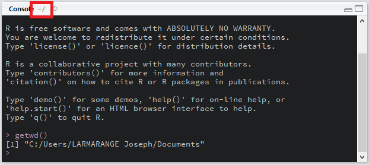
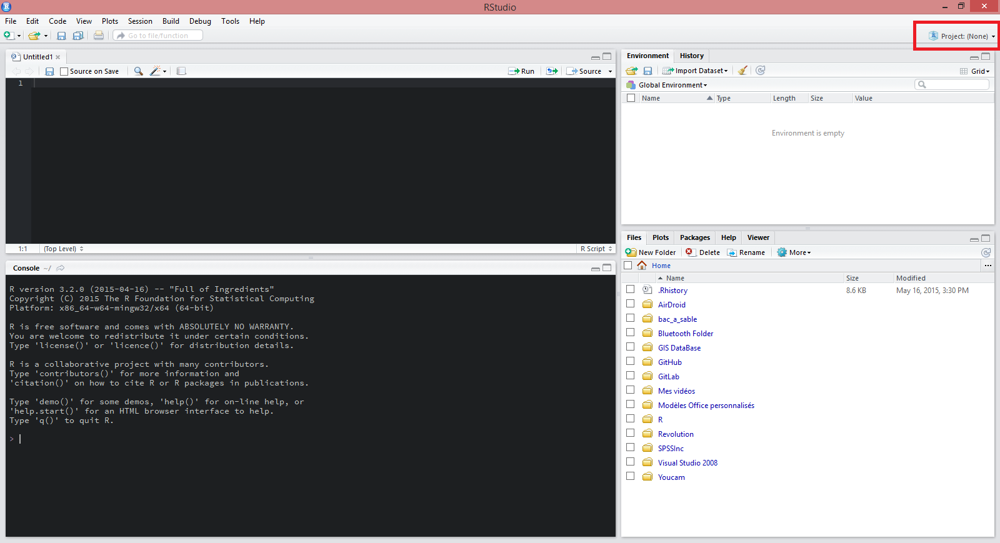
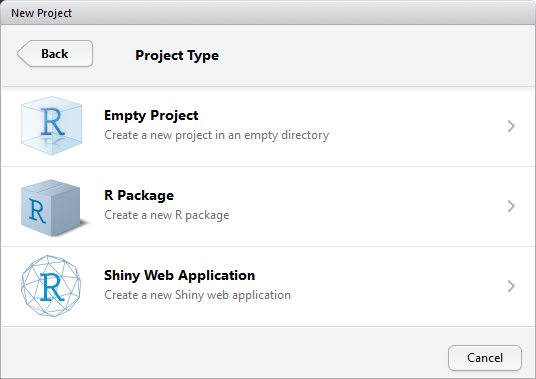
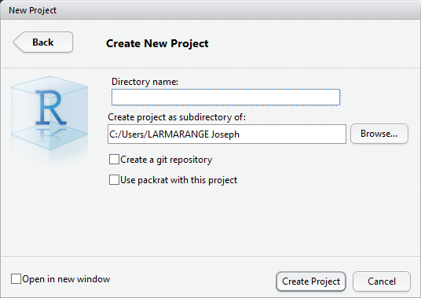

```{r options_communes, include=FALSE}
source("options_communes.R")
```

## Le répertoire de travail

À chaque fois que l'on demandera à **R** de charger ou d'enregistrer un fichier
(en particulier lorsque l'on cherchera à importer des données,
voir le [chapitre dédié](import-de-donnees.html)),
**R** évaluera le nom du fichier qu'on lui a transmis par rapport au 
<dfn>répertoire de travail</dfn> actuellement défini, 
qui correspond au répertoire dans
lequel **R** est actuellement en train de s'exécuter.

Pour connaître de le répertoire de travail actuel, on pourra utiliser la fonction
`getwd`{data-pkg="base"} :

```{r, eval=FALSE}
getwd()
```

Lorsque l'on travaille sous **RStudio**, le répertoire de travail est également affiché
dans le quadrant inférieur droit, en gris, à la droite du mot *Console* (voir la 
capture d'écran ci-après).

<figure>

<figcaption>Affichage du répertoire de travail sous RStudio</figcaption>
</figure>

Le symbole `~` correspond dans ce cas-là au répertoire utilisateur système, 
dont l'emplacement dépend du système d'exploitation. Sous **Windows**,
il s'agit du répertoire *Mes documents* ou *Documents* (le nom varie suivant
la version de **Windows**).

Le répertoire de travail peut être modifié avec la fonction 
`setwd`{data-pkg="base" data-rdoc="getwd"} ou, sous **RStudio**,
via le menu *Session > Set Working Directory*. Cependant, nous allons voir que
nous n'aurons en pratique presque jamais besoin de le faire si l'on travaille avec
**RStudio**.

## Les projets dans RStudio

**RStudio** dispose d'une fonctionnalité très pratique pour organiser son travail en
différents <dfn date-inedx="projet, RStudio">projets</dfn>.

L'idée principale est de réunir tous les fichiers / documents relatifs à un même projet (que ce soit les données, les scripts, les rapports automatisés...) dans un répertoire dédié^[Dans lequel il sera possible de créer des sous-répertoires.].

Le menu *Projects* est accessible via une icône dédiée située tout en haut à droite
(voir la capture d'écran ci-après).

<figure>

<figcaption>Accès au menu Projects sous RStudio</figcaption>
</figure>

### Créer un nouveau projet

Dans le menu *Projects* on sélectionnera l'option *New project*.
**RStudio** nous demandera dans un premier temps si l'on souhaite
créer un projet (i) dans un nouveau répertoire, (ii) dans un répertoire
déjà existant ou bien (iii) à partir d'un <dfn>gestionnaire de versions</dfn> (**Git** ou **SVN**).

<figure>

<figcaption>Options de création de projet sous RStudio</figcaption>
</figure>

Si vous débutez avec **R**, laissez de côté pour le moment les gestionnaires de versions qui sont destinés aux utilisateurs avancés. Dans le cadre d'un usage courant, on aura recours à *New Directory*.

**RStudio** nous demande alors le type de projet que l'on souhaite créer : (i) un projet 
vide, (ii) une extension **R** ou (iii) une application **Shiny**.

<figure>

<figcaption>Les différents types de projet sous RStudio</figcaption>
</figure>

Il est encore un peu tôt pour se lancer dans la création de sa propre extension pour **R** (voir le chapitre [Développer un package](developper-un-package.html)). Les applications **Shiny** (voir le [chapitre dédié](shiny-les-interfaces-interactives.html)) sont des applications webs interactives. Là encore, on attendra une meilleure maîtrise de **R** pour se lancer dans ce type de projets. Dans un contexte d'analyse d'enquêtes, on choisira dès lors *Empty project*.

<figure>

<figcaption>Création d'un projet dans un nouveau répertoire avec RStudio</figcaption>
</figure>

En premier lieu, on indiquera le nom de notre projet, qui sera également le nom du répertoire
qui sera créé pour stocker les données du projet. Puis, on indiquera le répertoire parent,
c'est-à-dire le répertoire dans lequel le répertoire de notre projet sera créé.

Les deux options suivantes concernent que les utilisateurs avancés. **RStudio** nous demande s'il on
veut activer **Git** sur ce projet (**Git** étant un gestionnaire de versions, l'option n'étant
affichée que si **Git** est installé sur votre PC) et s'il on
souhaite utiliser l'extension `packrat`{.pkg} sur ce projet.
`packrat`{.pkg} permet une gestion des extensions utilisées,
projet par projet, ce qui n'est vraiment utile que dans le cadre d'analyses bien
spécifiques.

Il ne nous reste plus qu'à cliquer sur *Create Project*.

### Fonctionnement par défaut des projets

Lorsque l'on ouvre un projet, **RStudio** effectue différentes actions :

* le nom du projet est affiché en haut à droite à côté de l'icône projets ;
* une nouvelle session **R** est exécutée (ainsi s'il on passe d'un projet à
  un autre, les objets du projet qu'on vient de fermer ne sont plus en mémoire) ;
* le répertoire de travail de **R** est défini comme étant le répertoire du projet 
  (d'où le fait que l'on n'a pas à se préoccuper de définir le répertoire de travail
  lorsque l'on travaille avec des projets **RStudio**) ;
* les objets créés (et sauvegardés dans le fichier `.Rdata`) lors d'une précédente 
  séance de travail sont chargés en mémoire ;
* l'historique des commandes saisies lors de nos précédentes séances de travail sont 
  chargées dans l'onglet *History* ;
* les scripts ouverts lors d'une précédente séance de travail sont automatiquement ouverts ;
* divers paramètres de **RStudio** sont restaurés dans l'état dans lequel ils étaient la
  dernière fois que l'on a travaillé sur ce projet.
  
Autrement dit, lorsque l'on ouvre un projet **RStudio**, on revient à l'état de notre 
projet tel qu'il était la dernière fois que l'on a travaillé dessus. Pratique, non ?

Petite précision toutefois, les extensions que l'on avait chargées en mémoire avec
la fonction `library`{data-pkg="base"} ne sont pas systématiquement rechargées
en mémoire. Il faudra donc les appeler à nouveau lors de notre séance de travail.

### Options des projets

Via le menu *Projects > Projects options* (accessible via l'icône projets en haut
à droite), il est possible de personnaliser plusieurs options spécifiquement pour
ce projet.

On retiendra surtout les 3 options principales de l'onglet *General* :

* à l'ouverture du projet, doit-on charger en mémoire les objets sauvegardés 
  lors d'une précédente séance de travail ?
* à la fermeture du projet, doit-son sauvegarder (dans le fichier `.Rdata`)
  les différents objets en mémoire ? Si l'on choisit l'option *Ask*, alors
  une fenêtre vous demandera s'il faut faire cette sauvegarde chaque fois que
  vous fermerez le projet.
* à la fermeture du projet, faut-il sauver l'historique des commandes ?

### Naviguer d'un projet à un autre

**RStudio** se souvient des derniers projets sur lesquels vous avez travaillé.
Lorsque vous cliquez sur le menu projets, vous verrez une liste de ces différents
projets. Il suffit de cliquer sur le nom du projet désiré pour fermer automatiquement
le projet en cours et ouvrir le projet désiré.

Votre projet n'apparait pas dans la liste ? Pas de panique. Il suffit de sélectionner
*Open project* puis de parcourir vos répertoires pour indiquer à **RStudio** le projet
à ouvrir.

Vous pouvez noter au passage une option *Open project in new window* qui permet
d'ouvrir un projet dans une nouvelle fenêtre. En effet, il est tout à fait 
possible d'avoir plusieurs projets ouverts en même temps. Dans ce cas là,
chaque projet aura sa propre session **R**. Les objets chargés en mémoire
pour le projet A ne seront pas accessibles dans le cadre du projet B et
inversement.

### Voir aussi

On pourra se référer à la documentation officielle de **RStudio** :
<https://support.rstudio.com/hc/en-us/articles/200526207-Using-Projects>.

## Appeler un script depuis un autre script

Au sein d'un même projet, on peut avoir plusieurs <dfn data-index="script">scripts **R**</dfn>. 
Cela permet de mieux organiser son code. Par exemple, on pourra avoir un premier script
chargé d'importer les données, un second dédié à la création de nouvelles
variables et un troisième dédié aux analyses statistiques.

Il est possible d'appeler un script au sein d'un autre script à l'aide de la
fonction `source`{data-pkg="base"} à laquelle on précisera le nom de fichier
du script en question.

Supposons par exemple que l'on ait préparé un script `preparation.R` chargé d'importer
les données et de les mettre en forme. Au debut de notre script `analyses.R`, on
pourra indiquer :

```{r, eval=FALSE}
source("preparation.R")
```

Si l'on exécute notre script `analyses.R`, au moment de l'appel à `source("preparation.R")`,
le fichier `preparation.R` sera chargé en mémoire et exécuté, puis le programme continuera
avec les commandes suivant du fichier `analyses.R`.

Ici, on a indiqué à `source`{data-pkg="base"} le fichier `preparation.R` sans mention
de répertoire. Dès lors, **R** va aller chercher ce fichier dans le répertoire de travail.
Sur un gros projet, on peut être amené à organiser ses fichiers en plusieurs sous-répertoires
pour une meilleure lisibilité. Dès lors, il faudra indiquer le <dfn>chemin relatif</dfn> pour accéder
à un fichier, c'est-à-dire le chemin à partir du répertoire de travail. Supposons que notre
fichier `preparation.R` est enregistré dans un sous-répertoire `import`. Dans ce cas-là,
on appelera notre fichier ainsi :

```{r, eval=FALSE}
source("import/preparation.R")
```

<div class="note">
On remarquera qu'on a utilisé une barre oblique ou *slash* (`/`) entre le nom du répertoire et 
le nom du fichier, ce qui est l'usage courant sous **Linux** et **Mac OS X**, tandis que sous
**Windows** on utilise d'ordinaire une barre oblique inversée ou *antislash* (`\`). Sous **R**,
on utilisera toujours la barre oblique simple (`/`), **R** sachant « retrouver ses
petits » selon le système d'exploitation.

Par ailleurs, l'<dfn>autocomplétion</dfn> de **RStudio** fonctionne aussi pour les noms
de fichiers. Essayez par exemple d'appuyer sur la touche <kbd>Tab</kbd> après avoir taper les premières lettres 
du nom de votre fichier.
</div>


