```{r options_communes, include=FALSE}
source("options_communes.R")
```

<div class="note">
La version originale de ce chapitre a été écrite par Julien Barnier dans le cadre de son
[Introduction à R et au *tidyverse*](https://juba.github.io/tidyverse/13-rmarkdown.html).
</div>

<dfn data-index="R Markdown"></dfn><dfn data-index="Markdown"></dfn>

L'extension `rmarkdown`{.pkg} permet de générer des documents de manière dynamique en mélangeant texte mis en forme et résultats produits par du code **R**. Les documents générés peuvent être au format **HTML**, **PDF**, **Word**, et bien d'autres^[On peut citer les formats **odt**, **rtf**, **Markdown**, etc.]. C'est donc un outil très pratique pour l'exportation, la communication et la diffusion de résultats d'analyse.

Le présent document a lui-même été généré à partir de fichiers **R Markdown**.

`rmarkdown`{.pkg} ne fait pas partie du **tidyverse**, mais elle est installée et chargée par défaut par **RStudio**^[Si vous n'utilisez pas ce dernier, l'extension peut être installée à part avec `install.packages("rmarkdown")` et chargée explicitement avec `library(rmarkdown)`.].

Voici un exemple de document **R Markdown** minimal :


```{r echo = FALSE, comment = ""}
cat(htmltools::includeText("resources/rmarkdown/minimal_sample.Rmd"))
```

Ce document peut être <q>compilé</q> sous différents formats. Lors de cette étape, le texte est mis en forme, les blocs de code sont exécutés, leur résultat ajouté au document, et le tout est transformé dans un des différents formats possibles.

Voici le rendu du document précédent au format **HTML** :

<figure>
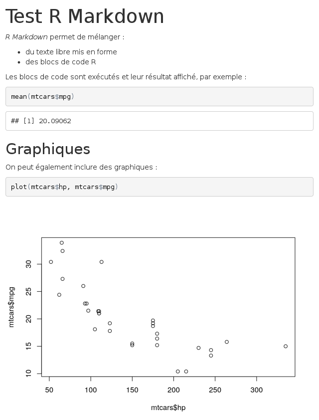
<figcaption>Rendu HTML<figcaption>
</figure>

Le rendu du même document au format **PDF** :

<figure>
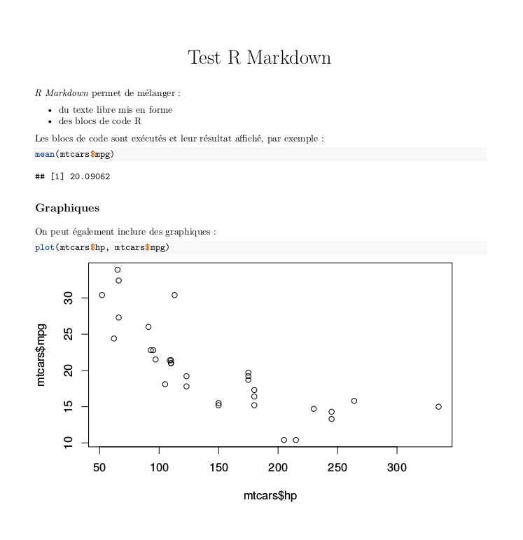
<figcaption>Rendu PDF<figcaption>
</figure>


Et le rendu au format **Word** :

<figure>
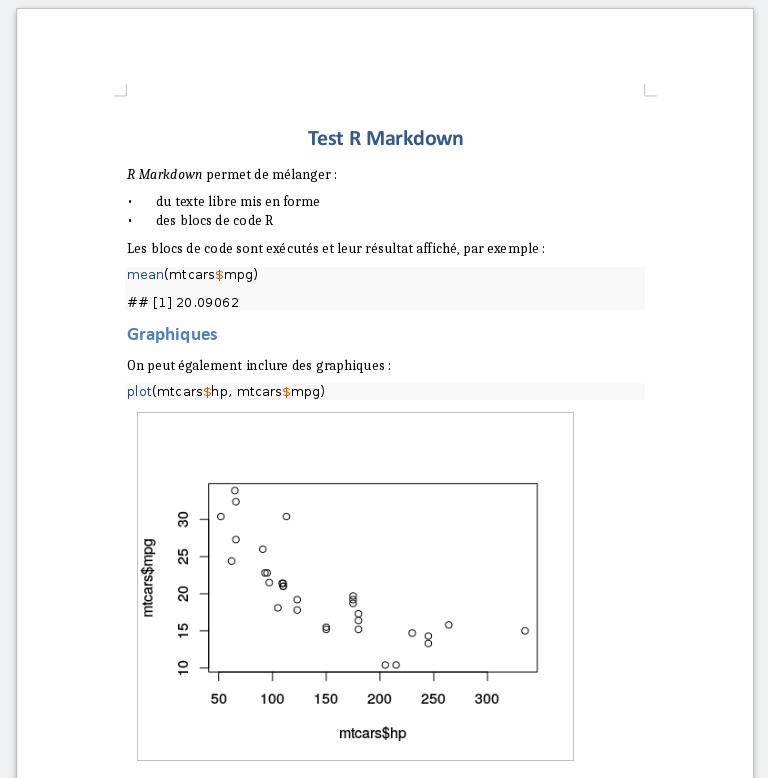
<figcaption>Rendu docx<figcaption>
</figure>

Les avantages de ce système sont nombreux :

- le code et ses résultats ne sont pas séparés des commentaires qui leur sont associés
- le document final est reproductible
- le document peut être très facilement régénéré et mis à jour, par exemple si les données source ont été modifiées.


## Créer un nouveau document

Un document **R Markdown** est un simple fichier texte enregistré avec l'extension `.Rmd`.

Sous **RStudio**, on peut créer un nouveau document en allant dans le menu *File* puis en choisissant *New file* puis *R Markdown...*. La boîte de dialogue suivante s'affiche :

<figure>
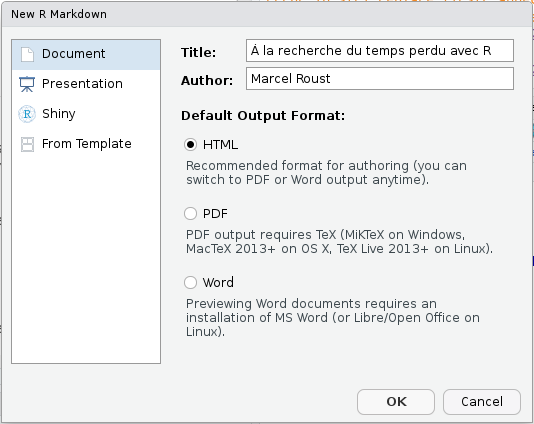
<figcaption>Création d'un document R Markdown<figcaption>
</figure>

On peut indiquer le titre, l'auteur du document ainsi que le format de sortie par défaut (il est possible de modifier facilement ses éléments par la suite). Plutôt qu'un document classique, on verra plus loin qu'on peut aussi choisir de créer une présentation sous forme de slides (entrée *Presentation*) ou de créer un document à partir d'un modèle (Entrée *From Template*).

Un fichier comportant un contenu d'exemple s'affiche alors. Vous pouvez l'enregistrer où vous le souhaitez avec une extension `.Rmd`.


## Élements d'un document R Markdown

Un document **R Markdown** est donc un fichier texte qui ressemble à quelque chose comme ça :

```{r echo = FALSE, comment = ""}
cat(htmltools::includeText("resources/rmarkdown/sample_Rmd.Rmd"))
```


### En-tête (préambule)

La première partie du document est son *en-tête*. Il se situe en tout début de document, et est délimité par trois tirets (`---`) avant et après :

    ---
    title: "Titre"
    author: "Prénom Nom"
    date: "10 avril 2017"
    output: html_document
    ---

Cet en-tête contient les métadonnées du document, comme son titre, son auteur, sa date, plus tout un tas d'options possibles qui vont permettre de configurer ou personnaliser l'ensemble du document et son rendu. Ici, par exemple, la ligne `output: html_document` indique que le document généré doit être au format HTML.


### Texte du document

Le corps du document est constitué de texte qui suit la syntaxe **Markdown**. Un fichier Markdown est un fichier texte contenant un balisage léger qui permet de définir des niveaux de titres ou de mettre en forme le texte. Par exemple, le texte suivant :

    Ceci est du texte avec *de l'italique* et **du gras**.
    
    On peut définir des listes à puces :
    
    - premier élément
    - deuxième élément
    
Génèrera le texte mis en forme suivant :    
    
> Ceci est du texte avec de l'*italique* et du **gras**.
>
> On peut définir des listes à puces :
>  
> - premier élément
> - deuxième élément

On voit que des mots placés entre des astérisques sont mis en italique, des lignes qui commencent par un tiret sont transformés en liste à puce, etc.

On peut définir des titres de différents niveaux en faisant débuter une ligne par un ou plusieurs caractères `#` :

```
# Titre de niveau 1

## Titre de niveau 2

### Titre de niveau 3
```

Quand des titres ont été définis, si vous cliquez sur l'icône *Show document outline* totalement à droite de la barre d'outils associée au fichier R Markdown, une table des matières dynamique générée automatiquement à partir des titres présents dans le document s'affiche et vous permet de naviguer facilement dans celui-ci :

<figure>
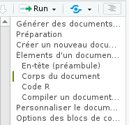
<figcaption>Table des matières dynamique<figcaption>
</figure>


La syntaxe **Markdown** permet d'autres mises en forme, comme la possibilité d'insérer des liens ou des images. Par exemple, le code suivant :

    [Exemple de lien](https://example.com)

Donnera le lien suivant :

> [Exemple de lien](https://example.com)

Dans **RStudio**, le menu *Help* puis *Markdown quick reference* donne un aperçu plus complet de la syntaxe.

### Blocs de code R

En plus du texte libre au format Markdown, un document **R Markdown** contient, comme son nom l'indique, du code **R**. Celui-ci est inclus dans des blocs (<dfn lang="en" data-index="chunk">chunks</dfn>) délimités par la syntaxe suivante :


```{r echo = FALSE, comment = ""}
cat(htmltools::includeText("resources/rmarkdown/code_chunk.Rmd"))
```

Comme cette suite de caractères n'est pas très simple à saisir, vous pouvez utiliser le menu *Insert* de **RStudio** et choisir **R**^[Il est possible d'inclure dans un document **R Markdown** des blocs de code d'autres langages], ou utiliser le raccourci clavier `Ctrl+Alt+i`.

<figure>
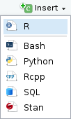
<figcaption>Menu d'insertion d'un bloc de code<figcaption>
</figure>

Dans **RStudio** les blocs de code **R** sont en général affichés avec une couleur de fond légèrement différente pour les distinguer du reste du document.

Quand votre curseur se trouve dans un bloc, vous pouvez saisir le code **R** que vous souhaitez, l'exécuter, utiliser l'autocomplétion, exactement comme si vous vous trouviez dans un script **R**. Vous pouvez également exécuter l'ensemble du code contenu dans un bloc à l'aide du raccourci clavier `Ctrl+Shift+Entrée`.

Dans **RStudio**, par défaut, les résultats d'un bloc de code (texte, tableau ou graphique) s'affichent directement *dans* la fenêtre d'édition du document, permettant de les visualiser facilement et de les conserver le temps de la session ^[Ce comportement peut être modifié en cliquant sur l'icône d'engrenage de la barre d'outils et en choisissant *Chunk Output in Console*].

Lorsque le document est <q>compilé</q> au format **HTML**, **PDF** ou **docx**, chaque bloc est exécuté tour à tour, et le résultat inclus dans le document final, qu'il s'agisse de texte, d'un tableau ou d'un graphique. Les blocs sont liés entre eux, dans le sens où les données importées ou calculées dans un bloc sont accessibles aux blocs suivants. On peut donc aussi voir un document **R Markdown** comme un script **R** dans lequel on aurait intercalé du texte libre au format **Markdown**.

<div class="note">
À noter qu'avant chaque compilation, une nouvelle session **R** est lancée, ne contenant aucun objet. Les premiers blocs de code d'un document sont donc souvent utilisés pour importer des données, exécuter des recodages, etc.
</div>


### Compiler un document (*Knit*)

On peut à tout moment compiler, ou plutôt <q>tricoter</q> (*Knit*), un document **R Markdown** pour obtenir et visualiser le document généré. Pour cela, il suffit de cliquer sur le bouton *Knit* et de choisir le format de sortie voulu :

<figure>
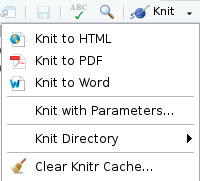
<figcaption>Menu *Knit*<figcaption>
</figure>

Vous pouvez aussi utiliser le raccourci `Ctrl+Shift+K` pour compiler le document dans le dernier format utilisé.


<div class="important">
Pour la génération du format PDF, vous devez avoir une installation fonctionnelle de `LaTeX` sur votre système. C'est en général le cas pour des ordinateurs Mac ou Linux, mais pas sous Windows : dans ce cas vous devrez installer une distribution comme [MiKTeX](https://miktex.org/).
</div>


Un onglet *R Markdown* s'ouvre dans la même zone que l'onglet *Console* et indique la progression de la compilation, ainsi que les messages d'erreur éventuels. Si tout se passe bien, Le document devrait s'afficher soit dans une fenêtre *Viewer* de **RStudio** (pour la sortie **HTML**), soit dans le logiciel par défaut de votre ordinateur.

## Personnaliser le document généré

La personnalisation du document généré se fait en modifiant des options dans le préambule du document. **RStudio** propose néanmoins une petite interface graphique permettant de changer ces options plus facilement. Pour cela, cliquez sur l'icône en forme d'engrenage à droite du bouton *Knit* et choisissez *Output Options...*

<figure>

<figcaption>Options de sortie R Markdown<figcaption>
</figure>


Une boîte de dialogue s'affiche vous permettant de sélectionner le format de sortie souhaité et, selon le format, différentes options :


<figure>
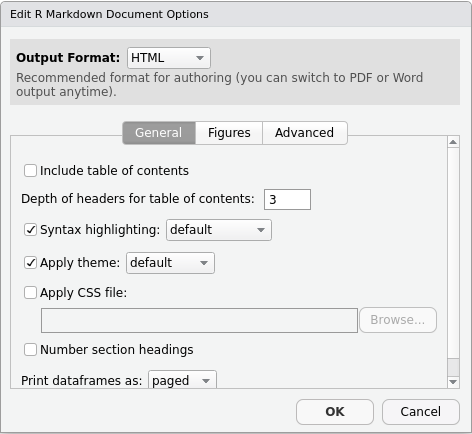
<figcaption>Dialogue d'options de sortie R Markdown<figcaption>
</figure>


Pour le format **HTML** par exemple, l'onglet *General* vous permet de spécifier si vous voulez une table des matières, sa profondeur, les thèmes à appliquer pour le document et la coloration syntaxique des blocs **R**, etc. L'onglet *Figures* vous permet de changer les dimensions par défaut des graphiques générés.

<div class="note">
Une option très intéressante pour les fichiers **HTML**, accessible via l'onglet *Advanced*, est l'entrée *Create standalone HTML document*. Si elle est cochée (ce qui est le cas par défaut), le document **HTML** généré contiendra en un seul fichier le code HTML mais aussi les images et toutes les autres ressources nécessaires à son affichage. Ceci permet de générer des fichiers (parfois assez volumineux) que vous pouvez transférer très facilement à quelqu'un par mail ou en le mettant en ligne quelque part. Si la case n'est pas cochée, les images et autres ressources sont placées dans un dossier à part.
</div>


Lorsque vous changez des options, **RStudio** va en fait modifier le préambule de votre document. Ainsi, si vous choisissez d'afficher une table des matières et de modifier le thème de coloration syntaxique, votre en-tête va devenir quelque chose comme :

    ---
    title: "Test R Markdown"
    output:
       html_document: 
         highlight: kate
         toc: yes
    ---

Vous pouvez modifier les options directement en éditant le préambule. 

À noter qu'il est possible de spécifier des options différentes selon les formats, par exemple :

    ---
    title: "Test R Markdown"
    output:
      html_document: 
        highlight: kate
        toc: yes
      pdf_document: 
        fig_caption: yes
        highlight: kate
    ---

La liste complète des options possibles est présente sur [le site de la documentation officielle](http://rmarkdown.rstudio.com/formats.html) (très complet et bien fait) et sur l'antisèche et le guide de référence, accessibles depuis **RStudio** via le menu *Help* puis *Cheatsheets*.


## Options des blocs de code R

Il est également possible de passer des options à chaque bloc de code **R** pour modifier son comportement.

On rappelle qu'on bloc de code se présente de la manière suivante :

```{r echo = FALSE, comment = ""}
cat(htmltools::includeText("resources/rmarkdown/code_chunk.Rmd"))
```

Les options d'un bloc de code sont à placer à l'intérieur des accolades `{r}`.

### Nom du bloc

La première possibilité est de donner un *nom* au bloc. Celui-ci est indiqué directement après le `r` :

`{r nom_du_bloc}`

Il n'est pas obligatoire de nommer un bloc, mais cela peut être utile en cas d'erreur à la compilation, pour identifier le bloc ayant causé le problème. Attention, on ne peut pas avoir deux blocs avec le même nom.

### Options

En plus d'un nom, on peut passer à un bloc une série d'options sous la forme `option = valeur`. Voici un exemple de bloc avec un nom et des options :

```{r echo = FALSE, comment = ""}
cat(htmltools::includeText("resources/rmarkdown/code_chunk_name_options.Rmd"))
```

Et un exemple de bloc non nommé avec des options :

```{r echo = FALSE, comment = ""}
cat(htmltools::includeText("resources/rmarkdown/code_chunk_noname_options.Rmd"))
```

Une des options la plus utile est l'option `echo`. Par défaut `echo` vaut `TRUE`, et le bloc de code **R** est inséré dans le document généré, de cette manière : 

```{r}
x <- 1:5
print(x)
```

Mais si on positionne l'option `echo=FALSE`, alors le code **R** n'est plus inséré dans le document, et seul le résultat est visible :

```{r echo=FALSE}
x <- 1:5
print(x)
```

Voici une liste de quelques unes des options disponibles :

Option   |    Valeurs    |  Description
---------|---------------|-------------------------------------------
echo     | TRUE/FALSE    | Afficher ou non le code R dans le document
eval     | TRUE/FALSE    | Exécuter ou non le code R à la compilation
include  | TRUE/FALSE    | Inclure ou non le code R et ses résultats dans le document
results  | "hide"/"asis"/"markup"/"hold" | Type de résultats renvoyés par le bloc de code
warning  | TRUE/FALSE    | Afficher ou non les avertissements générés par le bloc
message  | TRUE/FALSE    | Afficher ou non les messages générés par le bloc

Il existe de nombreuses autres options décrites notamment dans [guide de référence R Markdown](https://www.rstudio.com/wp-content/uploads/2015/03/rmarkdown-reference.pdf) (PDF en anglais).


### Modifier les options

Il est possible de modifier les options manuellement en éditant l'en-tête du bloc de code, mais on peut aussi utiliser une petite interface graphique proposée par **RStudio**. Pour cela, il suffit de cliquer sur l'icône d'engrenage située à droite sur la ligne de l'en-tête de chaque bloc :

<figure>
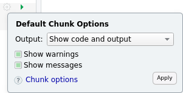
<figcaption>Menu d'options de bloc de code<figcaption>
</figure>


Vous pouvez ensuite modifier les options les plus courantes, et cliquer sur *Apply* pour les appliquer.


### Options globales

On peut vouloir appliquer une option à l'ensemble des blocs d'un document. Par exemple, on peut souhaiter par défaut ne pas afficher le code **R** de chaque bloc dans le document final.

On peut positionner une option globalement en utilisant la fonction `knitr::opts_chunk$set()`.
Par exemple, insérer `knitr::opts_chunk$set(echo = FALSE)` dans un bloc de code positionnera l'option `echo = FALSE` par défaut pour tous les blocs suivants.

En général, on place toutes ces modifications globales dans un bloc spécial nommé `setup` et qui est le premier bloc du document :

```{r echo=FALSE, comment=""}
cat(htmltools::includeText("resources/rmarkdown/setup_chunk.Rmd"))
```

<div class="note">
Par défaut RStudio exécute systématiquement le contenu du bloc `setup` avant d'exécuter celui d'un autre bloc.
</div>


### Mise en cache des résultats

Compiler un document **R Markdown** peut être long, car il faut à chaque fois exécuter l'ensemble des blocs de code R qui le constituent.

Pour accélérer cette opération, **R Markdown** utilise un système de *mise en cache* : les résultats de chaque bloc sont enregistrés dans un fichier et à la prochaine compilation, si le code et les options du bloc n'ont pas été modifiés, c'est le contenu du fichier de cache qui est utilisé, ce qui évite d'exécuter le code R.

<div class="note">
On peut activer ou désactiver la mise en cache des résultats pour chaque bloc de code avec l'option `cache = TRUE` ou `cache = FALSE`, et on peut aussi désactiver totalement la mise en cache pour le document en ajoutant `knitr::opts_chunk$set(echo = FALSE)` dans le premier bloc *setup*.
</div>


Ce système de cache peut poser problème par exemple si les données source changent : dans ce cas les résultats de certains blocs peuvent ne pas être mis à jour s'ils sont présents en cache. Dans ce cas, on peut vider le cache du document, ce qui forcera un recalcul de tous les blocs de code à la prochaine compilation. Pour cela, vous pouvez ouvrir le menu *Knit* et choisir *Clear Knitr Cache...* :

<figure>

<figcaption>Menu *Knit*<figcaption>
</figure>


## Rendu des tableaux

### Tableaux croisés

Par défaut, les tableaux issus de la fonction `table`{data-pkg="base"} sont affichés comme ils apparaissent dans la console de **R**, en texte brut :

```{r}
library(questionr)
data(hdv2003)
tab <- lprop(table(hdv2003$qualif, hdv2003$sexe))
tab
```

On peut améliorer leur présentation en utilisant la fonction `kable`{data-pkg="knitr"} de l'extension `knitr`{.pkg}. Celle-ci fournit un formatage adapté en fonction du format de sortie. On aura donc des tableaux <q>propres</q> que ce soit en **HTML**, **PDF** ou aux formats traitements de texte :

```{r}
library(knitr)
kable(tab)
```

Différents arguments permettent de modifier la sortie de `kable`{data-pkg="knitr"}. `digits`, par exemple, permet de spécifier le nombre de chiffres significatifs à afficher dans les colonnes de nombres :

```{r}
kable(tab, digits = 1)
```


### Tableaux de données et tris à plat

En ce qui concerne les tableaux de données (*tibble* ou *data frame*), l'affichage **HTML** par défaut se contente d'un affichage texte comme dans la console, très peu lisible dès que le tableau dépasse une certaine dimension.

Une alternative est d'utiliser la fonction `paged_table`{data-pkg="rmarkdown"}, qui affiche une représentation HTML paginée du tableau :

```{r paged_table, paged.print=FALSE}
rmarkdown::paged_table(hdv2003)
```

Une autre alternative est d'utiliser `kable`{data-pkg="knitr"}, ou encore la fonction `datatable`{data-pkg="DT"} de l'extension `DT`{.pkg}, qui propose encore davantage d'interactivité :

```{r datatable}
DT::datatable(hdv2003)
```

Dans tous les cas il est déconseillé d'afficher de cette manière un tableau de données de très grandes dimensions, car le fichier HTML résultant contiendrait l'ensemble des données et serait donc très volumineux.

<div class="note">
On peut définir un mode d'affichage par défaut pour tous les tableaux de données en modifiant les *Output options* du format **HTML** (onglet *General*, *Print dataframes as*), ou en modifiant manuellement l'option `df_print` de l'entrée `html_document` dans le préambule.

À noter que les tableaux issus de la fonction `freq`{data-pkg="questionr"} de `questionr`{.pkg} s'affichent comme des tableaux de données (et non comme des tableaux croisés).
</div>

### Autres extensions pour présenter des tableaux

Il existe de nombreuses extensions offrant des fonctionnalités de présentation enrichie des tableaux et autres objets **R**.

#### printr

L'extension `printr`{.pkg} développée par le même auteur que `knitr`{.pkg} étent le fonctionnement par défaut de `knitr`{.pkg}. Une fois chargée, le rendu automatique de certains objets (tel qu'un tableau croisé à trois variables) sera amélioré.


```{r}
library(printr)
```

```{r}
x1 = sample(letters[1:2], 1000, TRUE)
x2 = sample(letters[1:2], 1000, TRUE)
x3 = sample(letters[1:2], 1000, TRUE)
table(x1, x2, x3)
```

Pour d'autres exemples, voir la documentation de l'extension sur <https://yihui.name/printr/>.


#### kableExtra

L'extension `kableExtra`{.pkg} a pour objectif d'étendre la fonction `kable`{data-pkg="knitr"} de `knitr`{.pkg} avec des options comme la possibilité de regrouper des colonnes, ajouter des notes de tableau, coloriser certaines cellules...


```{r}
library(kableExtra)
dt <- mtcars[1:5, 1:4]

kable(dt, format = "html", caption = "Demo Table") %>%
  kable_styling(bootstrap_options = "striped",
                full_width = F) %>%
  add_header_above(c(" ", "Group 1" = 2, "Group 2[note]" = 2)) %>%
  add_footnote(c("table footnote"))
```

Pour une présentation détaillée, vous pouvez vous référer aux [vignettes disponibles avec l'extension](https://cran.r-project.org/web/packages/kableExtra/).

Notamment, il est possible d'utiliser `kableExtra`{.pkg} en conjonction avec l'extension `formattable`{.pkg} pour des rendus colorés et encore plus personnalisé de vos tableaux (voir la [vignette dédiée](https://cran.r-project.org/web/packages/kableExtra/vignettes/use_kableExtra_with_formattable.html)).


```{r}
library(knitr)
library(kableExtra)
library(formattable)
library(dplyr, quietly = TRUE)
mtcars[1:5, 1:4] %>%
  mutate(
    car = row.names(.),
    mpg = color_tile("white", "orange")(mpg),
    cyl = cell_spec(cyl, "html", angle = (1:5)*60, 
                    background = "red", color = "white", align = "center"),
    disp = ifelse(disp > 200,
                  cell_spec(disp, "html", color = "red", bold = T),
                  cell_spec(disp, "html", color = "green", italic = T)),
    hp = color_bar("lightgreen")(hp)
  ) %>%
  select(car, everything()) %>%
  kable("html", escape = F) %>%
  kable_styling("hover", full_width = F) %>%
  column_spec(5, width = "3cm") %>%
  add_header_above(c(" ", "Hello" = 2, "World" = 2))
```

#### Autres extensions

On peut également citer les extensions suivantes :

- `pander`{.pkg}
- `xtable`{.pkg}
- `tables`{.pkg}
- `sjPlot`{.pkg} et ses fonctions `sjt*`

Pour chacune, vous trouverez une documentation sur leur page **CRAN**, notamment sous forme de vignettes.

## Modèles de documents {#templates}

On a vu ici la production de documents <q>classiques</q>, mais **R Markdown** permet de créer bien d'autres choses. 

Le site de documentation de l'extension propose [une galerie](http://rmarkdown.rstudio.com/gallery.html) des différentes sorties possibles. On peut ainsi créer des slides, des sites Web ou même des livres entiers, comme le présent document.


### Slides

Un usage intéressant est la création de diaporamas pour des présentations sous forme de slides. Le principe reste toujours le même : on mélange texte au format **Markdown** et code **R**, et **R Markdown** transforme le tout en présentations au format **HTML** ou **PDF**. En général les différents slides sont séparés au niveau de certains niveaux de titre.

Certains modèles de slides sont inclus avec **R Markdown**, notamment :

- `ioslides` et `Slidy` pour des présentations HTML
- `beamer` pour des présentations en PDF via `LaTeX`

Quand vous créez un nouveau document dans RStudio, ces modèles sont accessibles via l'entrée *Presentation* :

<figure>
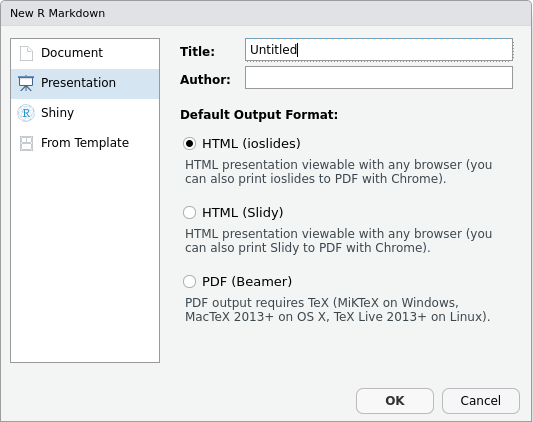
<figcaption>Créer une présentation R Markdown<figcaption>
</figure>


D'autres extensions, qui doivent être installées séparément, permettent aussi des diaporamas dans des formats variés. On citera notamment :

- `revealjs`{.pkg} (<https://github.com/rstudio/revealjs>) pour des présentations HTLM basées sur le *framework* [reveal.js](http://lab.hakim.se/reveal-js/#/)
- `rmdshower`{.pkg} (<https://github.com/mangothecat/rmdshower>) pour des diaporamas HTML basés sur [shower](https://github.com/shower/shower)

Une fois l'extension installée, elle propose en général un *template* de départ lorsqu'on crée un nouveau document dans RStudio. Ceux-ci sont accessibles depuis l'entrée *From Template*.

<figure>
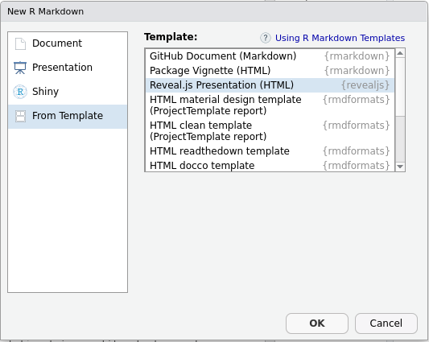
<figcaption>Créer une présentation à partir d'un template<figcaption>
</figure>


### Templates


Il existe également différents *templates* permettant de changer le format et la présentation des documents générés. Une liste de ces formats et leur documentation associée est accessible depuis la page [formats](http://rmarkdown.rstudio.com/formats.html) de la documentation.

On notera notamment :

- le template `distill`{.pkg} comportant de nombreuses options pour des documents scientifiques et techniques au format **HTML** (plus d'infos sur <https://rstudio.github.io/distill/>) ;
- des formats d'article correspondant à des publications dans différentes revues : `jss_article`, `elsevier_article`, etc. ;
- le format [Tufte Handouts](http://rmarkdown.rstudio.com/tufte_handout_format.html) qui permet de produire des documents **PDF** ou **HTML** dans un format proche de celui utilisé par Edward Tufte pour certaines de ses publications.

Enfin, l'extension `rmdformats`{.pkg} (<https://github.com/juba/rmdformats>) de Julien Barnier propose plusieurs modèles **HTML** adaptés notamment pour des documents longs :

<figure>

<figcaption>Modèle readthedown<figcaption>
</figure>

<figure>

<figcaption>Modèle html_clean<figcaption>
</figure>

<figure>

<figcaption>Modèle material<figcaption>
</figure>

Là encore, la plupart du temps, ces modèles de documents proposent un *template* de départ lorsqu'on crée un nouveau document dans **RStudio** (entrée *From Template*) :

<figure>

<figcaption>Créer un document à partir d'un template<figcaption>
</figure>

## Ressources

Les ressources suivantes sont toutes en anglais...

Yihui Xie, J. J. Allaire et Garrett Grolemund ont écrit un livre dédié intitulé *R Markdown: The Definitive Guide*. Ce livre est intégralement accessible à <https://bookdown.org/yihui/rmarkdown/>.


L'ouvrage *R for data science*, accessible en ligne, contient [un chapitre dédié à R Markdown](http://r4ds.had.co.nz/r-markdown.html).

Le [site officiel de l'extension](http://rmarkdown.rstudio.com/) contient une documentation très complète, tant pour les débutants que pour un usage avancé.

Enfin, l'aide de RStudio (menu *Help* puis *Cheatsheets*) permet d'accéder à deux documents de synthèse : une "antisèche" synthétique (*R Markdown Cheat Sheet*) et un "guide de référence" plus complet (*R Markdown Reference Guide*).


