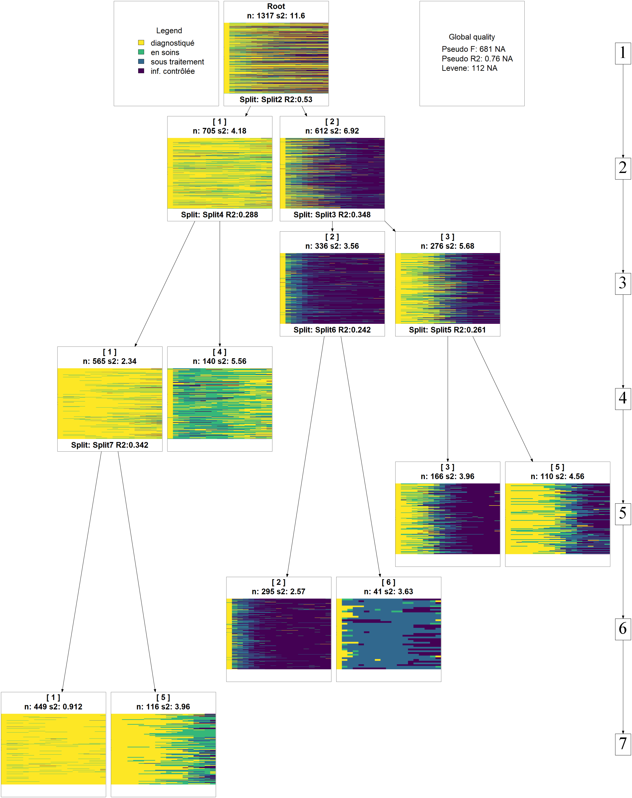

```{r options_communes, include=FALSE}
source("options_communes.R")
knitr::opts_chunk$set(tidy = FALSE, warning = FALSE)
```

Dans ce chapitre, nous allons aborder plusieurs méthodes d'analyse à partir d'un jeu de données longitudinales. Tout d'abord, importons les données dans **R** avec la commande suivante :

```{r include=FALSE}
load("data/care_trajectories.RData")
```

```{r, eval=FALSE}
load(url("http://larmarange.github.io/analyse-R/data/care_trajectories.RData"))
```

```{r}
class(care_trajectories)
```


Nous obtenons un objet appelé `care_trajectories`. La fonction `class`{data-pkg="base"} nous montre qu'il s'agit d'un tableau de données au format `data.table`{.pkg} (voir le [chapitre dédié](manipulations-avancees-avec-data-table.html)). Chargeons donc cette extension ainsi que le `tidyverse`{.pkg}.

```{r, message=FALSE}
library(tidyverse, quietly = TRUE)
library(data.table, quietly = TRUE)
```

## Première description des données

Jetons un premier regard aux données.

```{r}
care_trajectories
```

Il apparaît que les données sont dans un format <q>long</q> et *tidy* (voir le [chapitre sur **tidyr**](reorganiser-ses-donnees-avec-tidyr.html#tidy-data) pour une présentation du concept de <dfn lang="en">tidy data</dfn>), avec une ligne par individu et par pas de temps. Il apparait également que les données sont stockées sous formes de vecteurs labellisés (voir le [chapitre dédié aux vecteurs labellisés](facteurs-et-vecteurs-labellises.html#labelled)). Nous aurons donc besoin de l'extension `labelled`{.pkg}. 

```{r}
library(labelled)
```

Pour une description des variables, on pourra avoir recours à `describe`{data-pkg="questionr"} de `questionr`.

```{r}
library(questionr)
describe(care_trajectories, freq.n.max = 10)
```

Dans cette étude, on a suivi des patients à partir du moment où ils ont été diagnostiqués pour une pathologie grave et chronique et on a suivi leurs parcours de soins chaque mois à partir du diagnostic. La variable `status` contient le statut dans les soins de chaque individu pour chaque mois de suivi :

- **D** : s'il n'est pas actuellement suivi dans une clinique, soit que la personne n'est pas encore entrée en clinique après le diagnostic, soit qu'elle a quitté la clinique et qu'elle est donc sortie des soins ;
- **C** : indique que le patient est entré en soins (il est suivi dans une clinique) mais il n'a pas encore commencé le traitement, ou bien il a arrêté le traitement mais est toujours suivi en clinique ;
- **T** : la personne est sous traitement mais l'infections n'est pas <q>supprimée</q> ou <q>contrôlée</q>, soit que le traitement n'a pas encore eu le temps de faire effet, soit qu'il n'est plus efficace ;
- **S** : la personne est suivie en clinique, sous traitement et son infection est <q>supprimée</q> / <q>contrôlée</q>, indiquant que le traitement est efficace et produit son effet. Cette étape ultime du parcours de soins est celle dans laquelle on souhaite maintenir les individus le plus longtemps possible.

Il est important de noter que nous avons ici des statuts **hiérarchiquement ordonnés** (D < C < T < S), ce qui aura son importance pour les choix méthodologiques que nous aurons à faire.

Nous disposons également d'autres variables (âge, sexe, niveau d'éducation...) qui sont ici dépendantes du temps, c'est-à-dire que le cas échéant, elles peuvent varier d'un mois à l'autre en cas de changement.

Avant de démarrer les analyses, françisons certaines de ces variables.

```{r}
var_label(care_trajectories$sex) <- "Sexe"
val_labels(care_trajectories$sex) <- c(homme = 0, femme = 1)
var_label(care_trajectories$age) <- "Âge"
var_label(care_trajectories$education) <- "Education"
val_labels(care_trajectories$education) <- c(
  primaire = 1,
  secondaire = 2,
  supérieur = 3
)
```


Le fichier contient `r JLutils::fr0(nrow(care_trajectories))` lignes, ce qui ne veut pas dire qu'il y a ce nombre d'invidus suivis au cours du temps, puisque plusieurs lignes correspondent à un même individu. On peut obtenir le nombre d'individus différents assez facilement avec la commande :

```{r}
length(unique(care_trajectories$id))
```

**Précision :** dans ce fichier, tous les individus ne sont pas suivis pendant la même durée, car ils n'ont pas tous été diagnostiqués au même moment. Cependant, il n'y a pas de <q>trous</q> dans le suivi (ce qui serait le cas si certains individus sortaient de l'observation pendant quelques mois puis re-rentraient dans la cohorte de suivi).

Avant d'aller plus avant, il nous faut avoir une idée  du nombre d'individus observé au cours du temps, ce que l'on peut obtenir avec :

```{r}
ggplot(care_trajectories) +
  aes(x = month) +
  geom_bar()
```

Améliorons ce graphique en y ajoutant la distribution selon le statut dans les soins chaque mois, en améliorant l'axe du temps (tous les 6 mois est plus facile à lire) et en y ajoutant un titre et des étiquettes appropriées. Afin de disposer d'une palette de couleurs à fort contraste, nous allons utiliser l'extension `viridis`{.pkg}. Enfin, nous allons utiliser une petite astuce pour indiquer les effectifs sur l'axe horizontal. Au passage, nous allons également franciser les étiquettes de la variable `care_status` avec `val_labels`{data-pkg="labelled"} (notez aussi le recours à `to_factor`{data-pkg="labelled"} dans `aes`{data-pkg="ggplot2"} qui nous permet de transformer à la volée la variable en facteur, format attendu par `ggplot2`{.pkg} pour les variables catégorielles). On se référera au [chapitre dédié à **ggplot2**](ggplot2.html) pour plus de détails sur les différentes fonctions de cette extension graphique.

```{r, message=FALSE}
library(viridis)
n <- care_trajectories[month %in% (0:8*6), .(n = .N), by = month]$n
etiquettes <- paste0("M", 0:8*6, "\n(n=", n, ")")
val_labels(care_trajectories$care_status) <- c(
  "diagnostiqué, mais pas suivi" = "D",
  "suivi, mais pas sous traitement" = "C",
  "sous traitement, mais infection non contrôlée" = "T",
  "sous traitement et infection contrôlée" = "S"
)
ggplot(care_trajectories) +
  aes(x = month, fill = to_factor(care_status)) +
  geom_bar(color = "gray50", width = 1) +
  scale_x_continuous(breaks = 0:8*6, labels = etiquettes) +
  ggtitle("Distribution du statut dans les soins chaque mois") +
  xlab("") + ylab("") +
  theme_light() +
  theme(legend.position = "bottom") +
  labs(fill = "Statut dans les soins") + 
  scale_fill_viridis(discrete = TRUE, direction = -1) +
  guides(fill = guide_legend(nrow = 2))
```

On s'aperçoit qu'une majorité des personnes suivies ne l'ont été que peu de temps, avec une décroissance rapide des effectifs.

## Évolution de la cascade de soins au cours du temps

On nomme communément <q>cascade de soins</q> la proportion d'individus dans chaque statut à un moment du temps donné. On peut facilement obtenir celle-ci à partir du code du graphique précédent en ajoutant l'option `position = fill` à `geom_bar`{data-pkg="ggplot2"}.

```{r}
ggplot(care_trajectories) +
  aes(x = month, fill = to_factor(care_status)) +
  geom_bar(color = "gray50", width = 1, position = "fill") +
  scale_x_continuous(breaks = 0:8*6, labels = etiquettes) +
  scale_y_continuous(labels = scales::percent) +
  ggtitle("Cascade des soins observée, selon le temps depuis le diagnostic") +
  xlab("") + ylab("") +
  theme_light() +
  theme(legend.position = "bottom") +
  labs(fill = "Statut dans les soins") + 
  scale_fill_viridis(discrete = TRUE, direction = -1) +
  guides(fill = guide_legend(nrow = 2))
```

Les effectifs sont très faibles au-delà de 36 mois et il serait préférable de couper la cascade au-delà de M36, ce que l'on peut faire aisément ne gardant que les lignes correspondantes de `care_trajectories`.

```{r}
casc_obs <- ggplot(care_trajectories[month <= 36]) +
  aes(x = month, fill = to_factor(care_status)) +
  geom_bar(color = "gray50", width = 1, position = "fill") +
  scale_x_continuous(breaks = 0:8*6, labels = etiquettes) +
  scale_y_continuous(labels = scales::percent) +
  ggtitle("Cascade des soins observée, selon le temps depuis le diagnostic") +
  xlab("") + ylab("") +
  theme_light() +
  theme(legend.position = "bottom") +
  labs(fill = "Statut dans les soins") + 
  scale_fill_viridis(discrete = TRUE, direction = -1) +
  guides(fill = guide_legend(nrow = 2))
casc_obs
```


## Analyse de survie classique

L'<dfn>analyse de survie</dfn><dfn data-index="survie, analyse"></dfn> constitue l'approche statistique la plus fréquente pour appréhender des données biographiques. Dans sa version classique, l'analyse de survie modélise le temps mis pour vivre un événement particulier à partir d'un événement origine. 

Dans notre exemple, l'événement d'origine commun à tous les individus est le diagnostic VIH. Les personnes suivies peuvent vivre trois événements principaux : 

- entrée en soins (passage de **D** à **C**) ;
- initiation du traitement (passage de **C** à **T**) ;
- contrôle de l'infection (passage de **T** à **S**).

En toute rigueur, il faudrait également considérer les transitions inverses (sortie de soins, arrêt du traitement, échec virologique). De même, il est possible que certains aient vécus plusieurs transitions successives (entrée en soin, initiation du traitement, sortie de soins et arrêt du traitement, nouvelle entrée en soins...).

Pour le moment, contentons-nous de regarder la **première** entrée en soins, la **première** initiation du traitement et la **première** atteinte du contrôle de l'infection et de calculer la date de ces trois événements, dans un fichier `ind` contenant une ligne par individu.


```{r}
ind <- care_trajectories[month == 0]
ind$diagnostic <- 0
ind <- merge(
  ind,
  care_trajectories[
    care_status %in% c("C", "T", "S"), 
    .(entree_soins = min(month)),
    by = id
  ],
  by = "id", 
  all.x = TRUE
)
ind <- merge(
  ind,
  care_trajectories[
    care_status %in% c("T", "S"), 
    .(initiation_tt = min(month)),
    by = id
  ],
  by = "id", 
  all.x = TRUE
)
ind <- merge(
  ind,
  care_trajectories[
    care_status == "S", 
    .(controle = min(month)),
    by = id
  ],
  by = "id", 
  all.x = TRUE
)
```

Il nous faut également la durée de suivi par individu.

```{r}
ind <- merge(
  ind,
  care_trajectories[, .(suivi = max(month)), by = id],
  by = "id", 
  all.x = TRUE
)
```

Pour faciliter la suite des analyses, nous allons nous créer une petite fonction qui, en fonction de la date d'origine et la date d'événement retenues, calculera la courbe de <dfn>Kaplan-Meier</dfn> correspondante (voir le chapitre sur l'[analyse de suivie](analyse-de-survie.html) pour le calcul de la courbe de survie et celui dédié à l'[écriture de fonctions](ecrire-ses-propres-fonctions.html)).

```{r}
km <- function(date_origine, date_evenement, nom) {
  library(survival)
  
  # ne garder que les observations avec date d'origine
  tmp <- ind[!is.na(ind[[date_origine]]), ]
  
  # pre-remplir la variable time avec duree de suivi
  # depuis date d'origine
  tmp$time <- tmp$suivi - tmp[[date_origine]]
  # et considérer que l'événement n'a pas été vécu
  tmp$event <- FALSE
  
  # si date_evement documentée, événement vécu
  tmp[!is.na(tmp[[date_evenement]]), ]$event <- TRUE
  tmp[tmp$event == TRUE, ]$time <- 
    tmp[tmp$event == TRUE, ][[date_evenement]] -
    tmp[tmp$event == TRUE, ][[date_origine]]
  
  kaplan <- survfit(Surv(time, event) ~ 1, data = tmp)
  res <- broom::tidy(kaplan, conf.int = TRUE)
  res$nom <- nom
  res
}
```

Une première approche consiste à regarder la survenue de chacun des trois événements mentions plus haut en fonction du temps depuis le diagnostic.

```{r}
depuis_diag <- dplyr::bind_rows(
  km("diagnostic", "entree_soins", "entrée en soins"),
  km("diagnostic", "initiation_tt", "initiation du traitement"),
  km("diagnostic", "controle", "contrôle de l'infection")
)

g_diag <- ggplot(data = depuis_diag) +
  aes(x = time, y = 1 - estimate, 
      color = as_factor(nom), fill = as_factor(nom),
      ymin = 1 - conf.high, ymax = 1 - conf.low) +
  geom_ribbon(alpha = .25, mapping = aes(color = NULL)) +
  geom_line(size = 1) +
  theme_classic() +
  theme(
    legend.position = "bottom",
    panel.grid.major.y = element_line(colour = "grey")
  ) +
  scale_x_continuous(breaks = 0:6*6, limits = c(0, 36)) +
  scale_y_continuous(labels = scales::percent, limits = c(0, 1)) +
  xlab("mois depuis le diagnostic") + 
  ylab("") + labs(color = "", fill = "")
g_diag
```

Ce graphique ressemble à la cascade des soins observée que nous avions calculée plus haut, à quelques différences près :

- avec la méthode de Kaplan-Meier, la censure à droite, i.e. le fait que tous les individus n'ont pas la même durée de suivi, est correctement prise en compte et la courbe est corrigée en conséquence ;
- par contre, les transitions inverses ne sont pas considérées : lorsqu'un individu a atteint une étape, on ne regarde pas s'il en ressort.

Une autre manière d'appréhender nos trajectoires est de considérer le temps requis pour atteindre une étape une fois la précédente étape atteinte. Ce qu'on obtient facilement en adaptant légèrement notre code précédent.

```{r}
depuis_prec <- dplyr::bind_rows(
  km("diagnostic", "entree_soins", "entrée en soins"),
  km("entree_soins", "initiation_tt", "initiation du traitement"),
  km("initiation_tt", "controle", "contrôle de l'infection")
)

g_prec <- ggplot(data = depuis_prec) +
  aes(x = time, y = 1 - estimate, 
      color = as_factor(nom), fill = as_factor(nom),
      ymin = 1 - conf.high, ymax = 1 - conf.low) +
  geom_ribbon(alpha = .25, mapping = aes(color = NULL)) +
  geom_line(size = 1) +
  theme_classic() +
  theme(
    legend.position = "bottom",
    panel.grid.major.y = element_line(colour = "grey")
  ) +
  scale_x_continuous(breaks = 0:6*6, limits = c(0, 36)) +
  scale_y_continuous(labels = scales::percent, limits = c(0, 1)) +
  xlab("mois depuis l'étape précédente") + 
  ylab("") + labs(color = "", fill = "")

g_prec
```

Attention : cette représentation graphique peut éventuellement prêter à confusion dans sa lecture car l'échelle de temps n'est pas tout à fait la même pour chaque courbe, dans la mesure où la date d'origine diffère pour chacune. Dès lors, il peut être plus pertinent de présenter chaque courbe l'une à côté de l'autre.

```{r}
g_prec + facet_grid(~ as_factor(nom))
```

Ici, on voit plus clairement que l'étape où il y a le plus de <q>perdition</q> est celle de l'entrée en soins, moins des trois quarts des personnes diagnostiquées étant venu en clinique au mois une fois dans les trois ans suivant le diagnostic. Par contre, l'initiation du traitement une fois entré en clinique et le contrôle de l'infection une fois le traitement initié sont beaucoup plus rapide.

Pour aller plus loin avec les outils de l'analyse de survie classique, il serait possible de faire des analyses bivariées (Kaplan-Meier) ou multivariées (Cox) pour chacune de ces étapes. Cependant, il serait plus intéressant de trouver une approache statistique permettant de considérer dans un même modèle l'ensemble des transitions possibles.

## Une première analyse de séquences sur l'ensemble du fichier

L'<dfn>analyse de séquences</dfn><dfn data-index="séquence, analyse"></dfn> permet d'appréhender l'ensemble de la trajectoire de soins à travers la succession des états dans lesquels se trouvent les patients observés.

Nous allons donc réaliser une analyse de séquences (voir le [chapitre dédié](analyse-de-sequences.html)) sur l'ensemble de notre fichier. Pour cela, il va falloir préalable que nous transformions nos donnée actuellement dans un format <q>long</q> en un tableau <q>large</q>, c'est-à-dire avec une ligne par individu et une variable différentes par pas de temps. On peut réaliser cela facilement avec `spread`{data-pkg="tidyr"} de `tidyr`{.pkg} (voir le [chapitre dédié à **tidyr**](reorganiser-ses-donnees-avec-tidyr.html#spread-disperser-des-lignes)).

```{r}
library(tidyr)
large <- care_trajectories %>%
  dplyr::select(id, m = month, care_status) %>%
  spread(key = m, value = care_status, sep = "") 
large
```

On utilise `seqdef`{data-pkg="TraMineR"} de `TraMineR`{.pkg} pour créer nos séquences, avec les arguments `alphabet` pour forcer l'ordre de l'alphabet, `states` pour spécifier des étiquettes courtes à chaque état et `cpal` pour indiquer le code couleur de chaque état (et être raccord avec nos graphiques précédents).

```{r}
library(TraMineR, quietly = TRUE)
seq_all <- seqdef(
  large[, m0:m50],
  id = large$id,
  alphabet = c("D", "C", "T", "S"),
  states = c("diagnostiqué", "en soins", "sous traitement", "inf. contrôlée"),
  cpal = viridis(4, direction = -1)
)
```

On peut retrouver la cascade de soins avec `seqdplot`{data-pkg="TraMineR" data-rdoc="seqplot"}.

```{r}
seqdplot(seq_all, legend.prop = .25)
```

Nous allons maintenant calculer une matrice des distances entre individus par <dfn lang="en">optimal matching</dfn>. Dans le cas présent, nos différents status sont hiérarchiquement ordonnés. Il n'est donc pas raisonnable de penser que les coûts sont constants entre les différents statuts, puisqu'en un sens, passer directement de **D** à **T** peut être considéré comme être passé d'abord de **D** à **C** puis de **C** à **D**. Nous allons donc faire une matrice de coûts hiérarchisée. `seqcost`{data-pkg="TraMineR"} nous permets de produire une matrice de coûts constants, que nous allons ensuite modifier manuellement. Pour le coût *indel*, le plus simple est de considérer la moitié du coût de substitution maximum.


```{r}
couts <- seqcost(seq_all, method = "CONSTANT")
couts

couts$sm[1, ] <- c(0, 1, 2, 3)
couts$sm[2, ] <- c(1, 0, 1, 2)
couts$sm[3, ] <- c(2, 1, 0, 1)
couts$sm[4, ] <- c(3, 2, 1, 0)
couts$indel <- max(couts$sm) / 2
couts

dist_all <- seqdist(seq_all, method = "OM", sm = couts$sm, indel = couts$indel)
```

Calculons le dendrogramme et représentons le avec le tapis de séquence grace à `seq_heatmap`{data-pkg="JLutils"} de l'extension `JLutils`{.pkg}. Pour rappel, cette extension est seulement disponible sur [GitHUb](https://github.com/larmarange/JLutils). On l'installera donc (ou on la mettra à jour) avec la commande `devtools::install_github("larmarange/JLutils")`.

```{r, fig.height=7}
arbre_all <- hclust(as.dist(dist_all), method = "ward.D2")
library(JLutils, quietly = TRUE)
seq_heatmap(seq_all, arbre_all)
```

Il apparaît que les différentes séquences sont principalement regroupées en fonction de leur longueur. En effet, pour passer d'une séquence courte à une séquence longue il faut <q>ajouter</q> des statuts pour compléter la séquence ce qui induit *de facto* une distance élevée (en raison du coût *indel*). Dès lors, lorsque l'on travaille avec des séquences aux longueurs très disparates, une <dfn>classification ascendante hiérarchique</dfn> va produire une typologie de séquences courtes et de séquences longues, ce qui n'est pas forcément ce que l'on recherche.

Dans notre exemple, nous pouvons considérer que les séquences courtes ne sont pas pertinentes à retenir dans l'analyse car l'observation n'est pas assez longue pour voir le parcours de soins des patients. Une solution consiste à ne retenir que les individus observées au moins `n` mois et analyser leur trajectoire sur seulement `n` mois, ce qui permet de n'avoir que des séquences de même longueur. Dès lors, la distance entre deux séquences ne dépendra plus que des différences de parcours. On serait tenté de prendre un `n` élévé pour avoir ainsi des parcours de soins longs. Mais dans ce cas là, l'analyse ne se fera que sur un tout petit nombre d'individus et on manquera de puissance. Si, à l'inverse, on prends un `n` petit, nous aurons des effectifs élevés mais les séquences seront peut-être trop courtes pour mettre en évidence la variété des trajectoires. Il faut dès lors trouver un compromis entre ces deux contraintes.

Si l'on regarde notre premier graphique montrant le nombre d'observations au cours du temps, il apparaît une sorte de point d'inflexion au niveau de M18 avec un brusque décrochage. D'un autre côté, 18 mois offre un minimum de durée d'observations pour espérer voir émerger des trajectoires plus complexes.

## Une seconde analyse de séquences limitées aux 18 premiers mois

Reprenons notre analyse en se limitant aux individus observés au moins 18 mois (soit 19 status entre M0 et M18) et en se limitant aux 18 premiers mois pour modéliser les séquences. La fonction `seqlength`{data-pkg="TraMineR"} permets de récupérer la longueur de chaque séquence.

```{r, fig.height=7}
large$seq_length <- seqlength(seq_all)
large_m18 <- large[seq_length >= 19, id:m18]
seq_m18 <- seqdef(
  large_m18[, m0:m18],
  id = large_m18$id,
  alphabet = c("D", "C", "T", "S"),
  states = c("diagnostiqué", "en soins", "sous traitement", "inf. contrôlée"),
  cpal = viridis(4, direction = -1)
)
dist_m18 <- seqdist(seq_m18, method = "OM", sm = couts$sm, indel = couts$indel)
arbre_m18 <- hclust(as.dist(dist_m18), method = "ward.D2")
seq_heatmap(seq_m18, arbre_m18)
```

Reste maintenant à décider du nombre de classes à retenir. Encore une fois, c'est un équilibre à trouver entre le niveau de détails voulus et le niveau de simplification requis pour permettre l'analyse.

Pour faciliter ce choix, on peut avoir recours à la fonction `as.seqtree`{data-pkg="WeightedCluster"} de l'extension `WeightedCluster`{.pkg}, couplée à la fonction `seqtreedisplay`{data-pkg="TraMineR"}. **ATTENTION :** pour que le graphique puisse être produit, il faut que le logiciel libre **GraphViz** (<https://graphviz.gitlab.io/>) soit installé sur votre PC. On peut également installer **GraphViz** avec le code ci-dessous :

```{r, eval=FALSE}
source("http://bioconductor.org/biocLite.R")
biocLite("Rgraphviz")
```

La combinaison des deux fonctions va permettre de représenter l'évolution des catégories au fur-et-à-mesure que l'on coupe le dendrogramme plus bas. On peut choisir le type de graphique utilisé avec l'argument `type` (voir l'aide de `seqplot`{data-pkg="TraMineR"}) et le nombre maximum de clusters avec `nclust`.

```{r, eval=FALSE}
library(WeightedCluster, quietly = TRUE)
seqtree_m18 <- as.seqtree(arbre_m18, seqdata = seq_m18, diss = dist_m18, ncluster = 7)
seqtreedisplay(seqtree_m18, type="I", border=NA, show.depth=TRUE)
```

```{r, include=FALSE}
library(WeightedCluster, quietly = TRUE)
seqtree_m18 <- as.seqtree(arbre_m18, seqdata = seq_m18, diss = dist_m18, ncluster = 7)
seqtreedisplay(seqtree_m18, type="I", border=NA, show.depth=TRUE, filename = "images/trajectoires_soins_seqtreedisplay_m18.png", show.tree = FALSE)
```



Afin d'éviter de multiplier les sous-groupes, nous n'allons conserver que 4 catégories.

```{r}
large_m18$typo_cah <- cutree(arbre_m18, 4)
```

<div class="note">
Il est aussi possible de se baser sur divers indicateurs statistiques sur la <q>qualité</q> de chaque partition. Pour cela, on pourra par exemple avoir recours à la fonction `as.clustrange`{data-pkg="WeightedCluster"} de l'extension `WeightedCluster`{.pkg}. Essayez par exemple les commandes ci-après :

```{r, eval=FALSE}
nc <- as.clustrange(arbre_m18, dist_m18)
summary(nc, max.rank = 3)
plot(nc, norm = "zscore")
```

Pour plus d'informations, voir le [*manuel de la librairie WeightedCluster*](https://cran.r-project.org/web/packages/WeightedCluster/vignettes/WeightedClusterFR.pdf), chapitre 7.
</div>

On peut représenter le découpage du dendrogramme avec `A2Rplot`{data-pkg="JLutils"} fournie par `JLutils`{.pkg}

```{r}
A2Rplot(arbre_m18, k = 4, show.labels = FALSE)
```

Comme expliqué par Matthias Studer dans le [*manuel de la librairie WeightedCluster*](https://cran.r-project.org/web/packages/WeightedCluster/vignettes/WeightedClusterFR.pdf), plusieurs critiques peuvent être adressées aux procédures hiérarchiques, en particulier le fait que la fusion de deux groupes se fait en maximisant un critère local. 

L’algorithme <dfn>PAM</dfn> pour <dfn lang="en">Partitioning Around Medoids</dfn> suit une autre logique que les algorithmes hiérarchiques et vise à
obtenir la meilleure partition d’un ensemble de données en un nombre prédéfini de groupes. Il a l’avantage de maximiser un critère global et non uniquement un critère local. Par contre, le nombre de classes doit être fixé à l'avance.

Ayant décidé de retenir 4 classes au regard de notre classification ascendante hiérarchique, nous pouvons voir si l'algorithme PAM permets d'améliorer nos 4 classes. Nous allons utiliser la fonction `wcKMedoids`{data-pkg="WeightedCluster"} de l'extension `WeightedCluster`{.pkg} en lui indiquant comme partition initiale celle obtenue avec la classigication hiérarchique.

```{r}
pam_m18 <- wcKMedoids(dist_m18, k = 4, initialclust = arbre_m18)
large_m18$typo_pam <- pam_m18$clustering
```

Un tableau croisé nous permets de voir que les deux typologies restent proches.

```{r}
table(large_m18$typo_cah, large_m18$typo_pam)
```

Regardons les tapis de séquence des deux typologies.

```{r}
large_m18$ordre_cmd <- cmdscale(as.dist(dist_m18), k = 1)
seqIplot(seq_m18, group = large_m18$typo_cah, sortv = large_m18$ordre_cmd)
seqIplot(seq_m18, group = large_m18$typo_pam, sortv = large_m18$ordre_cmd)
```

Comme on le voit les deux typologies obtenues sont très proches. Suivant le cas, à vous de choisir celle qui semble la plus pertinente d'un point de vue sociologique. Il existe également divers indicateurs statisques pour mesurer la qualité d'une partition (voir le [*manuel de la librairie WeightedCluster*](https://cran.r-project.org/web/packages/WeightedCluster/vignettes/WeightedClusterFR.pdf) de Matthias Studer). Ils peuvent être calculés avec la fonction `wcClusterQuality`{data-pkg="WeightedCluster"}. Comparons les deux typologies obtenues.


```{r}
tab <- tibble(
  stat = names(wcClusterQuality(dist_m18, large_m18$typo_cah)$stats),
  cah = wcClusterQuality(dist_m18, large_m18$typo_cah)$stats,
  pam = wcClusterQuality(dist_m18, large_m18$typo_pam)$stats
)
knitr::kable(tab, digits = 3)
```

Selon ces indicateurs calculés, l'approche PAM obtiendrait une partition légèrement de meilleure qualité que celle obtenuepar CAH.

L'extension `WeightedCluster`{.pkg} fournie aussi une fonction `wcSilhouetteObs`{data-pkg="WeightedCluster"} permettant de mesurer la <q>silhouette</q> de chaque séquence. Plus cette métrique est élevée et proche de 1, plus la séquence est proche du centre de classe et <q>caractéristique</q> de la classe. On peut utiliser cette métrique pour classer les séquences sur le tapis de séquences.

```{r}
large_m18$sil <- wcSilhouetteObs(dist_m18, large_m18$typo_pam)
seqIplot(seq_m18, group = large_m18$typo_pam, sortv = large_m18$sil)
```

Nous voyons émerger quatre groupes distincts :

- les *rapides*, qui entrent en soins et initient le traitement dès les premiers mois suivant le diagnostic ;
- les *lents*, qui entrent en soins et initient le traitement plus tardivement, après M6 ;
- les *inaboutis*, qui entrent en soins mais n'initient pas le traitement ;
- les *hors soins*, qui ne sont pas entrés en soins où n'y sont pas restés.

Le graphique obtenu avec `seqIplot`{data-pkg="TraMineR" data-rdoc="seqplot"} affiche visuellement chaque groupe avec la même hauteur, pouvant laisser accroire que chaque groupe a le même poids dans l'échantillon. Pour produire une représentation graphique des tapis de séquences plus <q>correcte</q>, où chaque la hauteur de chaque groupe correspondrait à son poids dans l'échantillon, nous allons passer par `ggplot2`{.pkg}. Un tapis de séquences peut-être vu comme un <q>raster</q> et dès lors représenté avec `geom_raster`{data-pkg="ggplot2"}. Pour travailler avec `ggplot2`{.pkg}, nos données doivent être au format *tidy*, c'est-à-dire avec une ligne par point d'observation, soit une ligne par personne et par jour. Nous allons donc repartir du fichier `care_trajectories`. Le mois d'observation indiquera la position en abscisse. Quant à la position en ordonnée, il faudra que nous la calculions, séparément pour chaque groupe, afin d'éviter des <q>lignes vides</q> dans le graphique.

```{r, fig.height=8}
# nommer les groupes
large_m18$groupe <- factor(
  large_m18$typo_pam,
  c(85, 23, 410, 6),
  c("Rapides", "Lents", "Inaboutis", "Hors soins")
)

# calculer le rang des individus dans chaque groupe
setorder(large_m18, "ordre_cmd")
large_m18[, rang_cmd := 1:.N, by = groupe]

# créer un fichier long
long_m18 <- care_trajectories[id %in% large_m18$id & month <= 18]
long_m18 <- merge(
  long_m18,
  large_m18[, .(id, groupe, rang_cmd)],
  by = "id",
  all.x = TRUE
)
long_m18$care_statusF <- to_factor(long_m18$care_status)

# calculer les effectifs par groupe
tmp <- large_m18[, .(n = .N), by = groupe]
tmp[, groupe_n := paste0(groupe, "\n(n=", n, ")")]
long_m18 <- merge(
  long_m18,
  tmp[, .(groupe, groupe_n)],
  by = "groupe",
  all.x = TRUE
)

# graphique des tapis de séquences
ggplot(long_m18) +
  aes(x = month, y = rang_cmd, fill = care_statusF) +
  geom_raster() +
  facet_grid(groupe_n ~ ., space = "free", scales = "free") +
  scale_x_continuous(breaks = 0:6*3, labels = paste0("M", 0:6*3)) +
  scale_y_continuous(breaks = 0:5*100, minor_breaks = NULL) +
  xlab("") + ylab("") +
  theme_light() +
  theme(legend.position = "bottom") +
  labs(fill = "Statut dans les soins") + 
  scale_fill_viridis(discrete = TRUE, direction = -1) +
  guides(fill = guide_legend(nrow = 2))

```


## Facteurs associés à l'appartenance à chaque groupe

Une fois les différents groupes de trajectoires identifiés, il est courant de vouloir regarder si certains facteurs influencent l'appartenance à un groupe plutôt qu'un autre. Dans nos données d'exemple, nous nous intéresserons aux variables suivantes : sexe, groupe d'âges et niveau d'éducation.

Ces différentes variables sont renseignées pour chaque mois dans le tableau de données `care_trajectories`, en tenant compte des éventuels changements au cours du temps. Ici, notre analyse est menée au niveau individuel. Nous allons donc récupérer la valeur de ces différentes variables au moment du diagnostic, à savoir à M0.

```{r}
large_m18 <- merge(
  large_m18,
  care_trajectories[
    month == 0, 
    .(id, sex, age, education)
  ],
  by = "id",
  all.x = TRUE
)
```

L'extension `finalfit`{.pkg}, présentée dans le chapite sur la [régression logistique](regression-logistique.html#tableaux-all-in-one), permets via sa fonction `summary_factorlist`{data-pkg="finalfit"} de produire rapidement le tableau de l'analyse bivariée. En l'occurence, le code ci-dessous permets de sortir les effectifs, les pourcentages en colonnes et les p-values correspondant au <dfn>test du Chi²</dfn><dfn data-index="Chi², test"></dfn>.^[Pour plus de détails sur les tableaux croisés et le test du Chi², voir le chapitre sur la [statisque bivariée](statistique-bivariee.html#deux-variables-qualitatives) et le chapitre sur les [tests de comparaison ](comparaisons-moyennes-et-proportions.html#chi2).]

```{r}
library(finalfit, quietly = TRUE)
explanatory <- c("sex", "age", "education")
dependent <- "groupe"
tab <- summary_factorlist(
  to_factor(large_m18), dependent, explanatory,
  p=TRUE, column = TRUE, total_col = TRUE
)
knitr::kable(tab, row.names = FALSE)
```

Une manière de présenter ces mêmes données de manière plus visuelle consiste à réaliser un <dfn data-index="diagramme en barres cumulées">diagramme en barres cumulées</dfn><dfn data-index="barres cumulées, diagramme en"></dfn> (voir le chapitre sur les [graphiques bivariés](graphiques-bivaries-ggplot2.html#diagrammes-en-barres)). Ici, nous utilisons une boucle `for`{data-pkg="base" data-rdoc="Control"} (voir le chapitre sur les [structures conditionnelles](structures-conditionnelles.html)) pour calculer les différents tableaux croisés et les fusionner avec `bind_rows`{data-pkg="dplyr" data-rdoc="bind"} (voir la section [concaténation de tables](manipuler-les-donnees-avec-dplyr.html#concatenation) du chapitre dédié à `dplyr`{.pkg}). Nous en profitions également pour calculer le test du Chi² et l'afficher avec le nom de la variable sur le graphique.

```{r, fig.height=6, fig.width=6, message=FALSE}
res <- tibble()
explanatory <- c(
  "sex" = "Sexe", 
  "age" = "Âge",
  "education" = "Education"
)
for (v in names(explanatory)) {
  tmp <- tibble::as_tibble(table(large_m18$groupe, to_factor(large_m18[[v]])), .name_repair = "unique")
  names(tmp) <- c("groupe", "level", "n")
  test <- chisq.test(large_m18$groupe, to_factor(large_m18[[v]]))
  tmp$var <- paste0(
    explanatory[v],
    "\n",
    scales::pvalue(test$p.value, add_p = TRUE)
  )
  res <- bind_rows(res, tmp)
}

ggplot(data = res) +
  aes(x = level, fill = groupe, weight = n) +
  geom_bar(position = "fill") +
  JLutils::stat_fill_labels() +
  facet_grid(var ~ ., scales = "free", space = "free") +
  scale_y_continuous(labels = scales::percent, breaks = 0:5/5) +
  coord_flip() +
  theme(legend.position = "bottom") +
  xlab("") + ylab("") + labs(fill = "")
```


Pour mieux visualiser les relations entre les variables, on peut avoir recours à la fonction `ggchisq_res`{data-pkg="JLutils"} de l'extension `JLutils`{.pkg} qui permets de représenter les <dfn data-index="résidus, test du Chi²">résidus du Chi²</dfn><dfn data-index="test du Chi², résidus"></dfn><dfn data-index="Chi², résidus">.

```{r}
library(JLutils)
ggchisq_res(
  sex + age + education ~ groupe,
  data = to_factor(large_m18),
  label = "scales::percent(col.prop)",
  breaks = c(-Inf, -4, -2, 0, 2, 4, Inf)
)
```

On peut ainsi noter que les hommes, les jeunes et ceux vivant à plus de 10 kilomètres d'une clinique sont plus souvent dans le groupe <q>Hors soins</q>. Inversement, les femmes et les plus éduqués sont plus souvent dans le groupe des <q>Rapides</q>. Résultat inattendu, les ménages les plus riches sont moins souvent dans les groupes ayant initiés un traitement (<q>Rapides</q> et <q>Lents</q>), ce résultat pouvant s'expliquer en partie par le fait que les plus aisés peuvent plus facilement accéder à des soins dans le secteur privé, et donc <q>faussement</q> apparaître <q>Hors soins<q>, car seuls les soins reçus dans le secteur public ont été mesurés dans cette étude.

Pour affiner les résultats, on aura recours à un modèle multivarié en exécutant une <dfn>régression logistique multinomiale</dfn><dfn data-index="multinomiale, régression logistique"></dfn> avec `multinom`{data-pkg="nnet} de l'extension `nnet`{.pkg} (pour plus de détails, voir le [chapitre dédié](regression-logistique.html#regression-logistique-multinomiale)).

```{r results="hide"}
library(nnet)
large_m18$groupe2 <- relevel(large_m18$groupe, "Hors soins")
regm <- multinom(
  groupe2 ~ sex + age + education, 
  data = to_factor(large_m18)
)
```

```{r, fig.height=3, fig.width=6}
tmp <- JLutils::tidy_detailed(regm, exponentiate = T, conf.int = TRUE)
tmp <- tmp[tmp$term != "(Intercept)", ]
ggplot(tmp) + 
  aes(x = label, y = estimate, ymin = conf.low, ymax = conf.high, color = y.level) +
  geom_hline(yintercept = 1, color = "gray25", linetype = "dotted") + 
  geom_errorbar(position = position_dodge(0.5), width = 0) + 
  geom_point(position = position_dodge(width = 0.5)) + 
  scale_y_log10() + 
  coord_flip() +
  xlab("Facteurs") + ylab("Odds Ratios") +
  labs(color = "vs. Hors Soins") +
  theme_light() + 
  theme(panel.grid.major.y = element_blank())
```

Nous pouvons représenter les effets des variables du modèle avec la fonction `ggeffect`{data-pkg="ggeffects} de `ggeffects`{.pkg}.

```{r, fig.width=12, fig.height=5}
library(ggeffects)
cowplot::plot_grid(plotlist = plot(ggeffect(regm)), ncol = 3)
```


## Modèle mixte à classes latentes

Un autre type d'approche envisageable pour identifier des classes de trajectoires est celle des <dfn data-index="modèle mixte à classes latentes">modèles mixtes à classes latentes</dfn><dfn data-index="mixte, modèle mixte à classes latentes"></dfn><dfn data-index="classes latentes, modèle mixte"></dfn><dfn data-index="latente, modèle mixte à classes latentes"></dfn>. Ce type de modèles peut prendre en compte une grande variété d'indicateurs, continus, binaires ou ordinaux. On peut y intégrer des co-variables et il n'est pas nécessaire de disposer du même nombre d'observations par individu.

Nous n'aborderons que brièvement ici ce type de modèles complexes. Sous **R**, ils peuvent être réalisés via l'extension `lcmm`{.pkg} et sa fonction homonyme `lcmm`{data-pkg="lcmm"}.

Commençons par préparer les données.

```{r}
care_trajectories$num_status <- as.integer(to_factor(care_trajectories$care_status))
care_trajectories[, sexF := to_factor(sex)]
care_trajectories[, ageF := to_factor(age)]
care_trajectories[, educationF := to_factor(education)]
```

Ici, nous allons modéliser le statut dans les soins en fonction du temps. Il faut indiquer au modèle, via le paramètre `ng` le nombre de groupes ou classes latentes souhaité. Ici, nous avons retenu 4 en lien avec les résultats de notre analyse de séquences. L'argument `link = "thresholds"` permets d'indiquer que notre variable d'intérêt est ordinale. Les modèles `lcmm`{data-pkg="lcmm"} peuvent également prendre en compte des variables continues.

**Attention :** le temps de calcul de ce type de modèle peut être long (plusieurs heures dans notre exemple), suivant le nombre de paramètres, le nombre d'observations et la puissance de votre machine.

```{r, eval=FALSE}
library(lcmm)
mod4 <-lcmm(
  num_status ~ month, random = ~ month, subject = 'id', 
  mixture = ~ month, ng = 4, idiag = TRUE, data = care_trajectories, 
  link = "thresholds"
)
```

```{r, include=FALSE}
library(lcmm)
load("data/trajectoires_mod4_lcmm.RData")
```

Voyons comment se présentent les résultats.

```{r}
summary(mod4)
```

On dispose d'un AIC et d'un BIC. Ainsi, une stratégie possible pour déterminer le nombre de classes consiste à calculer un modèle différent pour chaque nombre de classes envisagé puis à retenir le modèle ayant le plus faible AIC ou BIC.

Pour chaque observation, le modèle a calculé la probabilité qu'elle appartienne à chacune des 4 classes identifiées. La fonction `postprob`{data-pkg="lcmm"} fournit des statistiques sur cette classification.

```{r}
postprob(mod4)
```

Les classes et les probabilités d'appartenance à chacune sont disponibles aisément.

```{r}
head(mod4$pprob)
```

Récupérons la classe dans notre fichier de données.

```{r}
tmp <- dtplyr::tbl_dt(mod4$pprob)
care_trajectories <- merge(
  care_trajectories,
  mod4$pprob %>% dplyr::select(id, mod4_class = class),
  by = "id",
  all.x = TRUE
)
```

Améliorons les intitulés des classes et ajoutons le nombre d'individu par classes.

```{r}
n_par_classe <- table(mod4$pprob$class)
n_par_classe
care_trajectories$mod4_class2 <- factor(
  care_trajectories$mod4_class,
  levels = 1:4,
  labels = paste0(
    "Classe ",
    1:4,
    " (n=",
    n_par_classe,
    ")"
  )
)
```

Représentons la cascade observée dans chacune de ces classes.

```{r, fig.height=6, fig.width=10}
care_trajectories$care_statusF <- to_factor(care_trajectories$care_status)
ggplot(care_trajectories[month <= 36]) +
  aes(x = month, fill = care_statusF) +
  geom_bar(color = "gray50", width = 1, position = "fill") +
  scale_x_continuous(breaks = 0:6*6, labels = paste0("M", 0:6*6)) +
  scale_y_continuous(labels = scales::percent) +
  xlab("") + ylab("") +
  theme_light() +
  theme(legend.position = "bottom") +
  labs(fill = "Statut dans les soins") + 
  scale_fill_viridis(discrete = TRUE, direction = -1) +
  guides(fill = guide_legend(nrow = 2)) +
  facet_grid(~ mod4_class2)
```

Une manière alternative de présenter les classes consiste à représenter chaque mois, non pas la distribution dans chaque état, mais un <q>état moyen</q> en considérant que le statut dans les soins peut être assimilé à un score allant de 1 à 4.

```{r}
moyennes_mensuelles <- care_trajectories[
  month <= 36, 
  .(status_moyen = mean(num_status)), 
  by = .(month, mod4_class2)
]
```

```{r}
ggplot(moyennes_mensuelles) + 
  aes(x = month, y = status_moyen, color = mod4_class2) +
  geom_line(size = 2) +
  scale_x_continuous(breaks = 0:6*6, labels = paste0("M", 0:6*6)) +
  scale_y_continuous(
    breaks = 1:4, limits = c(1, 4),
    labels = c("diagnostiqué", "suivi", "sous traitement", "contrôlé")
  ) +
  xlab("") + ylab("Statut moyen") + labs(color = "") +
  theme_classic() +
  theme(
    legend.position = "bottom", 
    panel.grid.major = element_line(colour = "grey80")
  )
```

Il faut cependant rester vigilant, dans la mesure où ce type de représentation synthétique peut masquer la diversité des trajectoires sous-jacentes, notamment en termes de durée ou d'enchaînement des événements. Même si cela est peut-être plus difficile à lire, il est toujours bon de regarder les tapis de séquences.

```{r, fig.width=6, fig.height=8}
care_trajectories[, tmp_rang := as.integer(fct_infreq(factor(id))), by = mod4_class]

ggplot(care_trajectories[month <= 36]) +
  aes(x = month, y = tmp_rang, fill = care_statusF) +
  geom_raster() +
  facet_grid(mod4_class2 ~ ., space = "free", scales = "free") +
  scale_x_continuous(breaks = 0:6*6, labels = paste0("M", 0:6*6)) +
  scale_y_continuous(breaks = 0:5*200, minor_breaks = NULL) +
  xlab("") + ylab("") +
  theme_light() +
  theme(legend.position = "bottom") +
  labs(fill = "Statut dans les soins") + 
  scale_fill_viridis(discrete = TRUE, direction = -1) +
  guides(fill = guide_legend(nrow = 2))
```


## Modèle à observations répétées

Pour prendre en considération l'ensemble des observations présentes (sans se limiter aux individus observés au moins sur une certaine période), nous pouvons avoir recours à un <dfn>modèle à observations répétées</dfn><dfn data-index="observations répétées, modèle"></dfn>.

Il s'agit de modèles classiques sauf qu'au lieu de considérer une ligne par individu, nous allons intégrer dans le modèle une ligne par individu et par pas de temps. Dans la mesure où nous avons plusieurs observations pour une même personne, cela doit être pris en compte par l'ajout d'un <dfn>effet aléatoire</dfn><dfn data-index="aléatoire, effet"></dfn> dans le cadre d'un <dfn>modèle mixte</dfn><dfn data-index="mixte, modèle"></dfn> ou en ayant recours à un <dfn data-index="modèle GEE"></dfn><dfn data-index="GEE, modèle"></dfn> (voir le chapitre sur les [modèles à effets aléatoires](modeles-a-effets-aleatoires.html)).

Vue la nature de notre variable d'intérêt (plusieurs modalités ordonnées), nous aurons recours à une <dfn>régression logistique ordinale</dfn><dfn data-index="ordinale, régression logistique"></dfn> (voir le [chapitre dédié](regression-logistique.html#regression-logistique-ordinale)). Pour un modèle mixte ordinal on peut utiliser la fonction `clmm`{data-pkg="ordinal"} de l'extension `ordinal`{.pkg}. Pour un modèle GEE ordinal, citons `ordgee`{data-pkg="geepack"} de l'extension `geepack`{.pkg} ou encore `ordLORgee`{data-pkg="multgee"} de `multgee`{.pkg}. Il importe également que la dimension temporelle soit inclue dans les variables du modèle.

Ici, nous allons utiliser `ordgee`{data-pkg="geepack"}. Il nous faut tout d'abord transformer notre variable d'intérêt en un facteur ordonné.

```{r}
care_trajectories[, care_statusF := to_factor(care_status, ordered = TRUE)]
```

Nous allons transformer nos variables explicatives en facteurs. Pour le temps, dans la mesure où sont effet n'est pas forcément linéaire, nous allons l'intégrer en tant que variable catégorielle. Par contre, comme nous n'avons que très peu d'observations individuelles après 3 ans, nous ne prendrons en compte que les observations des 36 premiers mois. Nous allons aussi retirer les observations à M0 puisqu'à ce moment précis tous les individus sont dans la même situation (diagnostiqués mais pas en soins.)

```{r}
ct36 <- care_trajectories[month > 0 & month <= 36, ]
ct36[, sexF := to_factor(sex)]
ct36[, ageF := to_factor(age)]
ct36[, educationF := to_factor(education)]
ct36[, monthF := to_factor(month)]
```

Calculons notre modèle.

```{r}
library(geepack)
mod_td <- ordgee(
  care_statusF ~ sexF + ageF + educationF + monthF,
  data = ct36,
  id = ct36$id
)
```

Les coefficients du modèle s'obtiennent avec `summary`{data-pkg="base"}. Malheureusement, il n'existe pas de *tieder* pour ce type de modèle. Nous allons donc procéder manuellement.

```{r}
res <- summary(mod_td)$mean
res$term <- rownames(res)
head(res)
```

Les intervalles de confiance à 95% ne sont pas déjà calculés. Faisons-le donc nous même.


```{r}
mult <- stats::qnorm((1 + .95) / 2)
res$conf.low <- res$estimate - mult * res$san.se
res$conf.high <- res$estimate + mult * res$san.se
```

Enfin, nous souhaitons disposer des *odds ratios* et non des coefficients bruts. Il faut avoir recours à la fonction `exp`{data-pkg="base" data-rdoc="log"} (exponentielle).

```{r}
res$estimate <- exp(res$estimate)
res$conf.low <- exp(res$conf.low)
res$conf.high <- exp(res$conf.high)
```

Préparons un tableau avec les résultats. Pour le rendre plus lisible, nous allons mettre en forme les *odds ratios* avec une seule décimale. Améliorer le rendu des *p-values* et nous allons utiliser la virgule comme séparateur de décimal, comme il se doit. Nous aurons recours aux fonctions `number`{data-pkg="scales" data-rdoc="number_format"} et `pvalue`{data-pkg="scales" data-rdoc="pvalue_format"} de l'extension `scales`{.pkg} (voir le chapitre sur la [mise en forme des nombres](formater-nombres.html)).

```{r}
tab <- res %>% 
  mutate (
    estimate = scales::number(estimate, accuracy = .01, decimal.mark = ","),
    p = scales::pvalue(p, decimal.mark = ","),
    conf.low = scales::number(conf.low, accuracy = .1, decimal.mark = ","),
    conf.high = scales::number(conf.high, accuracy = .1, decimal.mark = ",")
  ) %>%
  dplyr::select(
    Facteur = term, OR = estimate, "p-value" = p, 
    "IC 95% bas" = conf.low, "IC 95% haut" = conf.high
  )
```

```{r}
knitr::kable(tab, row.names = FALSE, align = "lrrrr")
```

On peut facilement représenter tout cela graphiquement. On va supprimer les termes <q>seuils</q>, grâce à `str_detect`{data-pkg="stringr"} de `stringr`{.pkg}. On notera le recours à `fct_inorder`{data-pkg="forcats"} de `forcats`{.pkg} pour conserver l'ordre des termes selon leur ordre d'apparition.

```{r, fig.with = 4, fig.height=6}
res <- res[!str_detect(res$term, "Inter"),]
res$term <- fct_inorder(res$term)
res$term <- fct_recode(res$term,
               "femme vs. homme" = "sexFfemme",
               "âge : 30-59 vs. 16-29" = "ageF30-59",
               "âge : 60+ vs 16-29" = "ageF60+",
               "éducation : secondaire vs. primaire" = "educationFsecondaire",
               "éducation : supérieure vs. primaire" = "educationFsupérieur",
               "M2" = "monthF2",
               "M3" = "monthF3",
               "M4" = "monthF4",
               "M5" = "monthF5",
               "M6" = "monthF6",
               "M7" = "monthF7",
               "M8" = "monthF8",
               "M9" = "monthF9",
               "M10" = "monthF10",
               "M11" = "monthF11",
               "M12" = "monthF12",
               "M13" = "monthF13",
               "M14" = "monthF14",
               "M15" = "monthF15",
               "M16" = "monthF16",
               "M17" = "monthF17",
               "M18" = "monthF18",
               "M19" = "monthF19",
               "M20" = "monthF20",
               "M21" = "monthF21",
               "M22" = "monthF22",
               "M23" = "monthF23",
               "M24" = "monthF24",
               "M25" = "monthF25",
               "M26" = "monthF26",
               "M27" = "monthF27",
               "M28" = "monthF28",
               "M29" = "monthF29",
               "M30" = "monthF30",
               "M31" = "monthF31",
               "M32" = "monthF32",
               "M33" = "monthF33",
               "M34" = "monthF34",
               "M35" = "monthF35",
               "M36" = "monthF36")
res$var_group <- c("a", "b", "b", "c", "c", rep("d", 35))

GGally::ggcoef(
    res, exponentiate = TRUE, 
    mapping = aes(x = estimate, y = fct_rev(term), color = var_group)
  ) +
  theme_classic() + ylab("") + xlab("Odds Ratio") +
  theme(legend.position = "none")
```

Sur ce graphique, on visualise bien l'évolution temporelle traduite par les odds ratios associés à chaque mois, ainsi que les effets globaux de nos covariables : les femmes ont une meilleure progression dans la cascade de soins que les hommes, de même que les plus éduqués et les plus âgés.

## Modèle de survie multi-états

Depuis la fin du XX^e^ siècle, de nombreux développements ont réalisés pour étendre les modèles de survie à des processus <dfn data-index="modèle de survie multi-états">multi-états</dfn><dfn data-index="survie, modèle multi-états"></dfn><dfn data-index="multi-états, modèle de survie"></dfn>. Ces modèles permettent de considérer une grande variété de processus. Plusieurs implémentations existent dans **R**^[Comme par exemple `msSurv`{.pkg} pour une estimation non-paramétrique.]. Ici, nous allons utiliser l'extension `msm`{.pkg} qui repose sur des modèles de Markov multi-états et peut prendre en compte des co-variables dans le modèle. 

En premier lieu, pour cette extension, ils nous faut disposer des données sous une forme longue, c'est-à-dire avec une ligne par individu et point d'observation dans le temps, ce qui est déjà le cas du fichier `care_trajectories`. Les différents status possibles doivent également être codés sous la forme de nombres entiers croissants (ici 1 correspondra à D, 2 à C, 3 à T et 4 à S).

```{r}
library(msm)
care_trajectories$status <- as.integer(to_factor(care_trajectories$care_status))
setorder(care_trajectories, id, month)
```

Par ailleurs, nous n'allons concerver dans l'analyse que les individus avec au moins deux points d'observation, ici ceux observés au moins jusqu'à un mois.

```{r}
ct <- care_trajectories[id %in% care_trajectories[month == 1, id]]
```

La fonction `statetable.msm`{data-pkg="msm"} permet de calculer le nombre et le type de transitions observées dans les données.

```{r}
statetable.msm(status, id, data = ct)
```

Il faut ensuite définir les transitions possibles dans le modèle en faisant une matrice carrée. On indiquera 0 si la transition n'est pas possible, une valeur positive sinon.

```{r}
tr <- rbind(
  c(0, 1, 0, 0), # de 1 : vers 2
  c(1, 0, 1, 0), # de 2 : vers 1 ou vers 3
  c(0, 1, 0, 1), # de 3 : vers 2 ou vers 4
  c(0, 0, 1, 0)  # de 4 : vers 3
)
```

Dans notre matrice de transitions, nous n'avons pas défini de transition directe entre le statut 1 et le statut 3, alors que de telles transitions sont pourtant observées dans notre fichier. En fait, nous pouvons considérer qu'une transition de 1 vers 3 correspond en fait à deux transitions successives, de 1 vers 2 puis de 2 vers 3. La fonction `msm`{data-pkg="msm"} s'aura identifier d'elle-mêmes ces doubles, voire triples, transitions.

On peut facilement représenter notre matrice de transition sous forme de schéma à l'aide de l'excellente extension `DiagrammeR`{.pkg}.

```{r, message=FALSE}
library(DiagrammeR)
mermaid("
graph TD
1[diagnostiqué, mais pas suivi]
2[suivi, mais pas sous traitement]
3[sous traitement, mais infection non contrôlée]
4[sous traitement et infection contrôlée]

1--entrée<br />en soins-->2
2--initiation<br />traitement-->3
2--sortie<br />de soins-->1
3--contrôle<br />infection-->4
3--arrêt<br />traitement-->2
4--échec<br/>virologique-->3
", height = 300)
```

Il ne nous reste plus qu'à spécifier notre modèle. L'option `obstype = 1` indique à `msm`{data-pkg="msm"} que nos données correspondent à des *snapshots* à certains moments donnés (ici tous les mois) et donc que les transitions d'un état à un autre ont eu lieu entre nos points d'observation. Les types 2 et 3 correspondent à des dates de transition exactes (voir l'aide la fonction pour plus de détails).

```{r, eval = FALSE}
ms_mod <- msm(
  status ~ month, subject = id, data = ct, qmatrix = tr, obstype = 1
)
```

En exécutant cette commande, vous risquez d'obtenir le message d'erreur suivant :

```{.last}
Error in Ccall.msm(params, do.what = "lik", ...) : numerical overflow in calculating likelihood
```

Cela est dû à un problème d'échelle dans l'optimisation du modèle qui génère des nombres plus grands que ce que peux gérer l'ordinateur. Il peut être résolu de la manière suivante. Tout d'abord, on reexécute le modèle avec l'option `control = list(trace = TRUE)`.


```{r, eval = FALSE}
ms_mod <- msm(
  status ~ month, subject = id, data = ct, qmatrix = tr, obstype = 1, 
  control = list(trace = TRUE)
)
```

On obtient le message suivant :

```{.last}
initial  value 74796.800445 
Error in Ccall.msm(params, do.what = "lik", ...) : numerical overflow in calculating likelihood
```

Ce qui importe de retenir, c'est la valeur initiale du paramètre d'optimisation avant que l'erreur ne se produise. On va l'utiliser (ou une valeur proche) comme paramètre d'échelle pour l'optimation avec l'option `fnscale` :

```{r}
ms_mod <- msm(
  status ~ month, subject = id, data = ct, qmatrix = tr, obstype = 1, 
  control = list(fnscale = 75000, trace = TRUE)
)
```

On peut comparer la prévalence dans chaque état au cours du temps telle que modélisée par le modèle avec les valeurs observées avec la fonction `plot.prevalence.msm`{data-pkg="msm"}.

```{r}
plot.prevalence.msm(ms_mod)
```

Par défaut, `msm`{data-pkg="msm"} considère que les intensités de transition d'un état à un autre sont constantes au cours du temps. Or, dans notre example, il apparait que les prévalences observées varient différemment pendant les premiers mois après le diagnostic. Nous allons donc recalculer le modèle en spécifiant avec le paramètre `pci` que nous souhaitons considérer des intensités de transition différentes pour les trois premiers mois, la première année, la seconde année et après la seconde année. Comme il faudra plus d'itérations pour faire converger notre modèle, nous avons également augmenter la valeur du paramètre `maxit` (100 par défaut).

```{r, eval=FALSE}
ms_mod <- msm(
  status ~ month, subject = id, data = ct, qmatrix = tr, obstype = 1, 
  pci = c(3, 12, 24),
  control = list(fnscale = 75000, trace = TRUE, maxit = 500)
)
```

```{r include=FALSE}
load("data/trajectoires_ms_mod.RData")
```


Comparons à nouveau les prévalences estimées avec les prévalences observées.

```{r}
plot.prevalence.msm(ms_mod)
```

Comme on peut le voir, l'ajustement entre les deux a été amélioré.
Les prévalences elles-mêmes peuvent s'obtenir avec `prevalence.msm`{data-pkg="msm"}.

```{r}
prevalence.msm(ms_mod)
```

Ceci dit, le format dans lequel sont renvoyées les prévalences n'est que peu pratique pour les exploiter ensuite, par exemple avec `ggplot2`{.pkg}. L'extension `JLutils`{.pkg} fournit une fonction expérimentale `tidy.prevalence.msm`{data-pjg="JLutils"}^[avant l'éventuelle intégration diretement dans `msm`{.pkg} d'un *tidier* officiel.] permettant de transformer ce résultat dans un format <dfn data-index="tidy data" lang="en">tidy</dfn>.

```{r}
library(JLutils)
prev <- tidy.prevalence.msm(prevalence.msm(ms_mod, times = 0:36))
head(prev)
prev$status <- to_factor(prev$status)
casc_status <- c(
  "diagnostiqué, mais pas suivi",
  "suivi, mais pas sous traitement",
  "sous traitement, mais infection non contrôlée",
  "sous traitement et infection contrôlée"
)
levels(prev$status) <- casc_status
```

Il est alors ensuite facile de produire le graphique de la cascade de soins, estimée par le modèle, que l'on pourra mettre en comparaison de la cascade observée que nous avions calculé tout à l'heure.

```{r, fig.height = 8, fig.width = 8}
casc_est <- ggplot(prev) +
  aes(x = time, fill = status, weight = expected) +
  geom_bar(color = "gray50", width = 1, position = "fill") +
  scale_x_continuous(breaks = 0:6*6, labels = paste0("M", 0:6*6)) +
  scale_y_continuous(labels = scales::percent) +
  ggtitle("Cascade des soins estimée, selon le temps depuis le diagnostic") +
  xlab("") + ylab("") +
  theme_light() +
  theme(legend.position = "bottom") +
  labs(fill = "Statut dans les soins") + 
  scale_fill_viridis(discrete = TRUE, direction = -1) +
  guides(fill = guide_legend(nrow = 2))
multiplot(casc_obs, casc_est)
```

Comme on peut le voir, dans le modèle, l'évolution est plus <q>lissée</q> comparativement aux données brutes observées.

Un des intérêts de `msm`{data-pkg="msm"} est la possibilité d'y intégrer des covariables, permettant ainsi de calculer un modèle multivarié. Les variables peuvent être dépendantes du temps, puisqu'il suffit de renseigner leur valeur à chaque point d'observation.

```{r}
ct$sex <- to_factor(ct$sex)
ct$age <- to_factor(ct$age)
ct$education <- to_factor(ct$education)
```

```{r, eval=FALSE}
ms_mod_mult <- msm(
  status ~ month, subject = id, data = ct, qmatrix = tr, obstype = 1, 
  pci = c(3, 12, 24),
  control = list(fnscale = 75000, trace = TRUE, maxit = 500),
  covariates = ~ sex + age + education
)
```

```{r include=FALSE}
load("data/trajectoires_ms_mod_mult.RData")
```

Les <dfn data-index="risque relatif">risques relatifs</dfn>, ou <dfn data-index="hazard ratio" lang="en">hazard ratios</dfn> en anglais, associés à chaque covariable et à chaque transition s'obtiennent avec `hazard.msm`{data-pkg="msm"}. Une fois encore, le format de sortie n'est pas le plus adapté pour un traitement graphique, mais on pourra avoir recours à `tidy.hazard.msm`{data-pkg="JLutils"} de `JLutils`{.pkg}.

```{r}
hr <- tidy.hazard.msm(hazard.msm(ms_mod_mult))
head(hr)
```

On va recoder certaines étiquettes en vue de faire un graphique des résultats.

```{r}
hr$type <- "Transition ascendante"
hr[hr$transition == c("State 2 - State 1"),]$type <- "Transition descendante"
hr[hr$transition == c("State 3 - State 2"),]$type <- "Transition descendante"
hr[hr$transition == c("State 4 - State 3"),]$type <- "Transition descendante"

hr$term <- fct_recode(
  fct_inorder(hr$term),
  "femme vs. homme" = "sexfemme",
  "30-59 vs. 16-29" = "age30-59",
  "60+ vs. 16-29" = "age60+",
  "éduc. secondaire vs. primaire" = "educationsecondaire",
  "éduc. supérieure vs. primaire" = "educationsupérieur"
)

hr$transition <- fct_recode(
  fct_inorder(hr$transition),
  "entrée en soins" = "State 1 - State 2",
  "sortie de soins" = "State 2 - State 1",
  "initiation traitement" = "State 2 - State 3",
  "arrêt traitement" = "State 3 - State 2",
  "contrôle infection" = "State 3 - State 4",
  "échec virologique" = "State 4 - State 3"
)

head(hr)
```

Vu le nombre de coefficients (un risque relatif par covariable et par transition), on va organiser le graphique en distinguant les transitions acsendantes et les transitions descendantes, d'une part, et en regroupant les risques relatifs d'une même covariable, d'autre part. Pour alléger le graphique, nous allons également retirer la covariable `timeperiod` créé par l'argument `pci`, en ayant recours à `str_detect`{data-pkg="stringr"} de l'extension `stringr`{.pkg} pour repérer les lignes en questions (voir le chapitre sur la [manipulation de texte](manipuler-du-texte.html#str_detect)).

```{r, fig.width=8, fig.height=5}
ggplot(data = hr[!str_detect(hr$term, "time"), ]) +
  aes(
    x = fct_rev(term), y = estimate, color = fct_rev(transition),
    ymin = conf.low, ymax = conf.high 
  ) +
  geom_hline(yintercept = 1, color = "gray25", linetype = "dotted") +
  geom_errorbar(position = position_dodge(0.5), width = 0) +
  geom_point(position = position_dodge(0.5)) + 
  scale_y_log10() + 
  facet_grid(~ type) +
  coord_flip() +
  theme_classic() +
  theme(legend.position = "bottom") +
  ylab("risque relatif") + xlab("") +
  labs(color = "Transition") +
  scale_color_brewer(palette = "Paired") +
  guides(color = guide_legend(reverse = TRUE))
```

Ce modèle de survie multi-états permet de mettre en évidence des effets différenciés selon la transition considérée. Par exemple, les femmes sont plus rapides en matière d'entrée en soins et de contrôle de l'infection (une fois le traitement initié) mais plus lentes à démarrer le traitement (une fois entrées en soins). Par contre, le sexe ne semble pas jouer sur les transitions descendantes (échec virologique, arrête du traitement ou sortie de soins).


<!--

## Résumé

<!-- indiquer avec chaque approche la question qui a été posée -->

